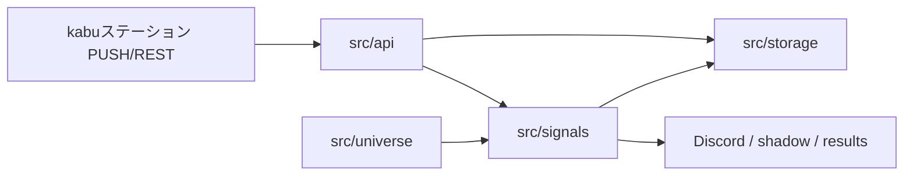
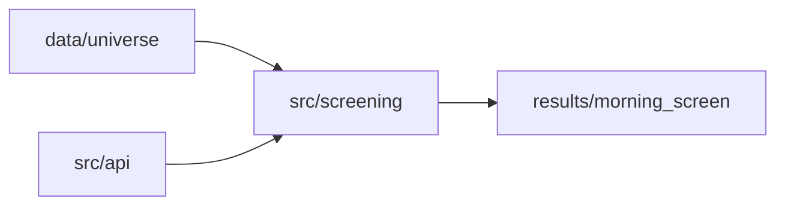
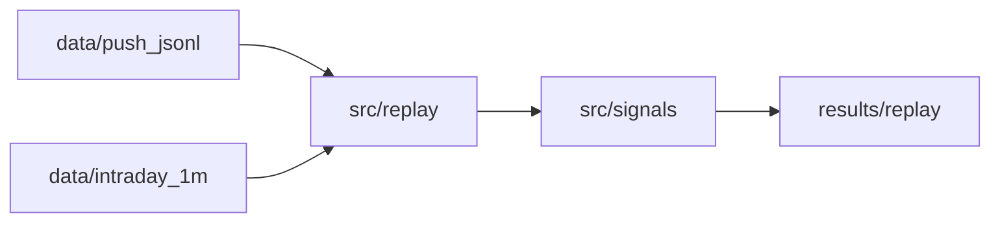

# kabu_native — アーキテクチャ

**更新:** スキャフォールド段階（設計のみ。コードは `kabu_native/src/` 未配置）

## 1. 位置づけ

kabu_native は **kabuステーション® API を一次データ源とするデイトレ支援の新スタック** です。

- **旧系:** Yahoo 非公式 API → `yahoo_kabu_watch.py` → `signal_engine`（Yahoo プロファイル）→ paper_trade / Discord。
- **新系:** kabu REST/PUSH → `kabu_native` 各モジュール → `kabu_signal_v1` → shadow / 通知 → （将来）発注連携。

両者は **同一プロセスに無理に統合しない**。設定・データパス・成果物を分け、検証が揃った段階で運用を切り替えます。

## 2. 設計原則

1. **Yahoo 1分足のドロップイン置換をしない** — kabu PUSH 近似足と Yahoo 足は品質が異なる（`docs/kabu_signal_design.md` Phase 5A）。
2. **`kabu_signal_v1` は別プロファイル** — 板・VWAP・累積出来高の差分・鮮度を主入力とする。
3. **旧系を壊さない** — ルートの watchdog / paper_trade / Replay は継続。
4. **段階的移行** — ルート `src/kabu_*` は参照・コピー元。いきなり削除・移動しない。

## 3. レイヤ構成

```text
                    ┌─────────────────────────────────────┐
                    │  scripts/  (CLI・運用エントリ)        │
                    └──────────────────┬──────────────────┘
                                       │
         ┌─────────────────────────────┼─────────────────────────────┐
         ▼                             ▼                             ▼
┌─────────────────┐          ┌─────────────────┐          ┌─────────────────┐
│ src/screening   │          │ src/signals     │          │ src/replay      │
│ 朝スクリーニング  │          │ kabu_signal_v1  │          │ 過去再生・集計   │
└────────┬────────┘          └────────┬────────┘          └────────┬────────┘
         │                            │                            │
         └────────────────────────────┼────────────────────────────┘
                                      ▼
                            ┌─────────────────┐
                            │ src/universe    │
                            │ 銘柄集合・登録   │
                            └────────┬────────┘
                                     ▼
                            ┌─────────────────┐
                            │ src/api         │
                            │ REST / PUSH     │
                            └────────┬────────┘
                                     ▼
                            ┌─────────────────┐
                            │ kabuステーション   │
                            │ (localhost API)  │
                            └─────────────────┘

         ┌──────────────────────────────────────────┐
         │ src/storage  ◀──▶  data/  /  results/     │
         └──────────────────────────────────────────┘
```

| レイヤ | 責務 |
|--------|------|
| **api** | 認証、板取得、PUSH 購読、レート・鮮度・セッション（昼休み・大引け）の扱い |
| **universe** | 銘柄マスタ、API 登録銘柄との整合、監視リストの生成 |
| **screening** | 寄り前: 流動性・ギャップ・板厚み等で候補をスコアリング |
| **signals** | 場中: `KabuBoardSnapshot` → エントリー / 更新 / 無効化（`kabu_signal_v1`） |
| **replay** | 保存 PUSH / 確定足 / 日次データから過去シナリオを再生 |
| **storage** | パス規約、JSONL 追記、CSV エクスポート、run メタデータ |

## 4. データフロー（目標）

### 4.1 ライブ（場中）



- 評価トリガ: **PUSH 受信** を主、REST 板は欠損時・最大間隔（例: 15秒）のフォールバック。
- 鮮度ゲート: `CurrentPriceTime` からの経過秒で stale を除外。

### 4.2 朝スクリーニング



- 旧系 `--morning-screen` と同様 **上位 N 銘柄** を出力するが、入力系列は kabu 前提。

### 4.3 リプレイ（約1か月）



- 入力優先: 保存済み PUSH JSONL → 補助として確定 1分足。
- Yahoo キャッシュ（ルート `data/intraday_1m/`）は **比較・回帰用に参照可**だが、新系リプレイの正にはしない。

## 5. kabu_signal_v1（概要）

詳細はルート **`docs/kabu_signal_design.md`** を正とする。要約:

| 項目 | 方針 |
|------|------|
| 一次入力 | `CurrentPrice`, `VWAP`, `TradingVolume` 差分, 板厚み, 鮮度 |
| 使わない | Yahoo 互換の「近似1分足のみ」での breakout 判定 |
| 出口 | 別モジュール（旧 `kabu_exit_engine` 試作を参考に新系で整理） |
| shadow | `results/shadow/` — 発注なしで live と並走検証 |

## 6. 旧系・試作コードとの関係

| ルート資産 | 新系での扱い（予定） |
|------------|----------------------|
| `yahoo_kabu_watch.py` | 触らない。並行運用 |
| `src/signal_engine.py` | Yahoo 専用のまま |
| `src/kabu_api_client.py`, `kabu_push_client.py` | `kabu_native/src/api/` へ段階移植 |
| `src/kabu_signal_engine.py`, `kabu_exit_engine.py` | `kabu_native/src/signals/` へ再構成 |
| `src/kabu_signal_replay.py` | `kabu_native/src/replay/` へ移植 |
| `scripts/kabu_api_check.py` | 接続確認は継続利用可。必要なら `kabu_native/scripts/` に薄いラッパ |

## 7. 実装フェーズ（推奨順）

| フェーズ | 内容 | 主な出力 |
|--------|------|----------|
| **0** | 本スキャフォールド（ディレクトリ + doc） | — |
| **1** | `src/api` — トークン・板・PUSH 購読・鮮度 | `logs/`（ルート runtime でも可） |
| **2** | `src/universe` + `data/universe` | 銘柄 CSV / JSON |
| **3** | `src/screening` | `results/morning_screen/` |
| **4** | `src/storage` + `data/push_jsonl` | 生ログ蓄積 |
| **5** | `src/signals`（`kabu_signal_v1`） | shadow イベント |
| **6** | `src/replay`（1か月） | `results/replay/` |
| **7** | 発注連携（調査・限定 API） | 未定 |

各フェーズ完了時に、ルート `docs/kabu_*_validation.md` と同様の検証 doc を `kabu_native/docs/` またはルート `docs/` に追加する。

## 8. 設定・秘密情報

- API パスワードは **ルート `.env`** の `KABU_API_PASSWORD` を継続利用（`docs/kabu_station_setup.md`）。
- 新系専用の閾値は **`kabu_native/configs/`** に置き、旧 `configs/replay_*.json` とは分離。

## 9. 成果物・ログの命名（方針）

旧系 `docs/DESIGN.md` §12 に倣い、実装時に以下を固定する:

- 日付バケット: `YYYYMMDD`（JST）
- run 識別: `morning_screen_<stamp>/`, `replay_<stamp>/`, `shadow_<stamp>/`
- メタ JSON: `*_run_meta.json`, サマリ: `*_summary.json`

具体パスは最初の CLI 実装時に `directory_structure.md` へ追記する。

## 10. 非目標（現時点）

- 旧 `yahoo_kabu_watch.py` の kabu への置換
- ルート `src/` の一括移動
- 本番発注の自動化
- Yahoo と kabu のシグナル判定の数値一致
