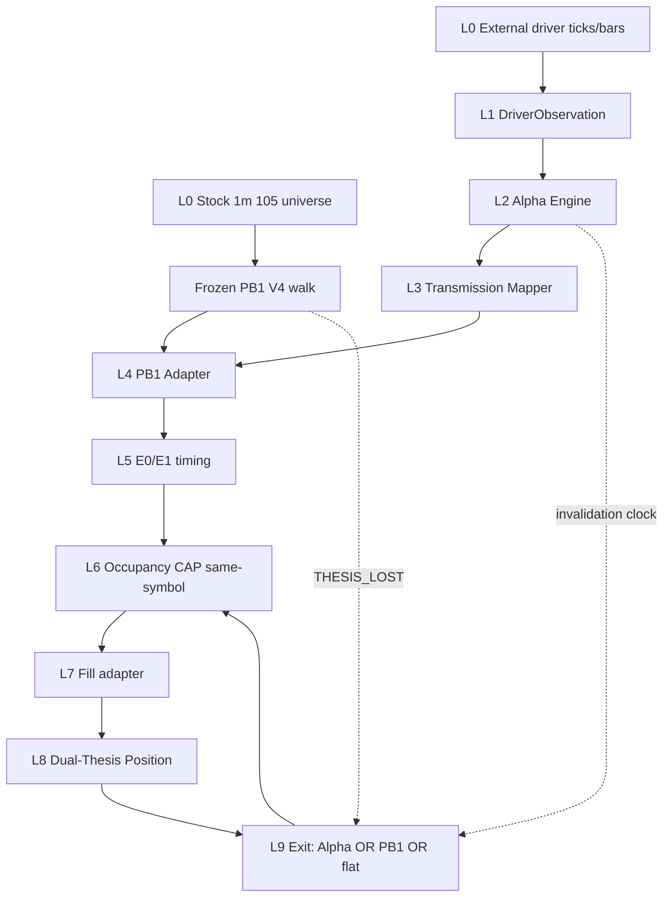

# Causal Driver × PB1 System Design V1

**DESIGN_ID:** `CAUSAL_DRIVER_PB1_SYSTEM_DESIGN_V1`  
**SPEC_ID:** `TRADEBOT_CAUSAL_DRIVER_PB1_ARCHITECTURE_SPEC_V1` (v1.0, 2026-09-21)  
**Created:** 2026-09-21 JST  
**Mode:** Design only. Research / Paper. No real orders.

```text
VERDICT: CAUSAL_DRIVER_PB1_SYSTEM_DESIGN_READY_V1
NEXT:    IMPLEMENT_PHASE0_DATA_AND_INTERFACE_FOUNDATION_V1
```

This document is the implementation SoT for the next research cycle. It does not create V5. It does not mutate Frozen PB1 V4. It does not open Frozen Validation economics or prospective economics.

---

## Executive Summary

PB1 V4 Complete Strategy is a locked economic failure:

- `PB1_V4_COMPLETE_STRATEGY_ECONOMIC_CONFIRMATION1_FAIL_V1` (Confirmation 1 net −235,671 yen, PF 0.574)
- `PB1_COMPLETE_STRATEGY_NO_ROBUST_CAUSAL_REPAIR_FOUND_V1`
- `PB1_ENTRY_ARCHITECTURE_INFORMATION_INSUFFICIENT_V1`

PB1 internals are not the next alpha. The new system inverts responsibility:

```text
External Causal Driver  = Alpha source
Alpha Engine            = direction / strength / expiry
Transmission            = market → sector → symbol
PB1 V4 Frozen machine   = stock-side confirmation + state filter
E0 / E1                 = entry timing only
Portfolio               = CAP / same-symbol / occupancy / slot / session flat
Execution               = historical approximation XOR native Ask1/Bid1
Dual-Thesis Exit        = Alpha invalidation OR PB1 THESIS_LOST OR session flat
```

Architecture is implementable against the current `kabu_native` repository. Remaining work is data-fabric and interfaces (Phase 0), not a missing conceptual design. Open data gaps are recorded; they are not hidden.

Top design decisions (repo-surveyed, not imagined):

1. **Research observation universe** is the frozen 105-symbol pool. It is not the daily trade list.
2. **Dynamic40 stays** as a Kabu 50-slot **resource / tradability gate**. It is not an alpha source.
3. **First driver family is USDJPY**, because historical coverage, proven `BAR_START` timestamps, and sector labels exist. Prior USDJPY research is **evidence, not a frozen alpha**.
4. **NK/TOPIX futures** are a prospective capture subtrack. They are not the first historical driver (no long history).
5. **Frozen V4 is consumed through an adapter.** The machine SHA does not change.
6. **Historical replay and Paper consume the same Alpha Engine interface.** Fill models stay separate.

Safety for this design task:

```text
code_changed = false
V4_CHANGED = false
V5_CREATED = false
FROZEN_VALIDATION_ECONOMIC_OPENED = false
PROSPECTIVE_DATA_OPENED = false
submit/cancel/live = 0/0/0
```

---

## Current System Inventory

Surveyed trees: `kabu_native/` (primary) and parent `tradebotfile/` (legacy paper / Yahoo). Verdicts below are design bindings, not code changes.

Legend: **REUSABLE** / **NEEDS_ADAPTER** / **MUST_NOT_REUSE** / **NEW_COMPONENT_REQUIRED**.

### Inventory table

| Component | CURRENT_MODULE | CURRENT_ROLE | Verdict |
|---|---|---|---|
| Frozen 105 research pool | `results/research/daytrade_historical_research_foundation_v2/research_pool_manifest.json` ; `src/research/daytrade_historical_research_foundation_v2/pool.py` | Observation universe (liquidity top80 ∪ activity top40, `union_n=105`, `did_not_force_n`) | **REUSABLE** as `RESEARCH_OBSERVATION_UNIVERSE`. Bind SHA; do not re-rank. |
| Native 1m OHLC panel | `data/reference/daytrade_historical_v2/minute/minute_{sym}_20240917_20260911.parquet` (105 files) ; `src/research/cause_first_mechanism_discovery_v1/panel.py` | Historical stock bars, `BAR_START`, columns `open,high,low,close,volume,trading_value` (+ `bar_start_jst` / `available_at_jst` on ingest) | **REUSABLE**. No Bid/Ask. |
| Frozen PB1 V4 machine | `src/research/pb1_v4_clarified_machine_correction_v4/` (`seed.py`, `active.py`, `location.py`, `thesis.py`, `execution.py`, `walk.py`, `machine.py`) | Opening-drive / location / thesis / E0/E1 **alpha generator (old)** | **NEEDS_ADAPTER**. Machine **REUSABLE frozen**. Role changes to filter. **MUST_NOT_REUSE** as Alpha source. Identity `PB1_V4_CLARIFIED_MACHINE_CORRECTION_V4_FROZEN_V1`, machine SHA `8d9c79b644616146ad01100e27f34368460d4c032d955d0ced2aab171fbfb6cf`. |
| V4 walk cache | `results/research/_work/pb1_v4_clarified_machine_correction_v4/walked.json` | Discovery E0=201 / E1=468 emit stream | **REUSABLE** for Discovery adapter tests. Other periods require frozen `emit_v4` replay, not cache mutation. |
| Complete Strategy occupancy | `src/research/pb1_v4_complete_strategy_build_and_economic_validation/portfolio.py` `replay_occupancy` | CAP=5, same-symbol, FILL occupancy, EXIT slot release, reentry without PnL gate | **REUSABLE** as L6 kernel. Dual-thesis adds EXIT reasons; occupancy math stays. |
| Historical fill | `.../fill.py` `fill_stamp` | `HISTORICAL_NEXT_BAR_OPEN_EXECUTION` + `RESEARCH_EXECUTION_APPROXIMATION` + `X1_8BPS_EXECUTION_STRESS` | **REUSABLE**. Never relabel as native fill. |
| Technical / ops exit | `.../exits.py` `resolve_exit` | `PB1_V4_THESIS_LOST_NEXT_OPEN` ; `SESSION_FLAT_1520` | **NEEDS_ADAPTER**: keep as stock-thesis and operational exits; add Alpha-thesis invalidation as a sibling reason. |
| Clocks | `.../clocks.py` | Lunch skip, next-open, flatten 15:20, same-bar ban | **REUSABLE**. |
| Data roles / date seal | `.../roles.py` ; Conf1 `replay_conf.py` ; `panel.load_minutes(..., allowed_dates, forbidden_dates)` | Partition Dev / OC / FV / prospective | **REUSABLE pattern**. New ledger must mark Conf1 as `ECONOMIC_DEVELOPMENT_EXPOSED` for the **new** architecture (already opened for PB1 V1). FV economics stay sealed. |
| Isolation / write fence | per-package `isolation.py` ; `write_overlap_n` vs capture/paper | Research vs live capture | **REUSABLE**. |
| Contamination ledger | `src/research/pb1_v4_clarified_machine_correction_v4_freeze_and_prospective_prep/ledger.py` | Prospective skip keys | **REUSABLE pattern**. New `DATA_ROLE_LEDGER` for driver series. |
| USDJPY historical | `src/research/usd_jpy_sector_symbol_response_v1/` ; parquet `results/research/_work/expand_causal_driver_catalog_v1/usd_jpy_sector_symbol_response_v1/usdjpy_1m_bidask_20240916_20251126.parquet` | Discovery-only FX Bid/Ask 1m, Jetta, proven `available_at = bar_start + 1m` | **REUSABLE** as L0/L1 source for Phase 1. **NEEDS_ADAPTER** to DriverObservation contract. Coverage currently **Discovery only**. |
| Sector/symbol mapping research | `src/research/sector_symbol_driver_response_mapping_v1/` | Verdict `CURRENT_DRIVER_SET_INSUFFICIENT_V1` (1321/1306 proxies) | **REUSABLE** as negative evidence. **MUST_NOT_REUSE** 1321/1306 as true futures. |
| NQ/ES / True CME / HKG / Korea | `src/research/nq_es_sector_symbol_response_v1/` etc. | Proxy found / CME blocked / HKG simultaneous / Korea unavailable | **REUSABLE** as catalog priors. Not first driver. |
| TSE33 / TOPIX17 labels | pool manifest fields `tse33_name`, `topix17_name` ; J-Quants listed master | Point-in-time **as-of pool freeze**, not a live sector-index series | **REUSABLE** as static SectorExposureMap v0. Versioned; do not reassign names after seeing PnL. |
| TOPIX daily index | `data/reference/jquants/indices_topix/` | Daily OHLC ~20260618–20260911 | **RESEARCH_CONTEXT_ONLY** until `available_at` for intraday decisions is proven. Too short / too coarse for Phase 1 alpha. |
| NK225 mini / TOPIX futures PUSH | `src/research/new_causal_information_acquisition_v1/` ; `data/market_context_capture/YYYYMMDD/futures/` | Isolated Core10+Dynamic38+2 futures from `20260911`; ~6 days on disk | **REUSABLE** capture. **MUST_NOT_REUSE** as historical alpha. Prospective driver subtrack. |
| Market capture sidecar | `src/small_paper/market_capture_sidecar.py` + writer/supervisor | Equity L2 PUSH, JST `received_at` | **REUSABLE** for Paper fill SoT. Not a driver. |
| Breadth rankings | `data/market_breadth_capture/` | Ranking JSONL, few days | **RESEARCH_CONTEXT_ONLY** until history exists. |
| Core10 + Dynamic40 | `src/universe/core10_dynamic40.py` ; AM/PM runner | 50 Kabu register slots | **REUSABLE** as L6 resource gate. **MUST_NOT_REUSE** as research universe or alpha. |
| Paper runtime (PBv2 / OR overlay / ExposureGate) | `src/small_paper/paper_trade_checked_runner.py` ; `pilot_runner` ; production YAML | Current Paper strategy | **MUST_NOT_REUSE** as Causal×PB1 alpha. Keep running unchanged until a later Paper certification of the **new** freeze. |
| Native Ask1 fill | `LIVE_FILL_SOT_ID = X1_IMMEDIATE_ASK` ; `BOARD_FRESHNESS_SEC_V1R = 5.0` | Paper/live-compatible fill | **REUSABLE** contract for L7 Paper. |
| Live order path | `live_order_safety_sm.py` ; sendorder builders | `PRODUCTION_FORBIDDEN` | **MUST_NOT_REUSE**. This design adds no order path. |
| Parent Yahoo / `tradebotfile/data/intraday_1m` CSV | parent tree | Legacy | **MUST_NOT_REUSE**. |
| Discord / summary | `src/small_paper/discord_*.py` | Paper notifications | **NEEDS_ADAPTER** later (Phase 10). Not Phase 0–8. |
| Entry-architecture features | `src/research/pb1_entry_architecture_reassessment/` | Univariate PB1 internals; verdict INSUFFICIENT | **MUST_NOT_REUSE** as alpha features. Harness patterns (folds, OOF, isolation) **REUSABLE**. |
| Freeze / SHA | V4 `definitions.machine_sha256` ; CS `freeze.py` | Identity lock | **REUSABLE pattern** for new Complete Strategy identity. |

### Frozen identities this design must not mutate

| Identity | Value |
|---|---|
| Frozen ENTRY | `PB1_V4_CLARIFIED_MACHINE_CORRECTION_V4_FROZEN_V1` |
| V4 machine SHA256 | `8d9c79b644616146ad01100e27f34368460d4c032d955d0ced2aab171fbfb6cf` |
| Complete Strategy identity | `PB1_V4_COMPLETE_STRATEGY_FROZEN_V1` |
| Complete Strategy SHA256 | `556542319d22dff40cc1758b24d44d2ecb1985b8595927ca8f80618126961bf8` |
| V1 economic | `PB1_V4_COMPLETE_STRATEGY_ECONOMIC_CONFIRMATION1_FAIL_V1` |
| Repair | `PB1_COMPLETE_STRATEGY_NO_ROBUST_CAUSAL_REPAIR_FOUND_V1` |
| Entry architecture | `PB1_ENTRY_ARCHITECTURE_INFORMATION_INSUFFICIENT_V1` |
| Split SHA (historical bind) | `2c9bd8f4ce7c86116833b54e1d41e4cbc4b59c3e504b769140fea435d375b3b4` |
| 105 manifest file SHA256 | `1d0a78b1bbd21d8ae06b0c4fab823281adba83190a9da9eda8a42fa43b34fbf7` |
| 105 symbols-order SHA256 | `25a54cba09811848e05141c3e551972f3016f406b747dadf0a2716bb04656902` |
| USDJPY prior | `USDJPY_SECTOR_SPECIFIC_DRIVER_FOUND_V1` (not a playbook, not global 105 rule) |

`UNIVERSE_MANIFEST_SHA256` for new runs **is** the manifest file SHA `1d0a78b1…`. Phase 0 binds it in code; it is no longer an open question.

---

## Superseded vs Current Design

| Topic | SUPERSEDED_DESIGN | CURRENT_DESIGN | MIGRATION_IMPACT |
|---|---|---|---|
| Alpha source | PB1 V4 ENTRY generator (E0/E1 emit = trade) | External Driver → Alpha Engine | Stop PB1 threshold / V5 filter work. V4 remains frozen filter. |
| Research universe | Runtime 40–50 (Core10+Dynamic40) or PB1 578 fills | Fixed 105 observation universe | Driver studies must score selected **and** non-selected names. Forbidden: start from 578 PB1 trades. |
| Dynamic40 | Implicit candidate / “what we trade” | Resource gate / Kabu 50-slot registration | Paper may fail-closed `NOT_REGISTERED`. Research population unchanged. |
| Direction | PB1 `DIR` creates side | Alpha creates side; PB1 may only **agree or reject** | Adapter forbids reverse. Mismatch → `ALPHA_DIRECTION_MISMATCH`. |
| EXIT | Single PB1 `THESIS_LOST` (+ session flat) | Dual thesis: Alpha invalidation OR PB1 THESIS_LOST OR session flat | Occupancy reused. Exit reason enum extended. Invalidation **rule** frozen per mechanism in research, not in this design. |
| Japan index | 1321/1306 treated as market driver | `PROXY_NOT_FUTURES`; insufficient (`CURRENT_DRIVER_SET_INSUFFICIENT_V1`) | Do not revive ETF proxies as true NK/TOPIX. |
| Paper strategy | PBv2 + OR overlay + ExposureGate | Unchanged operational Paper until new freeze + Paper cert | Two stacks. Do not merge YAML. |
| Data roles | Conf1 was holdout for PB1 V1 | For **new** architecture: Dev+Conf1 = `ECONOMIC_DEVELOPMENT_EXPOSED` | PB1 V1 FAIL stays FAIL. New work may use Conf1 economics. FV 20260422–20260911 economics remain sealed. |
| Prospective calendar | PB1 semantic from `20260924` | PB1 ledger stays. **New** strategy prospective = first eligible JP cash session **after that strategy's freeze**, not backfilled to 20260924 | Separate ledgers. |
| USDJPY 3-name lead list | Could be misread as a trade universe | Diagnostic only (`6787`,`7717`,`4092`) | Transmission must be sector/factor first. Symbol exceptions require a new version. |
| Sizing as alpha repair | 100-share yen concentration / equal-notional rescue | Sizing is a later Risk Layer after edge exists | CS development keeps SHARES=100 + bps metrics. No price-band blacklist. |
| Docs 2026-07-12 current system | Paper PBv2 as “the system” | Still accurate for **current Paper**. Superseded as research SoT for Causal×PB1 | Point readers here for research; keep 2026-07-12 for operations. |

Conflict audit note: older operations docs still describe Dynamic40 as the trading universe. This design **records** that conflict and does not silently rewrite those docs. Causal×PB1 research SoT is this file + the v1.0 specification.

---

## Architecture Diagram

```text
L0  DATA ACQUISITION
      stock 1m parquet | USDJPY Jetta | (later) NK/TOPIX PUSH | listed master
        ↓
L1  DRIVER NORMALIZATION
      DriverObservation {event_time, available_at, received_at, quality}
        ↓
L2  ALPHA ENGINE  (mechanism registry; plugin per driver_family)
      AlphaSignal {direction, strength, valid_from, valid_until, mechanism_id}
        ↓
L3  TRANSMISSION
      DriverState → SectorExposureMap → SymbolExposureMap → ResponseState
      candidates ⊆ 105
        ↓
L4  PB1 STATE FILTER  (frozen V4 via adapter; no direction rewrite)
      ALPHA_DIRECTION_AGREES ∧ PB1_ACTIVE ∧ LOCATION_VALID ∧ THESIS_LIVE
        ↓
L5  ENTRY TIMING  (E0 5m / E1 1m)   timing only
        ↓
L6  PORTFOLIO / RISK
      tradability / freshness / CAP=5 / same-symbol / occupancy
        ↓
L7  EXECUTION
      Historical: next 1m open + 8bps stress
      Paper:     X1_IMMEDIATE_ASK / first causal Bid1
        ↓
L8  POSITION STATE  (Alpha thesis + PB1 thesis)
        ↓
L9  EXIT  (first causal invalidation) → slot release → reentry eligible
        ↓
L10 RESEARCH / VALIDATION / AUDIT
      manifests, leakage firewall, freeze SHA, FV one-time, prospective Paper
```



Control principle: **no arrows from future stock returns or MFE into L1–L5.** Diagnostic horizons live only in L10 discovery notebooks/packages, never as ENTRY features.

---

## Module Boundaries

Proposed **new** package root (not created in this task):

```text
src/research/causal_driver_pb1/
  contracts/          # DriverObservation, AlphaSignal, EntryDecision, events
  firewall/           # data roles, allowlists, period guards
  drivers/            # registry + family plugins
  transmission/       # maps + response state
  engine/             # Alpha Engine (historical + live same API)
  pb1_adapter/        # Frozen V4 consume-only
  timing/             # E0/E1 gate (reuse V4 execution flags)
  dual_thesis/        # position theses + invalidation hooks
  replay/             # Complete Strategy replay wrapping occupancy/fill
  observability/      # event log
```

Family research packages stay one-analysis-per-folder, e.g. `src/research/alpha_driver_usdjpy_discovery_v1/`, and **import** contracts. They must not fork schemas.

### Layer contracts

| Layer | Responsibility | Inputs | Outputs | State ownership | Event clock | Failure behavior | Existing reuse | New |
|---|---|---|---|---|---|---|---|---|
| L0 | Acquire raw series | Provider APIs / parquet / PUSH | Raw frames with source timestamps | None (immutable stores) | Source clock | Missing → no rows; no fill | 105 parquet, Jetta client, futures capture, listed master | Canonical store under `data/reference/drivers/` (move FX out of `_work`) |
| L1 | Normalize + quality | Raw frames | `DriverObservation` | Last observation per `driver_id` | `available_at` | `MISSING`/`STALE`/`DEGRADED`; never interpolate | USDJPY `semantics.py` | Quality FSM + schema |
| L2 | Detect alpha | Observations + mechanism | `AlphaSignal` | Active alphas by id | `generated_at >= available_at` | Fail-closed: no signal | None as engine | Engine + registry |
| L3 | Map to names | Alpha + exposure maps | Candidate set ⊆ 105 | PIT maps (versioned) | Map `as_of <= decision_time` | Empty set ≠ guess-all | Pool TSE33 labels | Maps + ResponseState |
| L4 | Stock confirmation | Alpha + frozen PB1 snapshot | Agree / reject+reason | **None** (PB1 owned by V4) | PB1 completed-bar | Reject with reason | V4 `emit_v4` fields | Adapter only |
| L5 | Timing | L4 pass + E0/E1 flags | `EntryDecision` | None | E0 next-1m-open / E1 1m interaction | No decision | V4 `execution.py` | Conjunction gate |
| L6 | Risk / occupancy | EntryDecision stream | Admitted / blocked | CAP, pending, open | Event priority queue | CAP / SAME_SYMBOL / NOT_TRADABLE | `replay_occupancy` | Registration gate adapter |
| L7 | Fill | Admitted decision | Fill stamp | None | Next causal executable | No same-bar / mid / future quote | `fill.py` / `X1_IMMEDIATE_ASK` | Fill-model tag enforcement |
| L8 | Position theses | Fill + live observations | `PositionState` | Per position | Observation `available_at` | Fail-closed operational exit | None | Dual-thesis object |
| L9 | Exit | Theses + session clock | EXIT_PENDING / fill / release | Same occupancy heap | Invalidation then next open | SESSION_FLAT separate reason | `exits.py` | Alpha invalidation hook |
| L10 | Research governance | All | reports, SHA, ledgers | Ledgers | Run mode | Default deny FV/prospective economics | isolation + 3-file artifacts | Shared firewall + manifests |

---

## Data Contracts

### RESEARCH_OBSERVATION_UNIVERSE vs RUNTIME_TRADE_CANDIDATE_SET

| Concept | Definition | Binding |
|---|---|---|
| `RESEARCH_OBSERVATION_UNIVERSE` | Frozen 105 symbols | Manifest path above; file SHA `1d0a78b1…`; symbols-order SHA `25a54cba…` |
| `RUNTIME_TRADE_CANDIDATE_SET` | Session-specific names that may be admitted | `Transmission(candidates) ∩ Tradability ∩ Registered50 ∩ PB1-agree ∩ E0/E1` |
| `REGISTERED_50` | Core10 + Dynamic40 (standard Paper) or isolated NEW_INFO 48+2 futures | Resource constraint, not alpha |

Research always evaluates the 105. Runtime never trades a name solely because it is in Dynamic40.

### DriverObservation (L1)

| Field | Meaning | Rule |
|---|---|---|
| `driver_id` | Stable id, e.g. `USDJPY` | Registry key |
| `driver_family` | `FX` / `JP_FUT` / `US_FUT` / `ASIA` / `RATES` / `COMMODITY` / `JP_INTERNAL` | |
| `event_time` | Provider event / bar-start | Timezone explicit; store UTC |
| `available_at` | Earliest time the value is known | Historical: proven (USDJPY = bar_start+60s). If unproven → `RESEARCH_CONTEXT_ONLY` |
| `source_time` | Vendor timestamp as received | |
| `received_at` | Live capture receive time | Required on Paper/live path; `received_at <= decision_time` |
| `value` / `return` / `direction` / `strength` | Normalized inside family | Strength is **ex-ante**, not PnL-fit |
| `lookback_window` | Window used to compute return/strength | Frozen per mechanism |
| `valid_until` | Observation TTL before STALE | Not holding-time optimization |
| `freshness_sec` | `decision_time - available_at` (hist) or `decision_time - received_at` (live) | |
| `quality` | `VALID` / `STALE` / `MISSING` / `DEGRADED` | See Missing Data |
| `causal_ok` | `available_at <= decision_time` and quality in {VALID, DEGRADED if mechanism allows} | |
| `source_identity` | SHA of source file / capture seal | |

**Do not confuse `event_time`, `available_at`, `received_at`.** Alpha uses `available_at` (historical) or `max(available_at, received_at)` (Paper).

### AlphaSignal (L2)

| Field | Rule |
|---|---|
| `alpha_id` | Deterministic hash(`mechanism_id`, `driver_event_id`, `generated_at`) |
| `generated_at` | Engine clock; `>= available_at` |
| `driver_family` / `driver_event_id` | Trace to observation |
| `market_bias` | `BULL` / `BEAR` / `NEUTRAL` |
| `sector_id` / `symbol` | Scope after transmission; symbol may be null at market layer |
| `direction` | Same as intended trade side. PB1 cannot flip it |
| `strength` / `confidence` | Mechanism-defined ex-ante. **Not** in-sample PnL |
| `expected_horizon` | Diagnostic; not EXIT |
| `valid_from` / `valid_until` | Mandatory. Expired alpha cannot admit |
| `mechanism_id` | Registry |
| `causal_evidence` | Pointers to observations used |
| `data_freshness` | Copied quality |
| `status` | `ACTIVE` / `EXPIRED` / `INVALIDATED` / `SUPERSEDED` |

Driver observations are **not** EntryDecisions. No direct Driver → L7.

### EntryDecision (L5)

| Field | Rule |
|---|---|
| `entry_decision_id` | Deterministic |
| `decision_time` | Completed information clock |
| `symbol` / `direction` | Direction **copied from Alpha**, never from PB1 if they disagree (disagree = no decision) |
| `alpha_id` / `mechanism_id` | Required |
| `pb1_identity` | Frozen ENTRY identity + machine SHA |
| `pb1_state` | Snapshot: SEED/ACTIVE/LOCATION/THESIS/E0/E1 ids |
| `entry_type` | `E0_5M_CONFIRMED_EXECUTION` or `E1_1M_TIMED_EXECUTION` |
| `location` | Frozen location family/id |
| `alpha_valid_until` | Copied |
| `decision_reason` | Human/RCA string |
| `causal_ok` | Conjunction of clocks |

### Fill stamp

Reuse existing fields. Add `execution_channel`:

- `RESEARCH_EXECUTION_APPROXIMATION` + `HISTORICAL_NEXT_BAR_OPEN_EXECUTION`
- `PAPER_NATIVE` + `X1_IMMEDIATE_ASK` (long Ask1 / short Bid1) with `BOARD_FRESHNESS_SEC_V1R=5`

Forbidden: same-bar, mid, future quote, mixing channels in one metric without a split.

---

## Event Contracts

Every durable event has `event_time`, `observed_at`, `identity`, `reason`, `source`.

| Event | Emitted by | `event_time` | Notes |
|---|---|---|---|
| `DRIVER_OBSERVED` | L1 | `event_time` of bar/tick | `observed_at=available_at` hist / `received_at` live |
| `ALPHA_GENERATED` | L2 | `generated_at` | |
| `SYMBOL_SELECTED` | L3 | same | Includes rejected siblings for RCA (`not_selected_reason`) |
| `PB1_CONFIRMED` / `PB1_REJECTED` | L4 | PB1 completed-bar clock | Reject always has reason enum |
| `ENTRY_READY` | L5 | decision_time | |
| `ENTRY_ADMITTED` / `ENTRY_BLOCKED` | L6 | admit clock | CAP / SAME_SYMBOL / NOT_TRADABLE |
| `ENTRY_FILLED` | L7 | fill_t | |
| `ALPHA_THESIS_INVALIDATED` | L8/L9 | invalidation available_at | Not backdated from MFE |
| `PB1_THESIS_LOST` | Frozen V4 | `THESIS_LOST_AT` | Absorbing on that stock episode |
| `EXIT_REQUESTED` | L9 | first of the two theses or ops | |
| `EXIT_FILLED` | L7 | next causal executable | |
| `SLOT_RELEASED` | L6 | exit fill clock | Reentry needs **new** alpha_id and/or new execution_id |

### PB1 reject reasons (mandatory, never a bare false)

```text
ALPHA_EXPIRED
ALPHA_DIRECTION_MISMATCH
PB1_NOT_ACTIVE
PB1_NO_LOCATION
PB1_THESIS_LOST
E0_NOT_CONFIRMED
E1_NOT_CONFIRMED
DATA_STALE
DATA_MISSING
NOT_TRADABLE
NOT_REGISTERED
NOT_IN_TRANSMISSION_SCOPE
QUALITY_DEGRADED_FAIL_CLOSED
```

---

## State Machines

### A. Driver quality

```text
MISSING → (row appears) → VALID
VALID → (age > valid_until or gap) → STALE
VALID → (parse/spread anomaly) → DEGRADED
any → (source down) → MISSING
```

Alpha **fail-closed** on `MISSING` and `STALE`. `DEGRADED` is mechanism-specific; default fail-closed until a mechanism freeze says otherwise. **No forward fill. No guessed direction.**

### B. Alpha

```text
NO_ALPHA → ALPHA_ACTIVE (valid_from) → EXPIRED (valid_until)
                                 → INVALIDATED (mechanism rule)
                                 → SUPERSEDED (newer alpha_id same family)
```

Expired/invalidated alphas never admit. They may still kill an open Alpha thesis.

### C. Complete Strategy occupancy (reuse + dual thesis)

```text
FLAT
 → ENTRY_ALLOWED          # L4+L5 pass and L6 admit
 → FILL                   # L7
 → OPEN_POSITION          # L8 dual thesis live
 → EXIT_PENDING           # first causal invalidation OR SESSION_FLAT
 → EXIT_EXECUTED
 → SLOT_RELEASE
 → FLAT_OR_REENTRY_ELIGIBLE
```

Reentry requires a **new** causal identity (new `alpha_id` and/or new PB1 `execution_id`) after slot release. Winner/loser PnL must not gate reentry.

### D. Dual-thesis position

```text
PositionState:
  alpha_thesis_live: bool
  alpha_thesis_reason: str | null
  pb1_thesis_live: bool
  pb1_thesis_reason: str | null
  operational_flat_pending: bool
```

OPEN requires both theses live at fill. After fill:

```text
EXIT_PENDING when
  alpha_thesis_live == false
  OR pb1_thesis_live == false
  OR operational_flat_pending
```

PB1 `THESIS_LOST` is absorbing for that stock episode even if Alpha remains ACTIVE. Alpha invalidation kills the **position** without rewriting PB1 machine state.

### E. Event-time priority (same timestamp)

Existing kernel: `EXIT=0`, `FILL=1`, `ADMIT=2` in `portfolio.py`.

Extended deterministic key:

```text
(session_date, clock_minutes, priority, symbol, event_id)
```

| Priority | Kind |
|---:|---|
| 0 | `DRIVER_QUALITY` updates that fail-close an open position |
| 1 | `ALPHA_THESIS_INVALIDATED` / `PB1_THESIS_LOST` / `SESSION_FLAT` → `EXIT_REQUESTED` |
| 2 | `EXIT_FILLED` / `SLOT_RELEASED` |
| 3 | `ENTRY_FILLED` |
| 4 | `DRIVER_OBSERVED` / `ALPHA_GENERATED` / `SYMBOL_SELECTED` (state only) |
| 5 | `ADMIT` / `ENTRY_READY` |

Same priority: symbol string, then `event_id`. **No iteration-order dependence. No future peek.**

Lunch: keep `HOLD_THROUGH_LUNCH_RESUME_PM`. At first PM causal bar, re-evaluate both theses; if either is dead, `EXIT_PENDING` before any PM admit.

---

## Driver Architecture

### Registry (no giant if-tree)

```text
mechanism_id
driver_family
target_scope            # market | sector | symbol
direction_mapping       # documented, frozen
lead_window             # causal offsets only
expected_horizon        # diagnostic
valid_regimes           # optional; not post-hoc month blacklist
research_status         # CANDIDATE | REJECTED | FREEZE_CANDIDATE | FROZEN | FAIL
freeze_status
version
sha256
source_quality          # HISTORICAL_CAUSAL | REALTIME_CAUSAL | RESEARCH_CONTEXT_ONLY
```

Plugin API (conceptual):

```text
ingest(raw) -> list[DriverObservation]
detect(observations, decision_time) -> AlphaSignal | None
invalidate(position, observations, decision_time) -> (bool, reason)
```

Historical replay and Paper call the **same** three methods. Only L0 transport differs.

### Family catalog (repo-surveyed)

| Family | Source | Historical coverage | Native resolution | TZ / bar | Latency | Bid/Ask or OHLC | Missing | License | Runtime | Historical | Status |
|---|---|---|---|---|---|---|---|---|---|---|---|
| USDJPY | Dukascopy Jetta (`usd_jpy_.../source.py`) | 20240916–20251126 on disk | 1m + sampled ticks | UTC stored; JST +9; `BAR_START`; `available_at=T+1m` proven | Hist proven; **live delay UNRESOLVED** | 1m Bid and Ask OHLC | No interpolation; weekend gaps empty | Free | **No Paper FX capture today** | Discovery parquet exists | **FIRST IMPLEMENTATION DRIVER** |
| NK225 mini | Kabu PUSH `market_context_capture` | ~20260911–20260918 (thin) | Event PUSH | JST `received_at` | Live only | Board-style | No hist backfill (forbidden before `NEW_INFO_FROM_DAY`) | Broker | Isolated NEW_INFO path | **Not available** | Prospective subtrack |
| TOPIX fut | Same | Same | Same | Same | Same | Same | Same | Broker | Same | **Not available** | Prospective subtrack |
| 1321/1306 ETF | Minute panel **not in 105**; prior mapping used as proxy | Discovery-style if fetched | 1m OHLC | BAR_START | n/a | OHLC | n/a | Broker hist | Not registered as index | Proxy only | `PROXY_NOT_FUTURES` **MUST_NOT_REUSE** as futures |
| TOPIX daily | J-Quants | ~20260618–20260911 | Daily | Session date | Daily close | OHLC | Short | J-Quants | n/a | Coarse | `RESEARCH_CONTEXT_ONLY` |
| TSE33 sector **index** | — | — | — | — | — | — | — | — | — | **Not on disk** | `DATA_SOURCE_UNRESOLVED` |
| TSE33 labels | Pool manifest / listed master | As-of freeze | Static | n/a | n/a | n/a | Names can change in real TSE; we freeze the manifest | J-Quants | n/a | Yes | SectorExposureMap v0 |
| NQ/ES true CME | Audit package | Blocked | — | — | — | — | — | Paid/blocked | No | No | `TRUE_CME_NQ_ES_SOURCE_BLOCKED_V1` |
| NQ/ES proxy | Prior research | Discovery | 1m proxy | Proven in that package | Proxy | OHLC | — | Free proxy | No | Partial | Not first; true futures proof required |
| HKG / A50 | Prior | Discovery | — | — | — | — | — | — | No | Partial | `HKG_CHINA_A50_SIMULTANEOUS_ONLY_V1` |
| Korea semi | Prior | — | — | — | — | — | — | — | No | No | `KOREA_INTRADAY_SOURCE_NOT_AVAILABLE_V1` |
| Rates / oil / gold | — | — | — | — | — | — | — | — | No | No | `DATA_SOURCE_UNRESOLVED` |

### Lead/lag contract (Phase 1+)

Offsets stored as a map, e.g. `T-10 … T-1, T, T+1 … T+10` minutes. **Promotion uses causal side only** (`T-k`, k>0). A strong `T+` is lag/sync and **fails** the family gate.

Diagnostic outcomes (1m/3m/5m/10m/20m/30m future stock/sector returns) are `ALPHA_DISCOVERY_OUTCOME`. They are **not** strategy EXIT.

### Prior USDJPY result (inventory, not freeze)

Verdict `USDJPY_SECTOR_SPECIFIC_DRIVER_FOUND_V1`:

- Intraday residual: 0 sectors with causal lead; 7 simultaneous-only
- Preopen/open state more informative (e.g. 輸送用機器)
- 3 names with usable ~1m direct lead — **not** a trade list
- NEXT was preserve FX group and map the next family

Phase 1 **re-tests** USDJPY under this architecture (full 105, no PB1-trade subset, no 3-name filter). It may REJECT the family. That is allowed.

---

## Alpha Architecture

1. Mechanisms register; engine is family-agnostic.
2. `detect()` sees only observations with `available_at <= decision_time`.
3. Transmission is inside or immediately after detect; engine must not emit “long everything”.
4. `confidence` is not a fitted win-rate.
5. `valid_until` comes from the mechanism’s causal expiry (normalization, reversal, TTL). It is frozen in Phase D, not swept on PnL.
6. Adding a driver = new plugin + research package. Occupancy, PB1 adapter, fill, firewall stay unchanged.

Stand-alone gate before PB1 is attached (spec 12.1): causal lead, sector directionality, chronological folds, cross-sectional support, and **economic potential after 8bps** — not a Complete Strategy claim yet.

---

## PB1 Adapter

Frozen machine remains the SoT for stock state. Adapter **reads** snapshots:

From `walk.py` `_emit` / `emit_v4`:

`DIR`, `direction`, `OPENING_DRIVE_ACTIVE`, `LOCATION_IDENTIFIED`, `THESIS_LIVE`, `THESIS_LOST`, `THESIS_LOST_AT`, `E0_5M_CONFIRMATION`, `E1_1M_LEVEL_INTERACTION`, `EXECUTION_READY`, `location_id`, `thesis_id`, `execution_id`, …

### Agreement rules

| Check | Pass | Fail reason |
|---|---|---|
| Alpha present and `status=ACTIVE` | | `ALPHA_EXPIRED` |
| `decision_time` in `[valid_from, valid_until)` | | `ALPHA_EXPIRED` |
| Symbol in transmission scope | | `NOT_IN_TRANSMISSION_SCOPE` |
| `sign(Alpha.direction) == PB1.DIR` | | `ALPHA_DIRECTION_MISMATCH` |
| `OPENING_DRIVE_ACTIVE` or reached-and-live per frozen semantics | | `PB1_NOT_ACTIVE` |
| `LOCATION_IDENTIFIED` | | `PB1_NO_LOCATION` |
| `THESIS_LIVE` and not `THESIS_LOST` | | `PB1_THESIS_LOST` |
| E0 or E1 execution-ready | | `E0_NOT_CONFIRMED` / `E1_NOT_CONFIRMED` |

**PB1 never writes Alpha.direction.** Implementation test: adapter module has no assignment to alpha direction; mismatch is reject-only.

If Alpha arrives after a PB1 episode started, do **not** backfill an entry. Evaluate only states with clocks `>= alpha.generated_at`.

If PB1 is EXECUTION_READY without Alpha: **no new-strategy entry** (legacy V4-only emits are out of scope).

1m path cannot create location/direction/thesis (already frozen V4). Adapter must not call `mint_*` except through frozen `emit_v4`.

---

## Execution

| Channel | Entry | Exit | Label |
|---|---|---|---|
| Historical research | Next 1m **open** after signal bar (`fill.py`) | Next 1m open after invalidation, or 15:20 open | `RESEARCH_EXECUTION_APPROXIMATION` |
| Historical cost | 8 bps × price × 100 shares, both sides as existing tax | Same model | `X1_8BPS_EXECUTION_STRESS` |
| Paper | First fresh valid Ask1 (long) / Bid1 (short), freshness ≤ 5s | First causal Bid1/Ask1 | `X1_IMMEDIATE_ASK` |

Discovery parquet has **no** board. Historical PASS is not Paper PASS.

---

## Dual-Thesis Exit

Exit pending on the **first** of:

1. `ALPHA_THESIS_INVALIDATED` — rule defined in the **same** mechanism research that defines ENTRY, then frozen
2. `PB1_THESIS_LOST` — frozen V4 absorbing event → `PB1_V4_THESIS_LOST_NEXT_OPEN`
3. `SESSION_FLAT_1520` — operational, not thesis death
4. Optional later: data-fail-closed operational exit (source death)

This design **does not invent** USDJPY invalidation (e.g. “FX retraces X bps”). That would be profit fiction. Phase 1–4 must propose and precommit it.

Forbidden: MFE trailing, “best 10/20m hold”, backdated “alpha was already dead”.

---

## Portfolio

Reuse `replay_occupancy` with CAP=5, same-symbol, occupancy at FILL, release at EXIT.

SHARES=100 remains the **development executable** until an independent Risk Layer precommit. Evaluate signal quality in **bps**. Yen PnL is reported but not optimized via high-price exclusion.

Tradability gates (not alpha):

- Quote/bar freshness
- Missing driver → fail-closed
- `NOT_REGISTERED` on Paper if name not in day’s 50 slots
- Predefined liquidity floors from the **frozen pool construction** (already passed). No post-hoc symbol drop.

Dynamic40 handling (explicit):

- **Keep** Core10+Dynamic40 as standard Paper registration.
- **Do not** use Dynamic membership as a discovery filter.
- If Causal×PB1 Paper needs futures context, use the **isolated** NEW_INFO path (Dynamic38+2), never leak into standard YAML (`new_causal_information_acquisition_v1.spec` already forbids those tokens in standard files).

---

## Historical Replay

Shared interface:

```text
class DriverTransport:
    def observations(self, start, end, allowed_dates) -> iter[DriverObservation]

class HistoricalDriverReplay(DriverTransport):  # parquet / Jetta cache
class RuntimeDriverStream(DriverTransport):     # PUSH / future FX capture
```

`AlphaEngine.run(transport, stock_panel, pb1_snapshots, occupancy)` is the only Complete Strategy loop.

PB1 snapshots: call frozen `emit_v4` (or period-specific frozen walk) with **forbidden_dates** from the firewall. Do not edit V4.

Walk-forward: lock mechanism parameters on earlier chronological folds; save OOF predictions. No retune on the test fold.

---

## Runtime

Paper-only after freeze + holdout PASS + operational certification (spec §19). Research PASS is not a Paper start switch.

Runtime must:

- Consume live `received_at`
- Fail-closed on stale FX (once FX capture exists)
- Keep submit/cancel/live = 0/0/0
- Not enable sendorder

Until FX live capture exists, USDJPY **cannot** be a Paper alpha. Historical research is still valid.

Standard PBv2 Paper continues as today’s operational system and is **out of this design’s mutation set**.

---

## Data Roles

| Role | Dates | New-architecture use | Notes |
|---|---|---|---|
| Development | 20240917–20251126 | Mechanism discovery | Stock panel present |
| Economic Development Exposed | 20251127–20260421 | Walk-forward / architecture development | PB1 Conf1 already economically opened. **New** driver series for this window may be acquired. |
| Frozen Validation | 20260422–20260911 | Semantic already exposed; **economics sealed** until freeze | Never call this “fully blind” |
| PB1 Prospective Semantic | 20260924+ | Existing PB1 campaign ledger only | Not new-strategy economics |
| New Strategy Prospective | First eligible JP cash session after **new** freeze | Paper reproduction | No backfill |

`ECONOMIC_DEVELOPMENT_EXPOSED` for the new system = Development ∪ Confirmation 1.

---

## Leakage Firewall

Implement in `src/research/causal_driver_pb1/firewall/` (Phase 0–1):

1. **Dataset role manifest** per run (`data_role`, `allowed_dates`, `forbidden_dates`, `opened_datasets`, `economic_columns_allowed`).
2. **Run mode** enum: `DISCOVERY` | `C1_EXPOSED` | `FV_SEMANTIC_ONLY` | `FV_ECONOMIC` | `PROSPECTIVE_ECONOMIC`. Default cannot load FV/prospective **pnl**.
3. **Explicit allowlist** of files; `load_minutes` / `load_driver` raise on forbidden date rows (copy `panel.py` contract).
4. **Economic column guard:** `net_pnl_yen`, path MFE used as strategy outcome only if mode allows. Discovery may use **future diagnostic returns** labeled `ALPHA_DISCOVERY_OUTCOME` on allowed dates only.
5. **Contamination ledger** hashed into the research precommit: human/code opens of driver series, stock dates, outcomes.
6. **Write fence:** package `OUT/` only; overlap with capture/paper → abort; Frozen V4 / V1 FAIL / FV economic artifacts read-only.
7. **FV_ECONOMIC** mode exists only in a dedicated validation package after freeze; one-time; identity immutable.

---

## Freeze / Validation

Freeze only after Phases A–F PASS. Frozen blob (single SHA over concatenation):

```text
Driver source + transform
Lead window
Sector map + Symbol map (PIT SHA)
Alpha direction / strength / validity horizon
PB1 adapter identity (V4 machine SHA)
E0/E1 semantics (frozen)
Execution model ids
Exit semantics (dual thesis + ops)
Portfolio state machine (CAP, same-symbol)
Complete Strategy identity string
Universe manifest SHA
Data-role ledger SHA
```

Validation: open 20260422–20260911 **economics once**. FAIL is permanent for that identity. Fixes require a **new version**; that validation window then becomes development-exposed for the successor.

Prospective Paper: future clock only; no historical rewrite.

---

## Observability

A trade reconstructs as the ordered event list in Event Contracts, plus:

- `source_identity` of every driver file
- PB1 `thesis_id` / `execution_id`
- `alpha_id` / `mechanism_id`
- fill channel tag
- occupancy CAP/same-symbol decisions

Artifact rule for research runs remains `report.json` / `report.md` / `audit.xlsx` with the spec’s sheet list.

---

## Data Gap Analysis

| DATASET | NEEDED_FOR | AVAILABLE | DATE_RANGE | RESOLUTION | QUALITY | MISSING_FIELDS | ACTION |
|---|---|---|---|---|---|---|---|
| 105 equity 1m | L0 stock / PB1 | YES (105 parquet) | 20240917–20260911 | 1m OHLC | Production research panel; no quotes | Bid/Ask | Reuse; do not invent quotes |
| 105 universe manifest | Observation universe | YES | Frozen as-of 202609 | Static | Includes TSE33 | Time-varying sector membership | Bind SHA in Phase 0; do not rebuild |
| USDJPY 1m Bid/Ask | First driver hist | YES | 20240916–20251126 | 1m | Semantics proven | Conf1+FV FX; live `received_at` | Phase 0: optionally extend **through 20260421 only**. Never fetch FV in Phase 0–8 |
| USDJPY live | Paper parity | NO | — | — | — | Entire runtime path | `DATA_SOURCE_UNRESOLVED`. Block Paper USDJPY until a capture plugin exists |
| NK/TOPIX fut hist | JP_FUT family | NO | — | — | — | Long history | Do not backfill. Accumulate NEW_INFO subtrack |
| NK/TOPIX fut live | Prospective driver | PARTIAL | ~6 sessions | PUSH | Thin | Multi-month | Keep isolated capture |
| TSE33 sector index hist | Sector gate | NO | — | — | — | Entire series | v0: equal-weight **basket of 105 names in tse33_name** (PIT). Do not interpolate a missing index |
| TOPIX daily | Market context | YES short | ~20260618–20260911 | Daily | Coarse | Intraday `available_at` | Context only |
| Listed master | Sector labels | YES | J-Quants cache | Snapshot | Fine for freeze | Intraday changes | Freeze with universe |
| PB1 state replay | L4 | YES Discovery walk; Conf1 via CS packages | Dev+C1 walked in prior tasks | 1m/5m | Frozen | FV economic walk not for new PnL | Adapter over `emit_v4` |
| Native 1m board hist | Paper-identical hist fill | NO on discovery parquet | Capture from 20260721 (partial) | Event | Incomplete calendar | Full 105 L2 hist | Keep dual fill models |
| Rates/oil/gold/US true futures | Later families | NO / blocked | — | — | — | — | Catalog later; not Phase 1 |

Phase 0 acceptance does **not** require filling every row. It requires the table to be encoded as a machine-readable gap file inside the Phase 0 package (this design already records it).

---

## Implementation Phases

No code in this task. After design READY:

### Phase 0 — Data and interface foundation

- **Input:** this design; 105 manifest; existing parquet; USDJPY Discovery parquet
- **Output:** bound `UNIVERSE_MANIFEST_SHA256`; `DriverObservation`/`AlphaSignal` schemas; firewall stubs; gap ledger; optional USDJPY extension to 20260421
- **Acceptance:** SHA bind tests; schema tests; firewall refuses FV economic load; V4 hash unchanged
- **Test:** unit tests on schemas, date guards, universe SHA
- **blocked_by:** none

### Phase 1 — Common event contracts + USDJPY historical adapter

- **Input:** Phase 0 schemas; Jetta semantics
- **Output:** `HistoricalDriverReplay` for USDJPY; quality FSM; no PB1
- **Acceptance:** `available_at` join proof reproduced; no interpolation
- **Test:** semantics probes (20240917 09:00 JST = 00:00 UTC)
- **blocked_by:** Phase 0

### Phase 2 — Driver research harness (standalone)

- **Input:** 105 panel + USDJPY observations
- **Output:** lead/lag maps, sector baskets, symbol residuals; verdict FOUND/REJECTED
- **Acceptance:** causal-side only; chronological folds; not 578-trade subset; not 3-name freeze
- **Test:** placebo T+ offsets cannot pass the gate
- **blocked_by:** Phase 1

### Phase 3 — Sector / symbol transmission

- **Input:** Phase 2
- **Output:** versioned SectorExposureMap / SymbolExposureMap
- **Acceptance:** PIT maps; support after dropping top symbol/day
- **Test:** map SHA stability
- **blocked_by:** Phase 2 FOUND (if REJECTED → next family, do not force PB1)

### Phase 4 — Alpha Engine + validity horizon candidate

- **Input:** Phase 3
- **Output:** `AlphaSignal` stream; precommitted `valid_until` **hypothesis** (not PnL-swept)
- **Acceptance:** engine consumes Historical transport only; fail-closed quality
- **Test:** expiry prevents late admits
- **blocked_by:** Phase 3

### Phase 5 — PB1 adapter

- **Input:** Alpha stream + frozen V4 snapshots
- **Output:** agreement table; reject reasons
- **Acceptance:** no direction rewrite tests; Alpha-absent ⇒ no entry
- **Test:** mismatch fixtures
- **blocked_by:** Phase 4; V4 SHA pin

### Phase 6 — Dual-thesis + occupancy replay

- **Input:** adapter decisions
- **Output:** Complete Strategy candidate replay (Dev+C1)
- **Acceptance:** EXIT/FILL/ADMIT priority; 8bps; CAP=5
- **Test:** occupancy invariants from CS package
- **blocked_by:** Phase 5 **and** a precommitted alpha invalidation rule from Phase 4

### Phase 7 — Freeze package

- **Input:** robust CS candidate
- **Output:** frozen identity + SHA
- **Acceptance:** all freeze fields present; V5 still not created as a PB1-internal version
- **blocked_by:** Phase 6 PASS

### Phase 8 — Frozen Validation economics (one-time)

- **Input:** freeze
- **Output:** PASS or permanent FAIL
- **Acceptance:** FV economic opened only here; no identity edit on FAIL
- **blocked_by:** Phase 7
- **Forbidden until then**

### Phase 9 — Paper runtime (USDJPY live still a blocker)

- **Input:** PASS + FX live source **or** explicit delay
- **Output:** Paper path using same engine
- **Acceptance:** submit/cancel/live 0/0/0; received_at used
- **blocked_by:** Phase 8 PASS **and** live USDJPY `DATA_SOURCE_UNRESOLVED` resolved
- **Note:** if FX live is still unresolved after historical PASS, Paper waits; do not fake FX from stock.

### Phase 10 — Prospective Paper of the **new** freeze

- After Phase 9 cert. Separate from PB1 `20260924` semantic campaign.

Minimum vertical slice = **Phases 0–2** (USDJPY standalone on 105). Do not jump to Complete PnL.

---

## Design Review Answers

**Q1. Alpha independent of PB1?**  
Yes. L2 emits Alpha from driver observations only. PB1 is L4 confirmation. Alpha-absent ⇒ no new-strategy entry. PB1-ready without Alpha ⇒ no new-strategy entry.

**Q2. 105 vs runtime set?**  
Yes. 105 is `RESEARCH_OBSERVATION_UNIVERSE`. Runtime set is the conjunction in Data Contracts. Dynamic40 is not the 105.

**Q3. Who owns Driver→Sector→Symbol?**  
L3 Transmission Mapper (`causal_driver_pb1/transmission`), called by the Alpha Engine. Not PB1, not Dynamic40, not occupancy.

**Q4. event_time / available_at / received_at?**  
Distinct fields on `DriverObservation`. Historical decisions use `available_at`. Paper uses `max(available_at, received_at)`. USDJPY historical `available_at` is proven as bar_start+1m.

**Q5. Alpha expiry?**  
`AlphaSignal.valid_from` / `valid_until` plus status `EXPIRED`/`INVALIDATED`. Admit path checks expiry. Horizon frozen with the mechanism, not swept on hold-time PnL.

**Q6. PB1 cannot rewrite Alpha direction?**  
Adapter copies Alpha.direction onto EntryDecision only after sign match. Mismatch → `ALPHA_DIRECTION_MISMATCH`. Enforcement: unit tests + code owners; V4 modules stay read-only.

**Q7. Dual-thesis EXIT state machine?**  
L8 `PositionState` + L9 + occupancy heap. First causal invalidation enqueues EXIT before FILL/ADMIT. PB1 THESIS_LOST remains absorbing for the stock episode.

**Q8. Historical vs Paper Alpha semantics?**  
Same `ingest/detect/invalidate`. Transports differ. Fill models differ and stay labeled.

**Q9. FV leakage firewall?**  
Run-mode allowlist, forbidden dates on loaders, economic column guard, contamination ledger, write fences. FV economics only in Phase 8 package.

**Q10. Why keep Dynamic40?**  
Kabu 50-slot registration / tradability. Not alpha. Isolated NEW_INFO may use Dynamic38+2 futures without touching standard YAML.

**Q11. New driver plugin?**  
Yes, via mechanism registry. New family = new plugin + research package. Shared occupancy/adapter/firewall unchanged.

**Q12. Full trade audit?**  
Yes, event chain Driver→Alpha→Transmission→PB1→Admit→Fill→Theses→Exit→Release with ids.

**Q13. Missing data now?**  
USDJPY after 20251126 (Conf1 extend allowed later; FV not); live USDJPY; NK/TOPIX historical futures; TSE33 index series; true CME; rates/commodities; full L2 history for 105.

**Q14. Minimum vertical slice?**  
Phase 0–2: bind 105, contracts, firewall, USDJPY historical standalone lead/lag on all 105 names.

**Q15. Largest risk / blocker?**  
(1) Prior USDJPY result may **fail** the new standalone gate (weak intraday lead, 3-name concentration) — then STOP that family, do not PB1-tune. (2) Live FX capture missing ⇒ Paper delayed even if historical PASS. (3) Dual-thesis invalidation must be invented in research, not here — if researchers skip to PnL grid, the architecture is violated. (4) 50-slot Paper vs 105 observation can starve driver-selected names — treat as tradability, not as a reason to shrink research universe.

None of these make the **design** unimplemented. They are Phase gates.

---

## Risks / Blockers

| ID | Item | Class | Handling |
|---|---|---|---|
| R1 | USDJPY Conf1 FX not on disk | Phase 0 data | Optional extend to 20260421; Discovery-only standalone is allowed if declared |
| R2 | Live USDJPY `DATA_SOURCE_UNRESOLVED` | Paper blocker | Historical research proceeds; Phase 9 waits |
| R3 | No historical NK/TOPIX | Family blocker for JP_FUT | Do not start Phase 1 on futures |
| R4 | No TSE33 index | Mitigated | Basket proxy from frozen 105 labels |
| R5 | Weak prior USDJPY lead | Research outcome risk | Accept REJECTED; next family from catalog |
| R6 | Mixing PBv2 Paper with new engine | Operational risk | Isolation; no YAML merge |
| R7 | Using 578 PB1 trades as mother set | Methodology violation | Firewall test: universe size must be 105 clocks, not 578 |
| R8 | Inventing alpha invalidation in design | Forbidden | Deferred to mechanism freeze |
| R9 | Opening FV economics early | Forbidden | Firewall |
| R10 | Mutating V4 / creating V5 | Forbidden | Hash pin tests in every package |

No **design-level** blocker remains for Phase 0 start. Spec §22 open questions: 105 path+SHA **resolved**; USDJPY historical latency **resolved**; live latency **unresolved (Paper only)**; sector PIT **resolved as frozen labels**; stock 1m **available**; family-specific expiry **deferred to Phase 4 by contract**; new prospective start **defined as post-freeze first eligible session**.

---

## Final Verdict

```text
VERDICT: CAUSAL_DRIVER_PB1_SYSTEM_DESIGN_READY_V1

NEXT: IMPLEMENT_PHASE0_DATA_AND_INTERFACE_FOUNDATION_V1
```

Implementability rests on: frozen 105 + 1m panel, frozen V4 consume-only, Complete Strategy occupancy/fill/clocks, proven USDJPY historical timestamps, and an explicit firewall for FV/prospective economics.

Do not implement strategy code in the design task. Do not retune PB1. Do not open Frozen Validation economics.

```text
code_changed = false
V4_CHANGED = false
V5_CREATED = false
FROZEN_VALIDATION_ECONOMIC_OPENED = false
PROSPECTIVE_DATA_OPENED = false
submit/cancel/live = 0/0/0
```

STOP after Phase 0 is a **later** implementation task.
