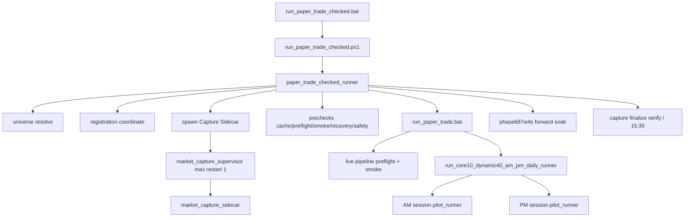
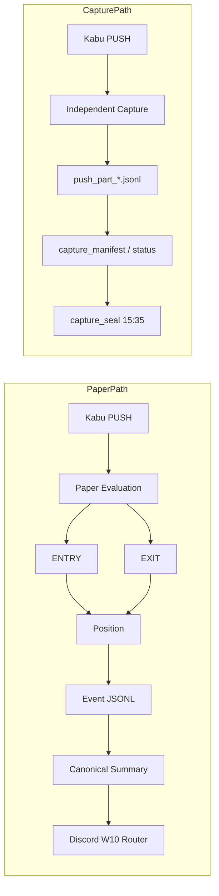
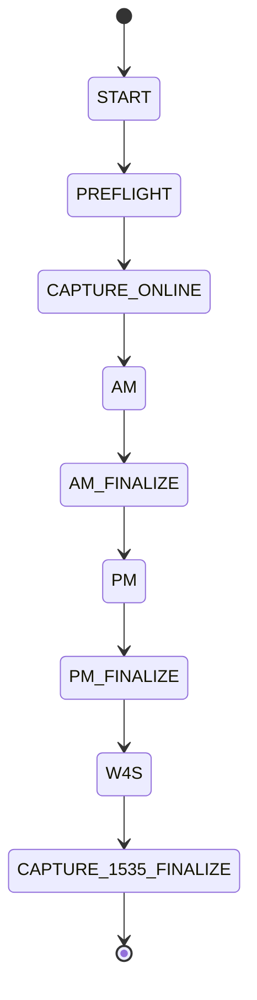

# TradeBot Current System Design Specification

# TradeBot 現行システム設計仕様書


**Version:** 2026.07.12  
**Generated (JST):** 2026-07-12T06:32:15+09:00  
**State:** PAPER TRADE ONLY — REAL ORDERS NOT AUTHORIZED / NOT IMPLEMENTED  
**Production YAML:** `configs/small_paper_pilot_q070_cap3_entry_price_risk_guard_trailing_mfe_shadow.yaml`  
**YAML SHA256:** `a20e40ed1bf52624478ecfecf73270a2e3f8df293b37ebcf9d5534ba410e4690`  
**Source of Truth:** Runtime BAT/PS1/Python/YAML (not historical Phase prose)


## 1. 文書概要

本書は 2026-07-12 時点の TradeBot Paper Runtime を、実コード到達性に基づき正式仕様化した設計書である。過去 Phase 文書は参考に留め、現行 `run_paper_trade_checked.bat` 起動経路と production YAML を優先する。


## 2. システム目的

- 日本株デイトレ候補を Paper（仮想）で評価し、ENTRY/EXIT・Summary・Discord・Capture Seal・W4S を運用する。
- 市場 PUSH を Capture Sidecar で独立保存し、Paper 障害でも当日テープを保全する。
- 実注文は未実装・未許可。Safety フラグと HARD_FAIL で実発注経路を封じる。


## 3. 対象範囲

- Checked Runner 起動〜Capture ONLINE〜Paper AM/PM〜W4S〜Capture 15:35 finalize
- production YAML の ENTRY/EXIT/Universe/Refresh/Discord/Seal
- Runtime Gate 28 ノード契約


## 4. 対象外

- 実注文送信・口座振替・本番資金移動
- research_long フル期間リプレイ（Monday Gate 除外）
- 廃止 Shadow（Exit Shadow Monitor, rise5 shadow, VWAP shadow reject）の再有効化前提


## 5. 全体アーキテクチャ

### A. 起動構成図



### B. Process 図

- **Checked Runner** (`paper_trade_checked_runner`) — 親オーケストレータ
- **Paper Runtime** (`pilot_runner` via AM/PM daily runner) — ENTRY/EXIT
- **Market Capture Sidecar** — 別 PID、15:35 まで
- **Discord Worker** — async fail-open
- **Kabu WebSocket** — Paper + Capture（dual WS 公式保証は未確定）
- **File Writer** — capture part JSONL / paper events / seals

### C. データフロー図



### D. Session lifecycle 図



### E. Registration ownership 図

- Paper は registration **owner/follower 協調**下で差分 refresh。
- Capture active 中: `safe_paper_unregister` が `unregister_all` を defer（W11A）。
- Capture reconnect: `clear_first=false`（registration 維持）。
- Code: `registration_lifetime.safe_paper_unregister` L306-359
- Sidecar は manifest follower — `unregister_all` 禁止。


## 6. 起動シーケンス

1. `run_paper_trade_checked.bat` → PowerShell Bypass → `run_paper_trade_checked.ps1`
2. `python -m small_paper.paper_trade_checked_runner`（`PaperTradeCheckedRunner.run` L1669-1801）
3. dotenv / disk / kabu readonly / universe / registration / **Capture start + ONLINE wait**
4. Paper prechecks（cache, preflight, smoke, recovery, design, safety flags）
5. `run_paper_trade.bat` を一度だけ起動
6. BAT 内: live pipeline preflight → production smoke → `run_core10_dynamic40_am_pm_daily_runner.py --universe-mode core10-dynamic40-price-risk-filter-shadow --enable-intraday-refresh --exit-policy-shadow trailing-mfe`
7. AM → PM → 戻って W4S → Capture finalize verify（live は 15:35 継続可）


## 7. Process / Thread構成

| Process | PID関係 | 備考 |
|---|---|---|
| Checked Runner | 親 | precheck+orchestrate |
| Capture Sidecar | 別PID（supervisor配下） | Paper失敗独立、restart<=1 |
| Paper BAT → AM/PM runner → pilot | 子 | AM/PM順次 |
| Discord async worker | Paper/Checked内スレッド| fail-open |
| Capture writer thread | Sidecar内 | queue/overflow |


## 8. ディレクトリ構成

詳細は `tradebot_directory_map.md`。主要:
- `kabu_native/src/small_paper/` runtime
- `kabu_native/configs/` production YAML
- `kabu_native/data/market_capture/YYYYMMDD/` Capture
- `kabu_native/results/small_paper/` Paper artifacts
- `kabu_native/runtime/` registration lock/manifest
- `docs/current_system_design/` 本書


## 9. 環境変数と設定ファイル

- Config SoT: `configs/small_paper_pilot_q070_cap3_entry_price_risk_guard_trailing_mfe_shadow.yaml` (sha256=`a20e40ed1bf52624478ecfecf73270a2e3f8df293b37ebcf9d5534ba410e4690`)
- Pin: `configs/production_config_sha256.pin`
- `.env` via `small_paper.env_loader`（Webhook URL はログに出さない）
- 詳細: `tradebot_environment_variables.md` / `tradebot_config_reference.csv`


## 10. Universe設計

- Mode: `core10-dynamic40-price-risk-filter-shadow`（BAT 固定）
- Core10 + Dynamic40、**最大50**（Kabu PUSH 登録上限）
- Price-risk filtering 適用
- Open position carry 優先、previous subscription keep on degraded refresh
- `open_symbols_exceed_cap` → CONTINUE（`will_stop=false`）


## 11. Kabu Station接続設計

- 前提: Kabu Station 起動・ログイン・API 利用可
- Readonly readiness: checked runner `step_kabu_readonly`
- Paper PushSource default: Kabu direct WS
- Capture: preferred PASSIVE_DUAL_WEBSOCKET（公式保証は未確定）


## 12. WebSocket / Registration設計

- Registration SoT: `runtime/market_registration_manifest.json` + lock
- Refresh: generation 付き差分更新
- Capture active: Paper `unregister_all=0`、reconnect `clear_first=false`
- Code: `market_capture_registration.py`, `registration_lifetime.py`


## 13. Market Capture Sidecar設計

- 別 PID / Paper failure 独立 / **15:35 JST** finalize
- Supervisor `MAX_AUTO_RESTARTS=1`（`market_capture_supervisor.py`）
- Part rotation: `max(existing)+1`、`O_CREAT|O_EXCL`（`market_capture_writer.py`）
- heartbeat / PID file / queue overflow → dropped_event / DEGRADED
- registration mismatch / sequence / manifest / seal / metrics
- disk full / malformed PUSH / reconnect / finalize
- **W11A**: Paper は Capture active 中 unregister しない；Windows PID probe は OpenProcess


## 14. Paper Runtime設計

- Core: `pilot_runner` push pipeline → ExposureGate → Observer positions
- Gate: `ExposureGate.evaluate_entry` L235-698
- paper_only=true, dry_run=true, shadow_only=true (YAML)
- live_trading_enabled=false, order_enabled=false


## 15. ENTRY設計

| 条件名 | status | config key | 現行値 | 入力 | 判定 | reject reason | Runtime file/function | actual/shadow | 変更可否 |
| --- | --- | --- | --- | --- | --- | --- | --- | --- | --- |
| PBv2 profile / entry_score_v2 | MAINLINE_ACTIVE | entry_profile / entry_score_v2_min / momentum_score_cutoff_max | momentum_volume_v2 / min=3 / cutoff<=0.2546 | entry_expectancy_score_v2, momentum_continuation_score, board tier | score_v2>=min AND momentum_score_cutoff_pass AND board_mid_or_high | entry_score_v2_below_threshold / momentum_low_required | src/research/exposure_gate.py::ExposureGate.evaluate_entry L235-698 | actual | YAML+pin; strategy change needs GO |
| Momentum low (explicit cutoff) | MAINLINE_ACTIVE | momentum_score_cutoff_max | 0.2546 | momentum_continuation_score | score <= cutoff (Phase472 PBv2) | momentum_low_required | src/research/exposure_gate.py::evaluate_entry + entry_expectancy_score_shadow.momentum_score_cutoff_pass | actual | config |
| Board mid/high required | MAINLINE_ACTIVE | (derived with entry_score_v2) | board_mid_or_high_required_for_v2 | board imbalance / board tier tokens | board mid or high required for v2 accept | entry_score_v2_below_threshold | src/small_paper/entry_expectancy_score_shadow.py::board_mid_or_high_required_for_v2 | actual | code |
| OR Open Strength Overlay | MAINLINE_ACTIVE | or_overlay_enabled / cap_pbv2 / cap_or / or_max_update_count | true / 4 / 1 / 8 | OR open strength features, update_count | CAP_SPLIT_4_1: PBv2<=4, OR<=1, total<=5 | or_cap_full / pbv2_cap_full | src/small_paper/or_overlay_entry.py + pilot_runner._maybe_try_or_overlay_entry | actual | config |
| Price Risk Guard | MAINLINE_ACTIVE | entry_price_risk_guard_enabled / min_entry_price / max_tick_ratio_pct / apply_mode | true / 50.0 / 5.0% / reject_entry | entry price, tick size ratio | price>=min AND tick_ratio<=max; apply reject_entry | entry_price_risk_guard | src/research/exposure_gate.py::evaluate_entry | actual (shadow flag true for audit) | config |
| High Drift Pullback | MAINLINE_ACTIVE | high_drift_guard_enabled | true | day_high distance, r5/r10/r15, dynamic40 | dynamic40 AND ((dh>=1.2% AND r10<-0.15% AND r5>r10) OR (dh>=1.5% AND (r15<-0.5% OR r5<-0.5%))) | high_drift_pullback | src/research/exposure_gate.py::evaluate_entry | actual | config |
| Weak Shape | MAINLINE_ACTIVE | weak_shape_reject_enabled | true | opening_peak / slow_opening_peak shape labels | reject opening_peak / slow_opening_peak at ENTRY | weak_shape_reject | src/research/exposure_gate.py::evaluate_entry | actual | config |
| Late Chase Guard | MAINLINE_ACTIVE | late_chase_guard_enabled | true | r10, day_high_distance | r10<0.3719 AND day_high_distance<1.1872 → reject | late_chase_guard | src/research/exposure_gate.py::evaluate_entry + late_chase_guard | actual | config |
| Classic RSI late chase | MAINLINE_ACTIVE | classic_late_chase_rsi_guard_enabled / threshold | true / 80.0 | late_chase_cluster flag, RSI14 | late_chase_cluster AND RSI14>=threshold | classic_late_chase_rsi_over80 | src/small_paper/classic_late_chase_rsi_guard.py + exposure_gate | actual | config |
| Reentry RSI | MAINLINE_ACTIVE | reentry_rsi_guard_enabled / threshold | true / 60.0 | prior stop_hit, RSI14 | re-entry after stop_hit requires RSI14>threshold | reentry_rsi_guard_below60 | src/research/exposure_gate.py::evaluate_entry | actual | config |
| Entry Quality G9 | MAINLINE_ACTIVE | entry_quality_guard_enabled / max_spread_bps / max_update_count | true / 50.0 / 5 | spread_bps, update_count | require spread<=50bps AND update_count<=5 | entry_quality_guard_spread / entry_quality_guard_update_count | src/small_paper/entry_quality_guard.py | actual | config |
| Entry Cluster Guard | MAINLINE_ACTIVE | entry_cluster_guard_enabled / reject_clusters / exception / liquidity_burst | true / clusters=[5] / csubs=[] / exception=true / thr=0.052267 | cluster model features, liquidity_burst | reject cluster5 unless E4 liquidity_burst exception | entry_cluster_guard | src/small_paper/entry_cluster_guard.py | actual | config+model json |
| Flat-band mainline | MAINLINE_ACTIVE | pbv2_flat_band_mainline_enabled (+ threshold keys) | true; rise5[0.0,0.5] rise10[-0.5,0.5] overheat>=2.0 | entry_rise_5min_pct, entry_rise_10min_pct, PBv2 pool | flat band + overheat evaluate_flat_plus_overheat | flat_band_mainline | src/small_paper/pbv2_flat_band_entry_guard.py | actual (shadow flag false) | config |
| Near day-high + low momentum (Dynamic40) | MAINLINE_ACTIVE | enable_near_day_high_low_momentum_dynamic40_guard | true | dynamic40, day-high proximity, momentum | production ENTRY reject for D40 near-high low-mom | near_day_high_low_momentum_dynamic40_guard | src/research/exposure_gate.py::evaluate_entry | actual | config |
| Position cap | MAINLINE_ACTIVE | max_concurrent_positions / position_cap_mode / position_cap_release / cap_pbv2 / cap_or | 5 / true / structural_exit / 4/1 | open position count by pool | total<=5 with OR split; release on structural exit | max_concurrent / pbv2_cap_full / or_cap_full | pilot_runner + exposure_gate + or_overlay_cap | actual | config |
| same_symbol_open_policy | MAINLINE_ACTIVE | same_symbol_open_policy | no_overlap_replace | open positions for symbol | reject ENTRY while same symbol open (no overlap replace chain) | REJECT_SAME_SYMBOL_OPEN_OVERLAP | src/small_paper/pilot_runner.py::_maybe_reject_same_symbol_open_overlap | actual | config |
| Allowed trading windows | MAINLINE_ACTIVE | allowed_trading_windows / use_market_time_window | 09:05-11:23, 12:33-15:20; use_market_time_window=true | market clock JST | outside window → reject | outside_allowed_trading_window | src/research/exposure_gate.py::evaluate_entry | actual | config |
| Stale price / board freshness | MAINLINE_ACTIVE | entry_freshness_guard_enabled / entry_max_price_age_sec / entry_max_board_age_sec / freshness_semantics_v2 | true / 3.0s / 3.0s / v2=True | CurrentPriceTime, board update time, event age | price/board age <=3s; trade_stale tag_only at 10s | freshness/stale reject (scan controller) | src/small_paper/entry_scan_controller.py + pilot_runner | actual | config |
| Daytrade suitability | MAINLINE_ACTIVE | daytrade_suitability_enabled / rule / apply_mode | true / volatility_liquidity_top50 / reject_entry | vol/liq ranking prior sessions | reject if not in suitability set | daytrade_suitability | src/small_paper/daytrade_suitability_gate.py | actual | config |
| Stop Low MFE Guard | NOT_RUNTIME_REACHABLE | stop_low_mfe_guard_enabled | false | n/a (disabled) | gate branch not taken when false | stop_low_mfe_guard (unused) | src/research/exposure_gate.py::evaluate_entry (guard None when disabled) | OFF | must stay false unless explicit GO |
| Daily loss / risk cluster | MAINLINE_ACTIVE | daily_loss_guard_enabled / daily_loss_guard_pct / risk_cluster_* | true / -2.5% / consecutive=5 | session PnL, consecutive losses | block further ENTRY when tripped | daily_loss_guard / risk_cluster_block | src/research/exposure_gate.py::evaluate_entry | actual | config |


### candidate → accept → reject

1. PUSH → candidate trade 構築
2. freshness / scan batch / same-symbol / universe membership
3. `ExposureGate.evaluate_entry`（上記表の順で reject 可）
4. OR overlay / position cap 分割
5. accept → observer open + Discord TRADE_ACTUAL；reject → JSONL + 条件により CAP_BLOCKED


### reject reason 一覧（本線）

`momentum_low_required`, `entry_score_v2_below_threshold`, `entry_price_risk_guard`, `high_drift_pullback`, `weak_shape_reject`, `late_chase_guard`, `classic_late_chase_rsi_over80`, `reentry_rsi_guard_below60`, `entry_quality_guard_spread`, `entry_quality_guard_update_count`, `entry_cluster_guard`, `flat_band_mainline`, `near_day_high_low_momentum_dynamic40_guard`, `daytrade_suitability`, `outside_allowed_trading_window`, `max_concurrent`, `pbv2_cap_full`, `or_cap_full`, `REJECT_SAME_SYMBOL_OPEN_OVERLAP`, `max_entries_per_scan`, `daily_loss_guard`, `risk_cluster_block`, `symbol_cooloff`, `outside_refresh_universe`, `am_pm_entry_stop`


## 16. EXIT設計

| 条件名 | status | config key | 現行値 | 入力 | 判定 | exit reason | Runtime file/function | actual/shadow |
| --- | --- | --- | --- | --- | --- | --- | --- | --- |
| Hard Stop -1.2% | MAINLINE_ACTIVE | discord_hard_stop_pct (Observer hard_stop_pct default 1.20) | 1.20% | entry_price, mark price | price <= entry*(1-0.012) → stop_hit | stop_hit | src/small_paper/observer_position_tracker.py (hard_stop_pct=1.20) | actual |
| Board Dynamic Trailing | MAINLINE_ACTIVE | structural_exit_policy=combined_structural_exit_v1_trailing_mfe_shadow | board_high: activate 1.0% giveback 60%; board_low: activate 0.6% giveback 40%; split@47.62 | peak_pnl, pnl, entry_imbalance_percentile | peak>=activate AND pnl<=peak*giveback | trailing_mfe_exit | src/research/structural_exit_policies.py::trailing_mfe_params + board_dynamic_trailing_shadow.py | actual (+ legacy 0.8%/50% shadow counterfactual logs) |
| No Progress Exit | MAINLINE_ACTIVE | no_progress_exit_enabled | true (linmfe_t900_i0p6_s0p05_c0p8_p0p3) | hold_sec, MFE, pnl | hold>=900s, required MFE 0.6+0.05/5m cap 0.8, pnl<0.3% | no_progress_exit | src/small_paper/no_progress_exit.py + observer_position_tracker | actual |
| Session end exit/finalize | MAINLINE_ACTIVE | live.session_end / AM-PM runner session boundaries | AM end ~11:25; PM/session_close at session end | session clock, open positions | force close remaining → session_close | session_close | observer_position_tracker + am_pm_daily_runner | actual |
| Stop Low MFE Guard | NOT_RUNTIME_REACHABLE | stop_low_mfe_guard_enabled | false | n/a | disabled | n/a | exposure_gate stop_low_mfe branch OFF | OFF |
| Exit Shadow Monitor (T2/T3) | NOT_RUNTIME_REACHABLE | exit_shadow_monitor_enabled / t2 / t3 | false / false / false | n/a | disabled (Phase669 removed from portfolio) | n/a | realtime_board_exit_shadow / exit shadow monitor OFF | OFF |

- Trailing params: `trailing_mfe_params` L131-137
- Observer: class L162-1190
- Time bases: `observer_entry_time`, market entry time, `CurrentPriceTime`; stale → tag/skip per freshness_semantics_v2
- EXIT 二重防止: SafetySM / observer close idempotency（同一 position 再 close 抑制）
- PnL: `yen_100` 正規化；MFE/MAE を event/summary に記録
- EXIT reasons: `stop_hit`, `trailing_mfe_exit`, `no_progress_exit`, `session_close`
- **OFF:** Stop Low MFE Guard / 旧 Exit Shadow Monitor = NOT_RUNTIME_REACHABLE


## 17. Position / Exposure管理

- max_concurrent=5, position_cap_mode=true, release=structural_exit
- OR split cap_pbv2=4 cap_or=1
- same_symbol_open_policy=no_overlap_replace


## 18. Intraday Refresh設計

- 10:00 AM refresh / 14:30 PM refresh（`am_pm_daily_runner.AM_REFRESH_HHMM/PM_REFRESH_HHMM`）
- open position carry → fill to 50；registration lock + generation
- failure / exceed_cap: keep previous subscription, CONTINUE
- Code: `src/universe/intraday_refresh.py`, `pilot_runner` refresh path ~L6279+


## 19. AM/PM Session設計

- Orchestrator: `src/runner/am_pm_daily_runner.py`
- AM ends ~11:25; PM screen ~12:25; trading windows YAML 準拠
- Summary preservation: `am_pm_summary_preservation`


## 20. 同一銘柄ポリシー

`same_symbol_open_policy: no_overlap_replace` — 保有中同一銘柄の新規 ENTRY を reject。


## 21. Shadow / Research設計

| name | class | affects_mainline | config | runtime |
| --- | --- | --- | --- | --- |
| I Shadow (readiness precision) | SHADOW | no | readiness_precision_shadow_enabled=true | src/small_paper/readiness_forward_shadow.py |
| H Shadow (readiness economics / refined H) | SHADOW | no | readiness_economics_shadow_enabled / readiness_refined_h_shadow_enabled=true | src/small_paper/readiness_forward_shadow.py |
| C Shadow (microsequence recovery-fail) | SHADOW | no | microsequence_recovery_fail_shadow_enabled=true | src/small_paper/microsequence_recovery_fail_forward_shadow.py |
| Flat Weak Range | SHADOW | no | flat_weak_range_shadow_enabled=true | src/small_paper/flat_weak_range_forward_shadow.py |
| NP Logger | OBSERVABILITY_ONLY | no (logger only) | np_pre_entry_feature_logger_enabled=true | src/small_paper/np_pre_entry_feature_logger.py |
| Sector Heat | RESEARCH_ONLY | no | n/a in production YAML | research scripts (not Monday mainline path) |
| Position Sizing Shadow | RESEARCH_ONLY | no | n/a production sizing fixed paper | research / live capital dry-run only |
| Classic Technical Indicator Research | RESEARCH_ONLY | no | classic momentum forward shadow modules | src/small_paper/classic_momentum_forward_shadow.py |
| Volume gate relaxation V90/V80 | SHADOW | no (production remains V100) | volume_gate_relaxation_shadow_enabled=true | pilot_runner volume gate shadow |
| PBv2 rise5 shadow | DEPRECATED | no | pbv2_rise5_shadow_enabled=false | src/small_paper/pbv2_rise5_shadow.py |
| VWAP shadow reject | DEPRECATED | no | vwap_shadow_reject_enabled=false | src/small_paper/vwap_shadow_reject.py |
| Exit Shadow Monitor | NOT_RUNTIME_REACHABLE | no | exit_shadow_monitor_enabled=false | disabled |
| IHC portfolio counterfactual | SHADOW | no | runtime hook | src/small_paper/shadow_ihc_portfolio.py / ihc_shadow_counterfactual.py |

## 22. NP Pre-entry Logger設計

- `np_pre_entry_feature_logger_enabled=true`
- Logger only — **no reject / no ranking**
- `src/small_paper/np_pre_entry_feature_logger.py`


## 23. Discord通知設計

W10 Router SoT: `src/notify/discord_notification_router.py`


| category | env_keys | rate_limit | fallback |
| --- | --- | --- | --- |
| TRADE_ACTUAL | KABU_SMALL_PAPER_NOTIFY_WEBHOOK_URL / KABU_SMALL_PAPER_DISCORD_WEBHOOK_URL | dedupe only | none |
| SESSION_SUMMARY | KABU_SMALL_PAPER_NOTIFY_WEBHOOK_URL / KABU_SMALL_PAPER_DISCORD_WEBHOOK_URL | dedupe only | none |
| CAP_BLOCKED | KABU_SMALL_PAPER_CAP_BLOCKED_WEBHOOK_URL | 1 per symbol/session/reason via dedupe | none |
| OPERATIONS | KABU_DISCORD_OPERATIONS_WEBHOOK_URL | 15 min | none |
| MARKET_CAPTURE | KABU_DISCORD_MARKET_CAPTURE_WEBHOOK_URL / KABU_MARKET_CAPTURE_WEBHOOK_URL | 15 min | none |
| RESEARCH_SHADOW | KABU_DISCORD_RESEARCH_WEBHOOK_URL / KABU_SHADOW_DISCORD_WEBHOOK_URL | AM/PM by caller | none; no cross to TRADE |
| CRITICAL_SAFETY | KABU_DISCORD_CRITICAL_WEBHOOK_URL | 30 min | CRITICAL_OPERATIONS_FALLBACK_DEFAULT=false |

- async worker / fail-open / dedupe / retry / rate limit / HTTP 429 / audit / dead-letter
- secret masking / demo 分離 / actual/shadow 分離 / **cross fallback 禁止**
- webhook 未設定 → SKIP（取引は継続）
- **Webhook URL 本体は本書に記載しない**


## 24. Canonical Summary設計

`src/small_paper/canonical_summary.py` — AM/PM summary 正規化。Shadow summary hook: `shadow_summary_runtime_hook.py`。


## 25. Session Manifest / Seal設計

- SoT: `session_seal.json`（`w4s_seal_propagation.py`）
- pre-seal snapshot → required artifacts SHA256 + row counts → seal
- snapshot vs seal 不一致 → SNAPSHOT_SEAL_MISMATCH / hash mismatch
- post-seal mutation 検出で verified=false


## 26. W4S Forward Soak設計

- Module: `research.phase687w4s_runtime_readonly_forward_soak`
- 資格: `session_provenance=LIVE_PAPER_RUNTIME` + runtime_session=true
- fixture/test/synthetic/path markers 除外（`is_excluded_forward_path`）
- 実 Forward 3 session 蓄積待ち；AM/PM count policy は W4S aggregate


## 27. SafetySM設計

- `live_order_safety_sm_enabled=true` but `live_trading_enabled=false`
- DryRunBrokerAdapter / submit HARD_FAIL / write adapter absent
- actual submit=0 cancel=0 を checked runner / W4S が検証


## 28. Recovery設計

- Operational: `operational_recovery.py`（disk, reconnect）
- Stateful journal: `stateful_journal_recovery.py`
- Assertion oracle: `recovery_assertion_oracle.py`


## 29. 例外処理設計

API/WS 例外はログ + degraded；Discord 例外は fail-open；Capture queue overflow は drop+metrics；Safety 違反は fail-closed。


## 30. Fail-open / Fail-closed設計

| 領域 | 方針 |
|---|---|
| Discord notify | fail-open |
| Capture writer overflow | degrade, not crash Paper |
| Paper precheck safety flags | fail-closed |
| Capture required (default) | fail-closed for Paper start |
| Real order path | HARD_FAIL fail-closed |
| open_symbols_exceed_cap | soft-open CONTINUE |


## 31. ファイルI/O設計

JSONL append（events/push parts）、atomic JSON status/seal、O_EXCL part create、PID file、registration lock。


## 32. JSONL schema一覧

詳細は `tradebot_event_schema.md`（paper events / capture push_part / restart_history / discord audit）。


## 33. Discord schema一覧

`PAYLOAD_SCHEMA_VERSION=687W10.1` — `NotificationEnvelope` fields。詳細 `tradebot_discord_routing.md`。


## 34. 時刻・営業日設計

全て JST（`Asia/Tokyo`）。trading_date=`YYYYMMDD` runtime clock。固定日付定数で本番取引日を決めない。


## 35. Windows起動設計

```
cd C:\Users\yhach\Documents\tradebotfile && .\run_paper_trade_checked.bat
```
PCスリープ無効・時刻同期・空き容量・Kabu起動必須。


## 36. テスト設計

- Runtime Gate: 323 passed（W11B 時点契約；`scripts/run_runtime_gate.py`）
- W11A regression: 91 passed
- Phase640/645: 18 passed
- compileall PASS；strategy/canonical diff 0；external send 0；submit/cancel 0
- Gate nodes (28):

  - `tests/test_phase687w8_paper_trade_checked_runner.py`

  - `tests/test_phase687w4t_kabu_readonly_readiness.py`

  - `tests/test_phase687w9_market_capture_sidecar.py`

  - `tests/test_phase687w11a_monday_p1_fixes.py`

  - `tests/test_am_pm_daily_runner_session_dirs.py`

  - `tests/test_phase549_entry_cluster_guard_runtime.py`

  - `tests/test_phase413_no_overlap_replace_policy.py`

  - `tests/test_canonical_summary.py`

  - `tests/test_phase687w7a2_w4s_seal_propagation.py`

  - `tests/test_phase687w4s_forward_soak.py`

  - `tests/test_phase687w10_discord_notifications.py`

  - `tests/test_phase687w10a_shadow_runtime_hook.py`

  - `tests/test_phase687_np_pre_entry_feature_logger.py`

  - `tests/test_phase687w7_operational_recovery.py`

  - `tests/test_phase687w7a_stateful_recovery.py`

  - `tests/test_phase687w7a1_recovery_assertion_integrity.py`

  - `tests/test_phase687w6_production_enablement_gate.py`

  - `tests/test_phase687w5_kabu_order_contract.py`

  - `tests/test_phase687w2_live_order_safety.py`

  - `tests/test_kabu_register.py`

  - `tests/test_intraday_refresh.py`

  - `tests/test_phase176_intraday_refresh_degraded_behavior.py`

  - `tests/test_phase616b_extension_bus_session_end_fix.py`

  - `tests/test_phase662_observer_entry_time_freshness.py`

  - `tests/test_phase684_ihc_counterfactual.py`

  - `tests/test_phase650_pbv2_flat_band_shadow.py`

  - `tests/test_allowed_trading_windows.py`

  - `tests/test_position_cap_mode.py`


- research_long **23 files**: Monday Gate 除外 / nightly / timeout>=900s


## 37. Runtime Gate設計

- Manifest schema `687W11B.1` name=`monday_active_runtime_gate`
- exclude_markers=['research_long']
- contract_notes={"cluster_guard": "MAINLINE_ACTIVE entry_cluster_guard_enabled=true", "stop_low_mfe": "NOT_RUNTIME_REACHABLE stop_low_mfe_guard_enabled=false", "exit_shadow_monitor": "NOT_RUNTIME_REACHABLE exit_shadow_monitor_enabled=false", "flat_band": "MAINLINE_ACTIVE pbv2_flat_band_mainline_enabled=true", "ihc": "SHADOW_ACTIVE readiness/microsequence shadows", "same_symbol": "MAINLINE_ACTIVE no_overlap_replace", "open_symbols_exceed_cap": "CONTINUE will_stop=false"}


## 38. セキュリティ設計

- Webhook/API password を文書・ログに出さない（redact）
- Capture に password/token/Authorization/HoldID/orders を書かない
- Real order path HARD_FAIL


## 39. 運用手順

詳細: `tradebot_operations_runbook.md`


## 40. 障害時対応

- Capture DEGRADED/mismatch → OPERATIONS/MARKET_CAPTURE 通知確認、当日 seal まで維持
- Paper BLOCKED / Capture CONTINUES → Paper 再起動判断、Capture 停止禁止（15:35前）
- Discord SKIP → 取引継続、Webhook env 確認
- SNAPSHOT_SEAL_MISMATCH → artifact 改変調査、W4S 非計上


## 41. 現在の制約

- 実注文未実装（NOT AUTHORIZED / NOT IMPLEMENTED）
- W4S 実 Forward は実市場セッション蓄積待ち
- dual WebSocket 公式保証は未確定
- Capture 実市場干渉は月曜 Forward で確認
- research_long 未完（23 files / nightly）
- repo-state 依存テストあり
- 古い legacy tests あり
- NP Logger は日数蓄積待ち
- Shadow（I/H/C, Flat Weak Range 等）は採用前
- classic technical strategy は研究中
- GO / READY は実注文許可を意味しない


## 42. Research Debt

- research_long 23 files 未完了/nightly
- NP Logger 日数蓄積待ち
- I/H/C / Flat Weak Range 採用前
- classic technical strategy 研究中
- repo-state 依存テスト残


## 43. 未実装領域

- Real order send/cancel path（NOT IMPLEMENTED）
- dual WebSocket 公式保証
- Production enablement beyond paper


## 44. 変更管理

- YAML 変更は `production_config_sha256.pin` 同期必須
- Strategy/canonical 変更は別 GO；本書は観測仕様
- OFF 機能を黙って ON にしない


## 45. 用語集

| Term | Meaning |
|---|---|
| PBv2 | momentum_volume_v2 entry path |
| OR overlay | Open Strength overlay entry pool |
| W4S | Forward soak evaluator |
| W10 | Discord notification router |
| W11A | Capture registration lifetime fixes |
| Capture Sidecar | Independent market tape recorder |
| MAINLINE_ACTIVE | Affects accept/reject or lifecycle |
| SHADOW_ACTIVE | Logs counterfactual, no ENTRY block |
| NOT_RUNTIME_REACHABLE | Flag false / path unused |


## 46. 付録

- Runtime Contract: `tradebot_runtime_contract.csv`
- Component inventory: `tradebot_component_inventory.csv`
- Config reference: `tradebot_config_reference.csv`
- Machine JSON: `tradebot_current_system_design.json`
- Traceability: `tradebot_traceability_matrix.csv`
- Test matrix: `tradebot_test_matrix.csv`


## Runtime Contract 表

| Feature | Status | Current value |
| --- | --- | --- |
| Entry Cluster Guard | MAINLINE_ACTIVE | True |
| Stop Low MFE Guard | NOT_RUNTIME_REACHABLE | False |
| Exit Shadow Monitor | NOT_RUNTIME_REACHABLE | False |
| Flat-band | MAINLINE_ACTIVE | True |
| I/H/C | SHADOW_ACTIVE | readiness/microsequence shadows true |
| same-symbol | MAINLINE_ACTIVE | no_overlap_replace |
| open_symbols_exceed_cap | OBSERVABILITY_ONLY | continue (will_stop=false) |
| Discord Router | MAINLINE_ACTIVE | W10 |
| Registration lifetime | MAINLINE_ACTIVE | defer unregister while Capture active |
| live_trading_enabled | MAINLINE_ACTIVE | false |
| order_enabled | MAINLINE_ACTIVE | false |
| Hard Stop | MAINLINE_ACTIVE | 1.20% |
| Board Dynamic Trailing | MAINLINE_ACTIVE | board_high/low tiers |
| No Progress Exit | MAINLINE_ACTIVE | true |
| OR Overlay | MAINLINE_ACTIVE | cap 4/1 |
| NP Pre-entry Logger | OBSERVABILITY_ONLY | true |
| Flat Weak Range Shadow | SHADOW_ACTIVE | true |
| Market Capture Sidecar | MAINLINE_ACTIVE | required until 15:35 |
| W4S Forward Soak | MAINLINE_ACTIVE | LIVE_PAPER_RUNTIME only |
| Real Orders | NOT_IMPLEMENTED | NOT AUTHORIZED |

## Safety / Real Order（結論）

```
live_trading_enabled=false
order_enabled=false
DryRunBrokerAdapter
submit=0
cancel=0
write adapter HARD_FAIL / absent

REAL ORDERS: NOT AUTHORIZED / NOT IMPLEMENTED
GO判定は実注文許可ではない。
```
