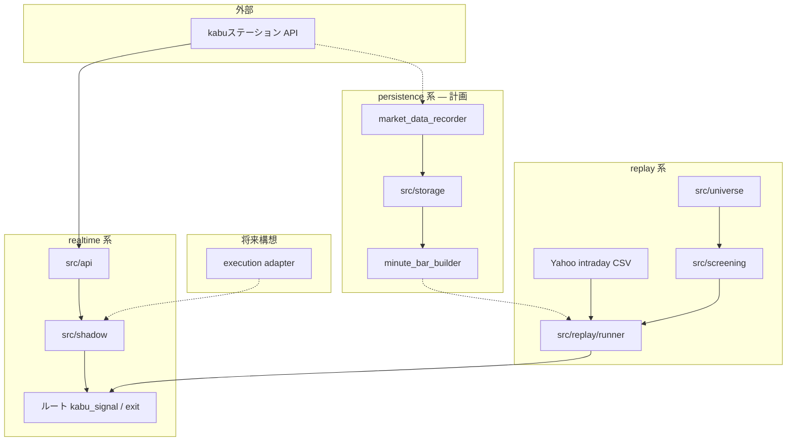
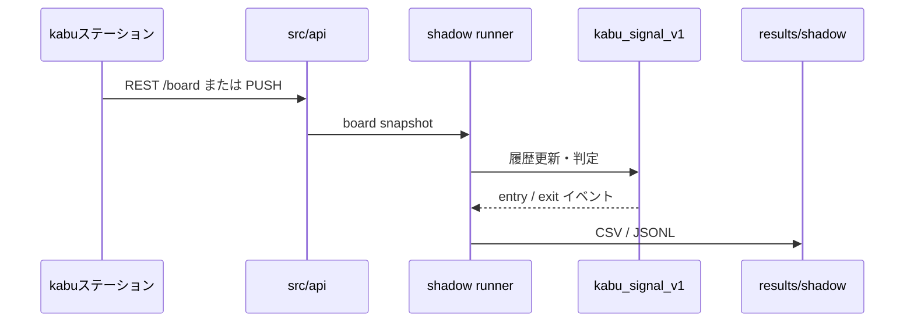
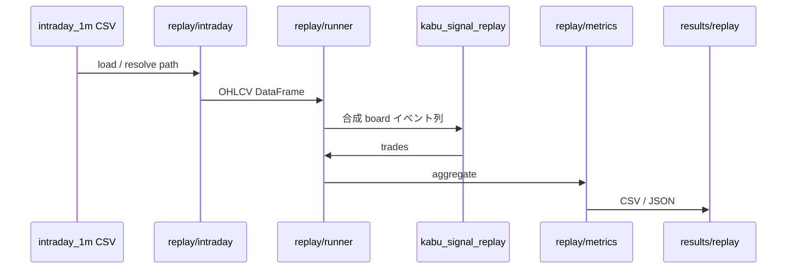

# 株ステーション連携システム — 詳細設計仕様書

**文書種別:** 詳細設計（Detailed Design）  
**対象:** `kabu_native/`（株ステーション® API 連携スタック）  
**前提:** [TODO.md](TODO.md)（Phase 1–15 完了状況・設計原則）  
**最終更新:** 2026-05-17  

---

## 凡例（実装状態の読み方）

| ラベル | 意味 |
|--------|------|
| **【実装済】** | コード・運用で利用可能 |
| **【部分実装】** | コアはあるが、本仕様の完成形ではない |
| **【未実装】** | 設計のみ。`.gitkeep` またはドキュメント上の計画 |
| **【将来構想】** | 現段階では有効化・本番利用しない |

本書では **現状・未実装・将来** を混同しない。各節末に状態を明示する。

---

# 1. システム概要

## 1.1 説明

**株ステーション連携システム**（以下 **kabu_native**）は、kabuステーション® API（REST / PUSH）を **一次データ源** とする、東証現物向けデイトレ支援のリアルタイム市場監視基盤である。

主要機能領域:

| 領域 | 内容 |
|------|------|
| 東証銘柄スクリーニング | universe 構築・朝スクリーニング（流動性・板・ギャップ等） |
| PUSH 配信監視 | WebSocket による板相当更新の受信（任意で shadow と併用） |
| replay / backtest | 過去データから `kabu_signal_v1` + `kabu_exit_v1` を再生し指標集計 |
| 将来の自動売買拡張 | 発注 adapter・リスク管理は **設計のみ**。現段階では無効 |

旧系（`yahoo_kabu_watch.py` + Yahoo 非公式 API）は **削除・統合しない**。並行運用し、データと成果物パスを分離する。

## 1.2 目的

| 目的 | 説明 |
|------|------|
| realtime と replay の完全統一 | 同一シグナル / EXIT エンジン（`kabu_signal_v1` / `kabu_exit_v1`）を live・再生の両方で使う |
| 市場構造ベース判定 | 寄り板安定化・大引け前 ENTRY 停止・BF confirm 等。**特定時刻・銘柄・日の最適化は採用しない** |
| 過学習回避 | 全銘柄 replay・ENTRY 品質（MFE/MAE）・trades 下限ルールで「trade 数だけ減らした改善」を除外 |
| 高速リアルタイム処理 | REST ポール + 任意 PUSH。将来は PUSH 中心に recorder → 1分足 → replay を一本化 |
| Yahoo 依存の段階的排除 | 場中は既に kabu のみ。**履歴 replay 入力** のみ Yahoo 由来 CSV が残る（Phase 16 で自前化） |

## 1.3 採用中の正式ルール（【実装済】）

shadow / replay 検証の **正** は Phase 13 採用ルール（[market_session_control.md](market_session_control.md)）:

- ENTRY: **09:05–14:50** JST（`entry_allowed()`）
- EXIT: `bf_confirm_count=2`, `fail_buffer_pct=0.12`, tier B
- **廃止:** `no_entry_until`（09:30 等の時間最適化ゲート）

> **【将来構想】** 発注連携時も、上記ルールをベースラインとし、別プロファイルで本番化しない。

---

# 2. 全体アーキテクチャ

## 2.1 データパイプライン（目標形）

```text
[株ステーション PUSH]
        │
        ▼
[market data recorder]     ← 【未実装】Phase 16
        │
        ▼
[JSONL storage]            ← data/push_jsonl/ 【未実装・空】
        │
        ▼
[minute bar builder]       ← 【未実装】Phase 16
        │
        ▼
[replay engine]            ← 【部分実装】runner.py（Yahoo CSV 合成経路が主）
        │
        ▼
[screening engine]         ← 【実装済】morning_screen + universe
        │
        ▼
[candidate engine]         ← 【部分実装】ルート kabu_signal_engine 参照
        │
        ▼
[shadow / future execution] ← shadow【実装済】 / execution【将来構想・無効】
```

## 2.2 サブシステム分割

### realtime 系 【部分実装】

| コンポーネント | 現状 | パス |
|----------------|------|------|
| REST 板ポール | 【実装済】 | `src/api/rest_client.py`, shadow `runner.py` |
| PUSH WebSocket | 【部分実装】 | `src/api/push_client.py`（register/受信可。常時 recorder なし） |
| シグナル / EXIT | 【実装済・ルート参照】 | `src/kabu_signal_engine.py`, `src/kabu_exit_engine.py` |
| shadow 仮想売買 | 【実装済】 | `src/shadow/runner.py` |
| 発注 | 【将来構想・無効】 | — |

評価トリガ: 既定は **REST `/board` ポール**；`--use-push` で PUSH リングへ併載。

### replay 系 【実装済（入力は Yahoo 由来あり）】

| コンポーネント | 現状 | パス |
|----------------|------|------|
| intraday 読込 | 【実装済】 | `src/replay/intraday.py` |
| バッチ replay | 【実装済】 | `src/replay/runner.py` |
| 集計 | 【実装済】 | `src/replay/metrics.py` |
| スイープ / 品質 / screen 統合 | 【実装済】 | `sweep_runner.py`, `entry_quality.py`, `screen_replay.py`, `session_control.py` |
| PUSH JSONL replay | 【未実装】 | Phase 17 |

エンジン本体はルート `src/kabu_signal_replay.py` を **import 参照**（`kabu_native/src/signals/` 未移植）。

### persistence 系 【未実装（ディレクトリのみ）】

| データ | パス | 状態 |
|--------|------|------|
| raw PUSH | `data/push_jsonl/` | `.gitkeep` のみ |
| 自前 1分足 | `data/intraday_1m/` | 空（正は将来ここ） |
| Yahoo 1分足（参照） | ルート `data/intraday_1m/` | 【実装済・read-only】540 symbol-days |
| shadow イベント | `results/shadow/` | 【実装済】 |
| replay 成果 | `results/replay/` | 【実装済】 |

## 2.3 レイヤ図（現行 + 計画）



---

# 3. 現在の実装状況

## 3.1 機能一覧

| 機能 | 状態 | 備考 |
|------|------|------|
| PUSH 受信 | **PARTIAL** | `KabuNativePushClient` 実装済。shadow は `--use-push` 任意。常時 JSONL 保存なし |
| REST / トークン | **DONE** | Phase 1。`check_api.py` |
| universe | **DONE** | Phase 2。`build_universe.py` |
| morning screening | **DONE** | Phase 3 |
| replay（バッチ） | **DONE** | Phase 4, 7–11, 13。入力は主に Yahoo CSV → 合成 board |
| 構造分析 / スイープ | **DONE** | Phase 6–10 |
| 市場セッション制御 | **DONE** | Phase 13。`session_control.py` |
| shadow（仮想売買） | **DONE** | Phase 14–15。発注・Discord なし |
| Discord 通知 | **DISABLED** | `shadow.yaml` safety 固定 false |
| execution（実発注） | **DISABLED** | 設計のみ §8 |
| minute bars（自前） | **TODO** | Phase 16 |
| market data recorder | **TODO** | Phase 16 |
| `src/storage/` | **TODO** | `.gitkeep` のみ |
| `src/signals/` 移植 | **TODO** | エンジンはルート `src/` 参照 |

## 3.2 完了フェーズ（【実装済】）

| Phase | 内容 |
|-------|------|
| 1 | API 層（REST / PUSH） |
| 2 | Universe |
| 3 | Morning screen |
| 4 | Replay 基盤 |
| 5 | Intraday 在庫監査 |
| 6–7 | 構造分析・全銘柄 replay |
| 8–11 | スイープ・ENTRY 品質・組合せ・screen×replay |
| 13 | 市場セッション制御（正式ルール） |
| 14–15 | Shadow・安全チェック |

Phase 12 は未定義。Phase 16 以降は §11。

## 3.3 Yahoo 依存（現状の残存）

| 依存 | 影響範囲 | realtime |
|------|----------|----------|
| ルート `data/intraday_1m/*.csv` | replay 主入力 | **未使用** |
| `push_messages_from_yahoo_df` 合成 | replay イベント生成 | **未使用** |
| 銘柄 `.T` suffix | パス・表示 | 表示のみ |

詳細: [TODO.md §4](TODO.md)。

---

# 4. データフロー

## 4.1 realtime 【部分実装】



| ステップ | 説明 | 状態 |
|----------|------|------|
| PUSH 受信 | WS メッセージをパース。変更時のみ配信 | 【部分実装】 |
| tick 処理 | kabu PUSH は raw tick ではなく板相当更新 | 【実装済】理解・ドキュメント化 |
| structure analysis | BF streak・breakout・VWAP 距離等 | 【実装済】エンジン内 |
| screening | 場中は watchlist（朝スクリーニング結果）で銘柄限定 | 【実装済】 |
| candidate 更新 | スコア・ENTRY 許可（session gate）・仮想ポジション | 【実装済】shadow |

**欠落（Phase 16）:** PUSH の append-only 永続化、recorder による欠損補完ログ。

## 4.2 replay 【実装済・入力経路に制約あり】



| ステップ | 説明 | 状態 |
|----------|------|------|
| minute bars 読込 | `data_roots` 優先: 新系 → 旧系 Yahoo CSV | 【実装済】 |
| replay clock | 1分足行を時系列で合成イベント化 | 【実装済】 |
| screening 再現 | `--morning-screen` / universe で銘柄集合を切替 | 【実装済】 |
| candidate 生成 | 同一 `kabu_signal_v1` 閾値（tier, score min） | 【実装済】 |
| metric 計測 | PF, win rate, exit_reason 内訳等 | 【実装済】 |

**lookahead 禁止:** 各行のタイムスタンプ以前の履歴のみで判定（リプレイエンジン契約）。  
**deterministic:** 同一入力 CSV + 設定 → 同一 trades（再現性を Phase 検証で利用）。

## 4.3 persistence 【未実装】

| 層 | 形式 | 用途 | 状態 |
|----|------|------|------|
| raw push | `push_jsonl/YYYYMMDD/<symbol>.jsonl` | 監査・高忠実度 replay | 【未実装】 |
| normalized events | 正規化 board スナップショット列 | エンジン直入力 | 【未実装】 |
| minute bars | `intraday_1m/YYYY-MM-DD/<symbol>.csv` | バッチ replay 正 | 【未実装・新系パス空】 |
| replay datasets | run メタ + trades + skipped | 検証成果物 | 【実装済】`results/replay/` |

---

# 5. モジュール設計

> 以下の **ファイル名** は目標モジュール名。現行コードとの対応を各節に記載。

## 5.1 `market_data_recorder.py` 【未実装 — Phase 16】

**配置予定:** `kabu_native/src/storage/market_data_recorder.py`

### 役割

- 場中の kabu **PUSH**（および必要なら REST `/board`）を欠損なく永続化
- shadow / replay と **別プロセスまたは shadow 内フック** で並走可能

### 入力 / 出力

| 方向 | 内容 |
|------|------|
| 入力 | PUSH payload（JSON）、任意で REST board レスポンス |
| 出力 | `data/push_jsonl/YYYYMMDD/<symbol>.jsonl`（または `push_YYYYMMDD.jsonl` 統合形式） |

### 必要機能

| 機能 | 要件 |
|------|------|
| flush | バッファ定期 flush（例: 1s / N 行） |
| crash 耐性 | append-only。途中 kill でも既存行は破損しない |
| append only | 上書き・削除禁止。ローテーションは日付パーティション |
| trading day partition | JST `YYYYMMDD` でディレクトリ分割 |
| JSONL rotation | サイズ上限時は同一日内で連番ファイル（将来） |

### 現状

- `data/push_jsonl/` は `.gitkeep` のみ
- shadow はメモリリングのみで **ディスク未保存**

---

## 5.2 `minute_bar_builder.py` 【未実装 — Phase 16】

**配置予定:** `kabu_native/src/storage/minute_bar_builder.py`

### 役割

- tick / PUSH 更新列から **確定 1 分足** を構築
- replay の primary 入力を `kabu_native/data/intraday_1m/` に移行

### 要件

| 要件 | 説明 |
|------|------|
| OHLCV | 1分枠の Open/High/Low/Close/Volume |
| VWAP | セッション累積ベース（kabu フィールドと定義整合） |
| session handling | 前場・後場のセッション ID / 取引所状態 |
| lunch break handling | 昼休み中は bar 確定を止める、または volume=0 扱いを明示 |

### 出力スキーマ（目標）

旧系 CSV と互換列を維持し、`replay/intraday.py` の `load_intraday_csv` がそのまま読めること。

### 現状

- replay は Yahoo 由来 CSV を `push_messages_from_yahoo_df` で合成イベント化（【実装済・暫定経路】）

---

## 5.3 `replay_engine.py` 【部分実装】

**現行:** `kabu_native/src/replay/runner.py` + ルート `src/kabu_signal_replay.py`

### 役割

- realtime と **同一ロジック** で過去を再生
- マルチ日・マルチ銘柄バッチ、`skipped_inputs` の完全記録

### 重要制約

| 制約 | 実装方針 |
|------|----------|
| lookahead 禁止 | イベント時刻 ≤ 現在 replay 時刻のみ参照 |
| deterministic replay | 固定 seed・固定合成密度（`synthetic_events_per_minute`） |
| clock simulation | 1分足行タイムスタンプ → 合成 PUSH 時刻 |

### replay 専用分岐の禁止

- `if replay: ... else: ...` でシグナル条件を変えない
- 許容: **入力アダプタ**（Yahoo CSV vs PUSH JSONL）のみ分岐
- 許容: `relaxed_signal` は検証用フラグとして config で明示（本番 shadow では既定 off）

### 現状ギャップ

| 項目 | 状態 |
|------|------|
| Yahoo CSV → 合成 board | 【実装済】主経路 |
| 自前 1分足 | 【未実装】 |
| PUSH JSONL 直再生 | 【未実装】Phase 17 |

---

## 5.4 `screening_engine.py` 【実装済】

**現行:** `src/universe/`, `src/screening/morning_screen.py`

### 役割

| 機能 | 説明 |
|------|------|
| universe 判定 | 流動性・価格帯・ETF 除外等（`configs/universe.yaml`） |
| VWAP / 板 | kabu `/board` 実測による朝スコア |
| breakout  proxy | ギャップ・前日比・出来高加速等（スクリーニングスコア） |
| liquidity | 売買代金・板厚み |
| volatility | 日中レンジ見込み等（設定依存） |

### 入出力

| 方向 | パス |
|------|------|
| 入力 | `data/universe/`, kabu REST |
| 出力 | `results/morning_screen/YYYYMMDD/` |

### replay との関係

- Phase 11: walk-forward top-N screen vs universe 全体の replay 比較 【実装済】
- live `morning_screen` と replay proxy の差は shadow で継続検証（【運用課題】）

---

## 5.5 `candidate_engine.py` 【部分実装】

**現行:** ルート `src/kabu_signal_engine.py`（`KabuBoardSnapshot` → スコア・ENTRY）

kabu_native 内の薄いラッパ・分析:

- `src/replay/entry_quality.py` — MFE/MAE/継続率
- `src/replay/combined_candidates.py` — ルール組合せ
- `src/replay/session_control.py` — `entry_allowed()`

### 役割（目標責務）

| 項目 | 説明 |
|------|------|
| Entry | breakout + スコア閾値 + session gate |
| Stop / Take | `kabu_exit_v1`（hard_stop, BF, tier） |
| score | `signal_score` 等 |
| ranking | morning_screen 順位・replay 内の銘柄優先度 |

### 移植計画

`src/signals/` へエンジンを移し、shadow / replay が同一パッケージを import（【未実装】）。

---

## 5.6 `shadow_executor.py` 【実装済 — 名称は `shadow/runner.py`】

**現行:** `kabu_native/src/shadow/runner.py`, `events.py`, `config.py`

### 役割

| 機能 | 説明 |
|------|------|
| 仮想売買 | ENTRY/EXIT を CSV/JSONL に記録。API 発注なし |
| performance tracking | 仮想ポジション・peak・BF streak |
| PF / MFE / MAE | 場中はイベント列；集計は replay 側が主 |

### 安全制約 【実装済】

- `configs/shadow.yaml` → `safety.*` すべて false
- `check_shadow_safety.py` で機械検証（Phase 15）

### エントリ

```bash
python kabu_native/scripts/run_shadow.py
python kabu_native/scripts/check_shadow_safety.py
```

---

# 6. replay 設計思想

## 6.1 原則 【実装済・運用必須】

| # | 原則 | 状態 |
|---|------|------|
| 1 | realtime と **コード共有**（同一 signal/exit） | 【実装済】ルート import |
| 2 | replay 専用分岐 **禁止**（アダプタ除く） | 【方針・要レビュー】`relaxed_signal` は検証のみ |
| 3 | 特定日最適化 **禁止** | 【文書化】[TODO.md §6](TODO.md) |
| 4 | 特定銘柄最適化 **禁止** | 【文書化】9984 集中は構造分析で監視 |
| 5 | 特定時刻最適化 **禁止** | 【実装済】`no_entry_until` 廃止、Phase 13 |
| 6 | **市場構造のみ** 利用 | 09:05 寄り安定、14:50 大引け前、BF confirm=2 |
| 7 | 全銘柄 replay で改善確認 | `universe_intraday_full.csv`（27 銘柄） |
| 8 | trades 減少だけの改善 **禁止** | Phase 8: `trades < max(45, baseline×0.55)` 除外 |

## 6.2 評価指標

| 指標 | 定義 / 用途 | 実装 |
|------|-------------|------|
| **PF** (profit factor) | 総利益 / \|総損失\| | `metrics._summary_block` |
| **win rate** | 勝ち trade 比率 | 同上 |
| **MFE** | 最大有利方向変動 | `entry_quality.py` |
| **MAE** | 最大不利方向変動 | 同上 |
| **expectancy** | 期待値（PnL/trade） | 分析スクリプト |
| **continuation rate** | breakout 後の継続率 | Phase 9 |

replay 改善の採用は **total_pnl のみで決めない**。Phase 9 の MFE・継続率を必ず併記。

## 6.3 検証パイプライン（【実装済】）

```text
run_replay.py
  → structure_analysis (analyze_replay_results.py)
  → phase8 sweep → phase9 entry quality
  → phase10 combined → phase11 screen replay
  → phase13 session control（正式ルール決定）
  → shadow live 検証
```

---

# 7. market session 設計

## 7.1 東証現物の扱い

| 区分 | JST（目安） | 設計上の扱い |
|------|-------------|--------------|
| 寄り付き | 09:00 | ENTRY 不可（板安定前） |
| ENTRY 開始 | **09:05** | 寄り板・気配安定化後 【正式】 |
| 前場 | 09:00–11:30 | 取引可能。昼休み前の ENTRY は 14:50 ルール内 |
| 昼休み | 11:30–12:30 | PUSH 停止の可能性。REST は日により可 |
| 後場 | 12:30–15:00 | 取引再開 |
| ENTRY 終了 | **14:50** | 新規 ENTRY 禁止 【正式】 |
| 引け | 15:00 | 未決済は `eod_close` 等で replay 終了 |

実装: `src/replay/session_control.py` — `entry_allowed(ts) -> bool`

## 7.2 必要機能

| 機能 | 状態 | 備考 |
|------|------|------|
| session state machine | 【部分実装】 | ENTRY 窓のみ。前場/後場/昼の明示 FSM は将来 |
| market open detection | 【実装済】 | 09:05 ゲート |
| lunch handling | 【部分実装】 | API ドキュメント・shadow ログで PUSH 停止を想定。bar builder は未実装 |
| close handling | 【実装済】 | 14:50 ENTRY 停止、replay `eod_close` |

## 7.3 設定

- `configs/session_control.yaml`
- `configs/replay.yaml` — `market_session_control`, `session_entry_*`
- `configs/shadow.yaml` — Phase 13 ルールと整合

---

# 8. 将来の execution 設計 【将来構想 — 現段階無効】

> **警告:** 本節は設計参考のみ。**現段階で自動発注を有効化しない。**

## 8.1 現状

| 項目 | 状態 |
|------|------|
| kabu 発注 API 呼び出し | **なし** |
| paper_trade 連携 | **なし**（旧系と分離） |
| shadow | 仮想ポジションのみ 【実装済】 |

## 8.2 将来コンポーネント（構想）

```text
[candidate_engine]
        │
        ▼
[order adapter]      ← kabu 発注 API 抽象化
        │
        ▼
[order manager]      ← 注文状態・約定照合
        │
        ├── [risk manager]      ← 1日損失上限・銘柄上限
        ├── [position manager]  ← 建玉・余力
        └── [emergency stop]    ← 全キャンセル・プロセス停止
```

| モジュール | 責務 |
|------------|------|
| 発注 adapter | 現物買い/売り、逆指値等の API 差異吸収 |
| order manager | 注文 ID 追跡、部分約定、重複防止 |
| risk manager | 最大 DD、同時銘柄数、1回リスク％ |
| position manager | 建玉と shadow 仮想の突合（将来） |
| emergency stop | 人間・watchdog からの即時全停止 |

## 8.3 禁止事項（現フェーズ）

- shadow / replay からの **無条件発注**
- Discord 通知と発注の同一プロセス化（誤発注リスク）
- Phase 10 型の **時間最適化ルール** の本番投入
- safety フラグの緩和

## 8.4 Phase 18 との関係

execution **simulation** の強化（約定スリッページ・板食いモデル）は発注の前段として replay / shadow で検証する（§11）。

---

# 9. 障害耐性

## 9.1 目標要件

| 要件 | 現状 | 計画 |
|------|------|------|
| Windows 再起動耐性 | 【部分】 | プロセス再起動後、recorder が同一 JSONL に append 再開 |
| watchdog | 【旧系あり】 | ルート `scripts/watchdog` — kabu_native 専用は【未実装】 |
| lock file | 【未実装】 | 二重起動防止（shadow / recorder 単独インスタンス） |
| append-only logs | 【部分】 | shadow イベントは append 【実装済】。PUSH raw は【未実装】 |
| recovery 手順 | 【文書化】 | 本節 + [shadow_safety.md](shadow_safety.md) |

## 9.2 recovery 手順（運用ドラフト）

1. **kabu ステーション** クライアント起動・API パスワード確認（`.env`）
2. `check_shadow_safety.py` 実行 → `safety_report_*.json` が pass
3. 前回異常終了時: `results/shadow/` の最終行タイムスタンプを確認
4. shadow 再起動（`--max-polls` で短試験後、本番ポール）
5. Phase 16 以降: `push_jsonl` の最終 offset から recorder 再開
6. ログ: `logs/runtime/kabu_native_shadow_YYYYMMDD.log`

## 9.3 データ整合

| 層 | 方針 |
|----|------|
| JSONL | 行単位 JSON。破損行はスキップして replay（Phase 17） |
| CSV intraday | 日付・銘柄でファイル分割。`skipped_inputs.csv` に欠損記録 |
| トークン | ファイル保存しない（API 層方針） |

---

# 10. 運用方針

## 10.1 基本フロー

```text
realtime（shadow）優先
    → イベント・仮想 PnL 観察
replay で仮説検証
    → 全銘柄・在庫期間・Phase 8–9 指標
replay で改善が確認できたルールのみ採用
    → shadow 設定・configs 更新
```

## 10.2 採用 / 却下ルール

| 方針 | 内容 |
|------|------|
| realtime 優先 | 場中の挙動は kabu board/PUSH を正とする |
| replay で検証 | 採用前に必ずバッチ replay |
| replay 改善のみ採用 | live だけの「気分」改善は入れない |
| 過学習禁止 | §6 原則。Phase 10 の 09:30 ゲートは **却下済み** |
| trades 減少だけの改善禁止 | スイープ除外ルール維持 |
| 全市場で再現性 | 27 銘柄 × 約 20 営業日（在庫に依存） |

## 10.3 旧系との並行

| 系統 | エントリ | データ |
|------|----------|--------|
| 旧 | `yahoo_kabu_watch.py` | Yahoo |
| 新 | `kabu_native/scripts/*` | kabu |

**触らない:** 旧 `watchlist.json`、旧 `data/intraday_1m/` の破壊的変更。

## 10.4 定期作業

| 作業 | 頻度 | スクリプト |
|------|------|------------|
| shadow 安全チェック | 場中前 | `check_shadow_safety.py` |
| intraday 在庫監査 | データ追加後 | `audit_intraday_data.py` |
| universe / morning screen | 営業日朝 | `build_universe.py`, `run_morning_screen.py` |

---

# 11. 次フェーズ

## Phase 16 — Market data & replay 自前化 【未実装 — 最優先】

| コンポーネント | 内容 |
|----------------|------|
| **market data recorder** | PUSH/REST の継続記録 |
| **push_jsonl 永続化** | `data/push_jsonl/YYYYMMDD/` |
| **minute bar builder** | 確定 1分足 → `kabu_native/data/intraday_1m/` |
| **replay 自前化** | `data_roots` で新系正 → Yahoo フォールバック |

### 完了条件

- [ ] 進捗が時系列で追える（recorder ログ・`audit_intraday_data` で新系 primary）
- [ ] Yahoo 依存箇所が [TODO.md](TODO.md) §4 と整合
- [ ] §6 設計原則を維持したまま入力源のみ切替

### 推奨実装順

1. PUSH JSONL recorder（shadow と共存・書き込みのみ）
2. minute bar builder（EOD バッチ）
3. `audit_intraday_data.py` — 新系パスを primary 表示
4. replay `data_roots` — kabu 正 → Yahoo フォールバック
5. 自前 1分足が十分蓄積後、Yahoo 合成経路を deprecated 化

---

## Phase 17 — PUSH replay & 高忠実度 replay 【未実装】

| 項目 | 内容 |
|------|------|
| PUSH replay | 保存 JSONL から `runner.py` 拡張。合成 board 不要経路 |
| high fidelity | 合成 `synthetic_*` パラメータ依存の低減 |
| 検証 | Yahoo 経路との差分レポート（回帰用） |

**開始条件:** Phase 16 で JSONL が最低 1 か月分・主要銘柄で蓄積。

---

## Phase 18 — Execution simulation 強化 【将来構想】

| 項目 | 内容 |
|------|------|
| スリッページモデル | 板厚み・約定遅延の仮想化 |
| 部分約定 | 数量分割の replay |
| shadow 整合 | 仮想 fill と replay fill の乖離監視 |

**注意:** Phase 18 は **実発注ではない**。Phase 8–9 と同様、シミュレーション層の強化。

---

## Phase 19+（参考・未確定）

| 候補 | 内容 |
|------|------|
| Discord 通知 | shadow と分離チャネル、safety 維持 |
| 発注連携調査 | 限定 API・手動確認 |
| GUI / monitoring | watchdog 連携、ランタイム可視化 |

---

# 付録 A — 現行ファイルマッピング

| 本仕様モジュール | 現行パス | 状態 |
|------------------|----------|------|
| market_data_recorder | — | 【未実装】 |
| minute_bar_builder | — | 【未実装】 |
| replay_engine | `src/replay/runner.py` | 【部分実装】 |
| screening_engine | `src/screening/`, `src/universe/` | 【実装済】 |
| candidate_engine | ルート `src/kabu_signal_engine.py` | 【部分実装】 |
| shadow_executor | `src/shadow/runner.py` | 【実装済】 |
| API | `src/api/` | 【実装済】 |
| storage | `src/storage/` | 【未実装】 |
| signals（移植先） | `src/signals/` | 【未実装】 |

---

# 付録 B — 関連ドキュメント

| ファイル | 内容 |
|----------|------|
| [TODO.md](TODO.md) | フェーズ完了・Yahoo 依存・優先 TODO |
| [architecture.md](architecture.md) | レイヤ概要（一部スキャフォールド記述あり） |
| [replay.md](replay.md) | replay CLI・スキップ理由 |
| [shadow.md](shadow.md) | shadow 運用 |
| [market_session_control.md](market_session_control.md) | ENTRY 時間枠 |
| ルート `docs/kabu_signal_design.md` | `kabu_signal_v1` 設計 |

---

# 変更履歴

| 日付 | 内容 |
|------|------|
| 2026-05-17 | 初版（TODO.md 前提の詳細設計仕様書） |
