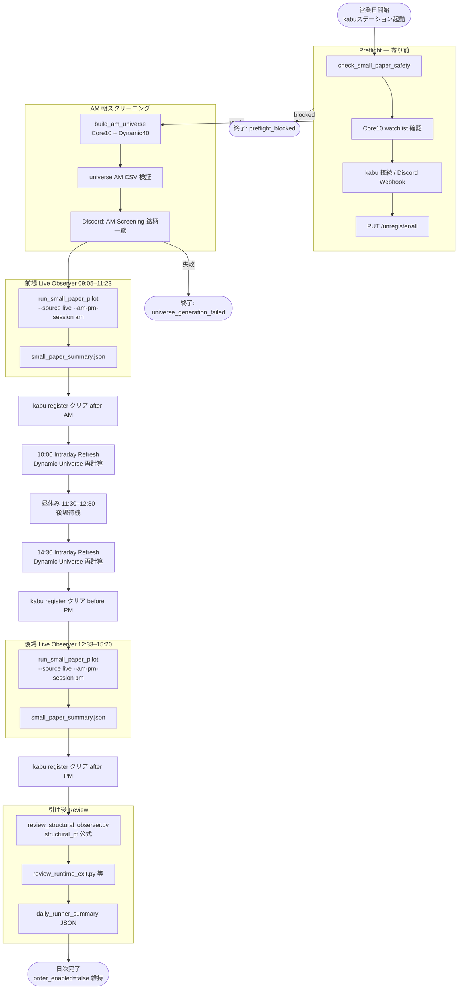
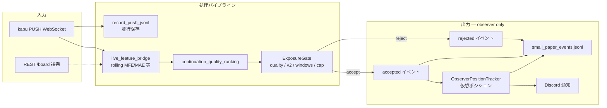
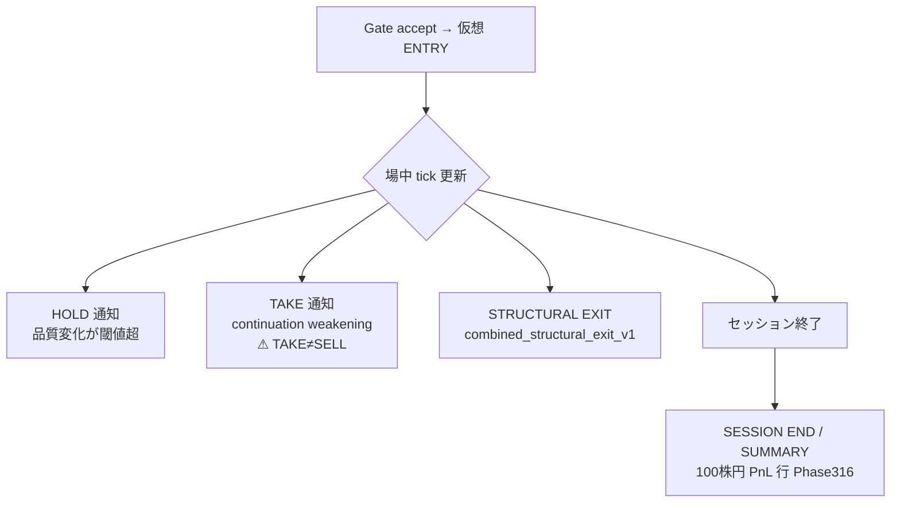
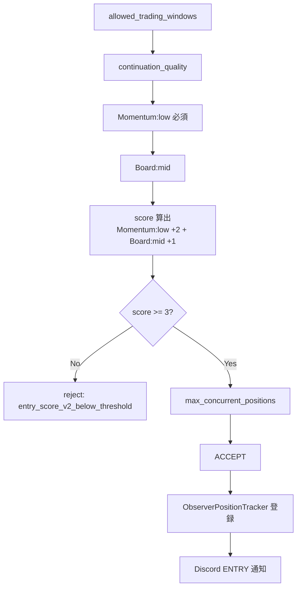

# 株ステーション連携システム — 設計仕様書（kabu_native）

**対象リポジトリ:** tradebotfile / `kabu_native/`  
**想定読者:** kabu_native を初めて触れる開発者・運用者  
**位置づけ:** 本文書は **kabuステーション® API を一次データ源とする新系**（universe・朝スクリーニング・リプレイ検証・shadow・**small paper observer**・データ蓄積・日次 runner）の設計仕様である。**EXIT v13 / continuation quality core / frozen runtime** は変更しない前提で、パスと起動方法を **2026-06-08（Phase 314–317）** 時点の実装に合わせて記述する。  
**別系統:** **旧 Yahoo 非公式 API 系**はリポジトリ内 **`market/yahoo/`**（互換シム `yahoo_kabu_watch.py`）に分離されている。詳細は **`docs/DESIGN.md`** を参照。**本書は旧 Yahoo 監視ループの仕様書ではない。**

**現在の主検証ランタイム（2026-06-08）:** **small paper observer**（`run_small_paper_pilot.py`、`--source live` / `push-replay`）。**現行運用 config:** **`small_paper_pilot_q070_cap3_entry_price_risk_guard_trailing_mfe_shadow.yaml`** — `min_continuation_quality: 0.70`、`max_concurrent_positions: 3`、**`entry_score_v2_min: 3`**（Phase 314）、**Momentum:low 必須 + Board:mid**。**observer only**・**実発注なし**・**runtime verification**（performance guarantee ではない）。平日 orchestration: **`run_core10_dynamic40_am_pm_daily_runner.py --exit-policy-shadow trailing-mfe --enable-intraday-refresh`**（Phase 148）。翌営業日前確認: **`run_phase317_tomorrow_paper_trade_preflight.py`**（Phase 317）。

### 現行運用 Config 分類（Source of Truth）

| 用途 | Config |
|------|--------|
| 旧 trial（参照・比較用） | `kabu_native/configs/small_paper_pilot_q070_cap3.yaml` |
| **現行運用** | `kabu_native/configs/small_paper_pilot_q070_cap3_entry_price_risk_guard_trailing_mfe_shadow.yaml` |
| Preflight 対象（Phase 317 既定） | 同上 |
| Daily Runner（`--exit-policy-shadow trailing-mfe`） | 同上 |
| push-replay / live smoke（推奨） | 同上 |

### Current Runtime Entry Rule（Source of Truth — Phase 314）

**現行運用における ENTRY 成立条件。** 実装: `entry_expectancy_score_shadow.py` + `exposure_gate.py`。詳細フロー: **§16.14**。

| 項目 | 内容 |
|------|------|
| **Momentum:low** | **+2**（**必須** — 単独では ACCEPT 不可） |
| **Board:mid** | **+1** |
| **`entry_score_v2_min`** | **3** |
| **ENTRY 成立** | 上記 **2 トークンのみ**で score = 3 → ACCEPT |

**ENTRY 判定に使用しない（Phase 314 で v2 から除外済）:** HBRecent, TV, Duration, Price（RollingMAE 含む v1 shadow 列はログ用に残る場合あり）。

**最終条件:** **`Momentum:low` AND `Board:mid`**（score ≥ 3）。

**PDF 化:** 推奨は `python tools/md_to_pdf.py kabu_native/docs/kabu_station_system_design.md kabu_native/docs/kabu_station_system_design.pdf`（日本語フォントを PDF に埋め込み、表・コードの視認性を調整済み）。代替として VS Code / Cursor のプレビューから「印刷 → PDFへ保存」。

### 現在のコード配置（2026-06-08）

| 役割 | 実体（編集・import の正） | 備考 |
|------|---------------------------|------|
| **small paper observer（主検証ランタイム）** | **`kabu_native/src/small_paper/`** | observer only・実発注なし（**§16**） |
| entry score v2 gate | **`kabu_native/src/small_paper/entry_expectancy_score_shadow.py`** | Momentum+Board のみ（Phase 314）。`ExposureGate` 連携 |
| continuation quality / ExposureGate | **`kabu_native/src/research/`** | `continuation_quality_ranking.py`, `exposure_gate.py` |
| structural EXIT（observer 層） | **`kabu_native/src/research/structural_exit_policies.py`** | `combined_structural_exit_v1`（**EXIT v13 ではない**） |
| 日次 AM/PM runner | **`kabu_native/src/runner/am_pm_daily_runner.py`** | Phase 148 orchestration（**§17**） |
| dynamic universe | **`kabu_native/src/universe/`** | `opening_dynamic50_universe.py`, `am_pm_universe.py`, `core10_dynamic40_*` |
| API（REST / PUSH） | **`kabu_native/src/api/`** | `KabuNativeRestClient` / `KabuNativePushClient` |
| universe / 朝スクリーン | **`kabu_native/src/universe/`**, **`src/screening/`** | JPX master 連携（Phase 100+）含む |
| リプレイ・検証バッチ | **`kabu_native/src/replay/`** | `pnl_yen.py`（100 株円換算・Phase 316）含む |
| Discord（small paper） | **`kabu_native/src/small_paper/discord_notifier.py`**, **`src/notify/discord.py`** | observer 通知。**売買指示ではない** |
| shadow（発注なし live・旧検証） | **`kabu_native/src/shadow/`** | `run_shadow.py`（small paper と **別経路**） |
| Logic Lab（研究） | **`kabu_native/src/research/logic_lab.py`** 等 | Phase 17–36（**§15**） |
| シグナル / EXIT | **ルート `src/kabu_signal_engine.py`**, **`src/kabu_exit_engine.py`** | `kabu_native/src/signals/` は **未移植** |
| データ蓄積 | **`kabu_native/src/storage/`** | `push_recorder.py`, `intraday_recorder.py`（Phase 42 — **§17**） |
| PUSH 記録 CLI | **`kabu_native/scripts/record_push_jsonl.py`** | `data/push_jsonl/YYYY-MM-DD/{symbol}.jsonl` |
| EOD 1 分足 | **`kabu_native/scripts/save_intraday_eod.py`** | JSONL → `data/intraday_1m/` |
| Tomorrow Preflight | **`kabu_native/scripts/run_phase317_tomorrow_paper_trade_preflight.py`** | Phase 317 — 翌営業日前統合確認 |

- **推奨起動:** リポジトリルートを cwd に **`python kabu_native/scripts/<script>.py`**（例: `run_shadow.py`）。
- **import:** shadow / replay は実行時にルートを `sys.path` に追加し、**`from src.kabu_signal_engine import …`** を利用。
- **混同注意:** 旧系 `yahoo_kabu_watch.py`・`signal_engine.py`（Yahoo プロファイル）と **別エンジン**（`kabu_signal_v1`）である。

### 起動コマンド対応表（主要 CLI）

| 用途 | コマンド（cwd = リポジトリルート） |
|------|-----------------------------------|
| API 接続確認 | `python kabu_native/scripts/check_api.py` |
| universe 構築 | `python kabu_native/scripts/build_universe.py --config kabu_native/configs/universe.yaml` |
| 朝スクリーニング | `python kabu_native/scripts/run_morning_screen.py --universe kabu_native/data/universe/universe_YYYYMMDD.csv` |
| リプレイ | `python kabu_native/scripts/run_replay.py --start-date … --end-date … --universe …` |
| shadow（live 検証） | `python kabu_native/scripts/run_shadow.py` |
| shadow 安全チェック | `python kabu_native/scripts/check_shadow_safety.py` |
| Logic Lab | `python kabu_native/scripts/run_logic_lab.py --start-date … --end-date … --universe …` |
| 研究終了基準（Phase 36） | `python kabu_native/scripts/run_research_exit_criteria.py --run-dir …/run_HHMMSS` |
| **small paper observer（現行運用）** | `run_small_paper_pilot.py --dry-run --source live --config kabu_native/configs/small_paper_pilot_q070_cap3_entry_price_risk_guard_trailing_mfe_shadow.yaml …` |
| live observer 準備 | `check_live_observer_readiness.py --config kabu_native/configs/small_paper_pilot_q070_cap3_entry_price_risk_guard_trailing_mfe_shadow.yaml` |
| push-replay（場外） | `run_small_paper_pilot.py --dry-run --source push-replay --push-dir … --config …/trailing_mfe_shadow.yaml` |
| **Tomorrow Preflight（Phase 317）** | `python kabu_native/scripts/run_phase317_tomorrow_paper_trade_preflight.py --day-stamp YYYYMMDD` |
| **日次 AM/PM runner** | `run_core10_dynamic40_am_pm_daily_runner.py --universe-mode core10-dynamic40-price-risk-filter-shadow --enable-intraday-refresh --exit-policy-shadow trailing-mfe …` |
| セッション後 review | `review_runtime_exit.py` / `review_structural_observer.py` / `review_phase56_diagnosis.py` 等 |
| structural 公式 PF | `review_structural_observer.py --structural-exit-policy combined_structural_exit_v1` |
| PUSH 記録（場中） | `python kabu_native/scripts/record_push_jsonl.py --universe …` |
| EOD 1 分足保存 | `python kabu_native/scripts/save_intraday_eod.py --universe …` |
| データ蓄積ステータス | `python kabu_native/scripts/check_data_accumulation.py --universe …` |
| intraday 在庫監査 | `python kabu_native/scripts/audit_intraday_data.py` |

**現行運用 config 短名:** `trailing_mfe_shadow.yaml` = `small_paper_pilot_q070_cap3_entry_price_risk_guard_trailing_mfe_shadow.yaml`

**watchdog / bat:** 現時点で **kabu_native 専用の watchdog は未整備**。旧系 `scripts/watchdog.py` は **Yahoo paper_trade / Issue Bot** 用（**§8.1**）。shadow 常駐化は手動起動または将来拡張（Phase 16 以降）。

---

## 目次

1. [目的と位置づけ](#1-目的と位置づけ)
2. [システム構成](#2-システム構成)
3. [監視銘柄の解決順](#3-監視銘柄の解決順)
4. [機能一覧](#4-機能一覧)
5. [判断ロジックの詳細](#5-判断ロジックの詳細)
6. [売買判断指標の数値と説明](#6-売買判断指標の数値と説明)
7. [環境変数・外部連携](#7-環境変数外部連携)
8. [依存関係・実行](#8-依存関係実行)
9. [設計上の注意](#9-設計上の注意)
10. [実装工程のトピック（これまでの経緯）](#10-実装工程のトピック)
11. [コマンドライン引数・実行分岐（kabu_native scripts）](#11-コマンドライン引数実行分岐kabu_native-scripts)
12. [成果物の命名とディレクトリ規則](#12-成果物の命名とディレクトリ規則)
13. [realtime / replay 統一: 共有エンジンと shadow](#13-realtime--replay-統一共用エンジンと-shadow)
14. [未実装・将来構想（Phase 16 以降）](#14-未実装将来構想phase-16-以降)
15. [Logic Lab と研究終了基準（Phase 17–36）](#15-logic-lab-と研究終了基準phase-17-36)
16. [Small Paper Observer System（Phase 45–317）](#16-small-paper-observer-systemphase-45-317)
    - [16.0 ペーパートレード日次フロー（朝スクリーニング→閉場）](#160-ペーパートレード日次フロー朝スクリーニング閉場)
17. [日次運用とデータ蓄積（Phase 42 / 113–148 / 317）](#17-日次運用とデータ蓄積phase-42--113148)
    - [17.4 Tomorrow Preflight（Phase 317）](#174-tomorrow-preflightphase-317)

---

## 1. 目的と位置づけ {#1-目的と位置づけ}

**kabu_native**（株ステーション連携システム）は、kabuステーション® API（REST / PUSH）から東証現物の相場データを取得し、**universe 構築・朝スクリーニング・シグナル判定・リプレイ検証・shadow・small paper observer** を一つのスタックに集約するためのツール群である。

- **証券会社への自動発注は現段階ではない**（shadow は仮想 ENTRY/EXIT、small paper は **observer 通知のみ**。いずれも `order_enabled=false`）。
- **現在の主検証ランタイム**は **small paper observer**（Phase 45–67）。PUSH → feature bridge → quality ranking → ExposureGate → observer tracker → Discord（ENTRY / HOLD / TAKE / **[STRUCTURAL EXIT]** / SUMMARY）。**TAKE≠SELL**・**EXIT≠実売却**（**§16.6**）。**execution system ではない**（**§16.11**）。
- **中核の実体**は `kabu_native/scripts/` の CLI と `kabu_native/src/` の各モジュール。シグナル / EXIT の **アルゴリズム本体**は現状 **ルート `src/kabu_*_engine.py`** にあり、kabu_native は **運用・データ・検証パイプライン**を担う。
- **旧系**（`market/yahoo/watch.py`、Yahoo 非公式 API、`signal_engine`）は **削除・統合しない**。データパス・成果物・watchlist を分離し並行運用する。
- **設計の正（シグナル定義）**はルート **`docs/kabu_signal_design.md`**（`kabu_signal_v1`）。本書は **運用アーキテクチャ・採用ルール・CLI・成果物**を正とする。

**方針（データ）**

1. **場中（realtime）** — kabu `/board`（＋任意 PUSH）のみ。Yahoo は使わない。
2. **履歴（replay）** — 当面は旧系 **`data/intraday_1m/`**（Yahoo 由来 CSV）を read-only 参照し、**合成 kabu board イベント**で再生。
3. **自前化の順** — PUSH JSONL 常時保存 → 自前 1 分足 → replay 入力の kabu 正規化（**§14 Phase 16**）。

**注意:** kabu PUSH は **raw tick ではなく板相当の変更時更新**である。Yahoo 1 分足との数値一致は目標としない（`docs/kabu_signal_design.md` Phase 5A）。

---

## 2. システム構成 {#2-システム構成}

| 構成要素 | 役割 | 状態 |
|----------|------|------|
| kabuステーション API | REST（板・トークン）、PUSH（WebSocket） | **実装済** |
| `kabu_native/src/api/` | 認証・板取得・PUSH register/受信・リトライ | **実装済** |
| `kabu_native/src/universe/` | 流動性・価格帯・ETF 除外で passed 銘柄を出力 | **実装済** |
| `kabu_native/src/screening/` | 朝スクリーニング（10 項目スコア） | **実装済** |
| ルート `src/kabu_signal_engine.py` | `kabu_signal_v1` — ENTRY 判定 | **実装済**（kabu_native 外） |
| ルート `src/kabu_exit_engine.py` | `kabu_exit_v1` — EXIT（BF, hard_stop 等） | **実装済**（kabu_native 外） |
| `kabu_native/src/replay/` | intraday CSV → 合成イベント → バッチ replay・集計 | **実装済** |
| `kabu_native/src/shadow/` | REST ポール（任意 PUSH）、仮想売買、イベントログ | **実装済**（検証系） |
| **`kabu_native/src/small_paper/`** | **主検証ランタイム** — observer only、live / push-replay、仮想ポジション | **実装済** |
| `kabu_native/src/research/` | `ExposureGate`, `continuation_quality_ranking`, Logic Lab | **実装済** |
| `record_push_jsonl.py` | PUSH 生ログ記録 | **実装済**（Phase 42） |
| `kabu_native/src/storage/` | JSONL append・PUSH→1m 集計・蓄積レポート | **部分実装**（Phase 42） |
| `save_intraday_eod.py` | JSONL → `data/intraday_1m/` | **実装済** |
| `kabu_native/data/push_jsonl/` | PUSH 生ログ（push-replay 入力） | **運用中**（git 外の日次データあり） |
| `kabu_native/data/intraday_1m/` | 自前 1 分足（replay 正の将来先） | **蓄積基盤あり**（在庫は `check_data_accumulation.py` で確認） |
| `data/intraday_1m/`（ルート） | Yahoo 由来 1 分足（replay **現行の主入力**） | **参照のみ**（540 symbol-days 例） |
| `kabu_native/configs/*.yaml` | universe / screen / replay / shadow 閾値 | **実装済** |
| `kabu_native/results/` | morning_screen / replay / shadow / **small_paper** / reports | **実装済** |
| 旧 `market/yahoo/` | Yahoo 監視・paper_trade | **別系統**（`docs/DESIGN.md`） |

**データパイプライン — 現在の主検証ランタイム（small paper observer・runtime verification）**

```text
[株ステーション PUSH] ──live──┐
[data/push_jsonl/] ──push-replay┘
        │
        ▼
[live_feature_bridge]
        ▼
[continuation_quality_ranking → ExposureGate]
        ▼
[observer_position_tracker → Discord observer]
        ▼
[results/small_paper/ + review scripts]
```

**データパイプライン（研究系・§14 参照）**

```text
[株ステーション PUSH/REST]
        │
        ▼
[record_push_jsonl]        ← 実装済
        │
        ▼
[data/push_jsonl/]
        │
        ├──► [small paper push-replay]   ← 主な場外 runtime verification
        │
        ▼
[minute bar builder]       ← 未実装
        │
        ▼
[replay engine]            ← Yahoo CSV 合成が主
        │
        ▼
[screening / universe]
        │
        ▼
[kabu_signal_v1 + kabu_exit_v1]
        │
        ▼
[shadow] / （将来 execution）
```

**`watchlist` の扱い**

| 系統 | 銘柄リストの正 |
|------|----------------|
| 旧 Yahoo | ルート `watchlist.json`（`market.yahoo.watch`） |
| kabu_native shadow | `morning_screen` 結果または `universe_intraday_full.csv`（**`watchlist.json` は変更しない**） |

---

## 3. 監視銘柄の解決順 {#3-監視銘柄の解決順}

### 3.1 shadow（`run_shadow.py`）

`configs/shadow.yaml` の `watchlist.source` に従う（CLI で上書き可）。

| 優先 | `source` | 解決方法 |
|------|----------|----------|
| 1 | `morning_screen`（**既定**） | `results/morning_screen/` 最新 CSV の **pass_screen=true** 上位 **`top_n`**（既定 10） |
| 2 | `universe` | `universe_path`（既定 `universe_intraday_full.csv`）の **passed** 銘柄、最大 **`top_n`** |

- `--watchlist-path` で CSV / ディレクトリを明示指定可能。
- `--dry-run` はリスト解決のみで終了。

### 3.2 universe ビルド（`build_universe.py`）

1. `configs/universe.yaml` の **`include_symbols`**（将来は銘柄マスタ拡張）
2. 各銘柄を kabu `/board` で実測
3. `min_trading_value` / 価格帯 / `max_spread_bps` / `exclude_etf` 等で passed / 除外理由を付与
4. `data/universe/universe_YYYYMMDD.csv` と JSON を出力

### 3.3 朝スクリーニング（`run_morning_screen.py`）

1. 入力: **universe CSV の `passed=true` のみ**
2. kabu `/board` で 10 項目スコアリング
3. `gates` で `pass_screen`、上位 `max_symbols` に `rank` を付与
4. 出力: `results/morning_screen/YYYYMMDD/morning_screen_*.{csv,json}`

### 3.4 リプレイ（`run_replay.py`）

銘柄集合は **いずれか必須**（排他ではなく指定されたソースをマージ）:

| オプション | 説明 |
|------------|------|
| `--symbols 9984.T,8306.T` | 直接指定 |
| `--universe path.csv` | `passed=true`（設定 `universe_passed_only`） |
| `--morning-screen path/` | `pass_screen=true`（最新 CSV 自動選択可） |

日付は **`--start-date` / `--end-date`**（YYYY-MM-DD）必須。

### 3.5 small paper / 日次 runner（`run_small_paper_pilot.py` / Phase 148）

1. **config** の `watchlist` / universe モード（runner 経由時は Phase 113/117 生成 CSV）
2. **ExposureGate** — quality・`entry_score_v2_min`・windows・cap
3. 出力: `results/small_paper/YYYYMMDD/live_*` または `push_replay_*`

日次 runner は **§17.3** 参照。

---

## 4. 機能一覧 {#4-機能一覧}

| 機能 | 起動の目安 | 概要 | 状態 |
|------|------------|------|------|
| API 接続確認 | `check_api.py` | トークン・板要約・PUSH 仕様（`--push-spec-only`） | **DONE** |
| universe 構築 | `build_universe.py` | 流動性フィルタ・passed CSV/JSON | **DONE** |
| 朝スクリーニング | `run_morning_screen.py` | 上位 N 銘柄ランキング | **DONE** |
| リプレイ（基盤） | `run_replay.py` | 1m CSV → 合成 board → trades 集計 | **DONE** |
| intraday 在庫監査 | `audit_intraday_data.py` | 日付×銘柄カバレッジ | **DONE** |
| **Logic Lab** | `run_logic_lab.py` | 全銘柄×複数日・固定プロファイル横比較（ENTRY/EXIT 診断） | **DONE** |
| **研究終了基準** | `run_research_exit_criteria.py` | 過学習リスク・OOS 準備・freeze 判定（メタ分析） | **DONE** |
| 構造分析 | `analyze_replay_results.py` | BF 比率・銘柄集中等 | **DONE** |
| パラメータスイープ | `run_phase8_sweep.py` | OFAT（EXIT 窓・BF confirm 等） | **DONE** |
| ENTRY 品質分析 | `run_phase9_entry_quality.py` | MFE / MAE / 継続率 | **DONE** |
| 組み合わせ候補 | `run_phase10_combined_candidates.py` | ルール組合せ（採用見送り含む） | **DONE** |
| screen × replay | `run_phase11_screen_replay.py` | universe vs top-N screen | **DONE** |
| 市場セッション制御 | `run_phase13_session_control.py` | 09:05–14:50 正式ルール確定 | **DONE** |
| shadow | `run_shadow.py` | 発注なし live、仮想ポジション | **DONE** |
| shadow 安全チェック | `check_shadow_safety.py` | safety フラグ・legacy 未接続の機械検証 | **DONE** |
| **small paper observer** | `run_small_paper_pilot.py` | runtime verification・observer only・**実発注なし** | **DONE（主検証ランタイム）** |
| small paper 安全チェック | `check_small_paper_safety.py` | `order_enabled` / `dry_run_required` 等 | **DONE** |
| live observer readiness | `check_live_observer_readiness.py` | live 再試験前ゲート | **DONE** |
| **entry score v2 gate** | `entry_expectancy_score_shadow.py` | Momentum+Board、**min=3**（Phase 267/314） | **DONE** |
| **日次 AM/PM runner** | `run_core10_dynamic40_am_pm_daily_runner.py` | Core10+Dynamic40・PUSH 記録・live pilot 連鎖 | **DONE** |
| **データ蓄積** | `record_push_jsonl.py` / `save_intraday_eod.py` / `check_data_accumulation.py` | Phase 42 — ロジック変更なし | **DONE** |
| dynamic universe（AM/PM） | `run_phase113_vol_liq_dynamic50_universe.py` 等 | 流動性・出来高ベース銘柄集合 | **DONE** |
| paper_trade / Discord 実売買 | — | small paper は **observer only**（実発注経路なし） | **STOPPED** |
| PUSH 記録 | `record_push_jsonl.py` | `data/push_jsonl/YYYY-MM-DD/` | **DONE** |
| 自前 1 分足（EOD） | `save_intraday_eod.py` | `kabu_native/data/intraday_1m/` | **DONE**（在庫は日次蓄積） |
| Discord 通知（shadow） | `shadow.yaml` | **既定 OFF** | **DISABLED** |
| Discord 通知（small paper） | `small_paper_pilot_q070_cap3_entry_price_risk_guard_trailing_mfe_shadow.yaml` | **`discord_enabled: true`**・**observer only**（Phase 316: EXIT に 100 株円表示） | **ENABLED（通知のみ）** |
| **Tomorrow Preflight（Phase 317）** | `run_phase317_tomorrow_paper_trade_preflight.py` | 翌営業日前の統合事前確認 | **DONE** |
| 自動発注 | — | API 発注経路なし | **DISABLED** |

### 4.1 検証・分析スクリプトの出力先

| CLI | 出力の目安 |
|-----|------------|
| `run_phase8_sweep.py` | `kabu_native/results/reports/phase8_sweep_YYYYMMDD.*` |
| `run_phase9_entry_quality.py` | `results/reports/phase9_entry_quality_YYYYMMDD.*` |
| `run_phase10_combined_candidates.py` | `results/reports/phase10_combined_candidates_YYYYMMDD.*` |
| `run_phase11_screen_replay.py` | `results/reports/phase11_screen_replay_YYYYMMDD.*` |
| `run_phase13_session_control.py` | `results/reports/phase13_session_control_YYYYMMDD.*` |
| `analyze_replay_results.py` | `results/reports/structure_analysis_YYYYMMDD.*` |
| `check_shadow_safety.py` | `results/reports/safety_report_YYYYMMDD.json` |
| `run_logic_lab.py` | `results/research/logic_lab/YYYYMMDD/run_HHMMSS/` |
| `run_research_exit_criteria.py` | 同一 run 配下の `research_exit_report.*`, `phase_progression_analysis.json` |
| `run_small_paper_pilot.py` | `results/small_paper/YYYYMMDD/{live_*,push_replay_*}/` |
| `record_push_jsonl.py` / `check_data_accumulation.py` | `results/reports/data_accumulation_status_YYYYMMDD.*` |
| `run_core10_dynamic40_am_pm_daily_runner.py` | `results/reports/daily_runner_*_YYYYMMDD.json` 等 |
| `run_phase317_tomorrow_paper_trade_preflight.py` | `results/reports/phase317_tomorrow_paper_trade_preflight.json` |
| `run_phase314_*` 等 | `results/reports/phase314_final_entry_score_simplification_report.json` 等 |
| `review_runtime_exit.py` 等 | 同一 session 配下の `runtime_exit_review.json` 等 |

### 4.2 リプレイのスキップ理由（`skipped_inputs.csv`）

| skip_reason | 意味 |
|-------------|------|
| `missing_intraday_csv` | 該当日・銘柄の CSV が無い |
| `empty_csv` | ファイルはあるが行が無い |
| `invalid_columns:…` | OHLCV 列不足・正規化失敗 |

**行は落とさず** スキップ一覧に残す（旧系 DESIGN と同趣旨）。

---

## 5. 判断ロジックの詳細 {#5-判断ロジックの詳細}

**重要:** **realtime（shadow）** と **replay** は **同一 `kabu_signal_v1` / `kabu_exit_v1`** を import するが、**入力データ源**（live board vs 合成イベント）が異なる。replay 専用の「条件緩和」は **`relaxed_signal`** 等の **明示フラグ**のみ（検証用・shadow 既定 OFF）。

### 5.1 一次入力 — `KabuBoardSnapshot`

PUSH 受信を主、REST `/board` を欠損時・最大間隔（shadow 既定 **15 秒**）のフォールバック。

| カテゴリ | 代表フィールド | 用途 |
|----------|----------------|------|
| 価格・時刻 | `CurrentPrice`, `CurrentPriceTime` | ブレイク・鮮度 |
| VWAP・出来高 | `VWAP`, `TradingVolume`（差分） | 乖離・出来高増 |
| セッション | `HighPrice`, `LowPrice`, `OpeningPrice` | 高値接近・レンジ |
| 板 | `BidPrice`/`AskPrice`, 気配数量 | スプレッド・板厚み |

詳細フィールド表は **`docs/kabu_signal_design.md` §1**。

### 5.2 ENTRY — `kabu_signal_v1`（概要）

| 段階 | 内容 |
|------|------|
| 銘柄前提 | shadow watchlist / replay 銘柄集合で限定 |
| 必須ゲート | スプレッド・鮮度・VWAP 乖離・高値接近・出来高増（v1 定義） |
| ブレイク | `price >= trigger_level` の初回 → `breakout_event` |
| スコア | `signal_score` 0〜100。**`entry_score_min`（既定 60）** 以上で ENTRY 候補 |
| タイミング | `require_timing_ok`（v1 のタイミングゲート） |
| セッション | **`entry_allowed(ts)`** — Phase 13 正式（**§5.4**） |

### 5.3 EXIT — `kabu_exit_v1`（shadow / replay 共通）

| 出口 | 概要 |
|------|------|
| **breakout_failure（BF）** | ブレイク水準からの失敗。`bf_confirm_count` 連続で確定 |
| **hard_stop** | Entry からの最大損失％（tier 別） |
| **EOD** | リプレイ終端で `eod_close` 等 |

shadow 採用（Phase 13）: **`bf_confirm_count=2`**, **`fail_buffer_pct=0.12`**, **`hard_stop_pct=1.20`**（tier B）— `configs/shadow.yaml`。

### 5.4 市場セッション ENTRY 枠（正式ルール）

**バックテスト上の「09:30 まで入らない」最適化ではなく**、東証現物の市場構造に基づく枠。

| 項目 | 値（JST） |
|------|-----------|
| ENTRY 開始 | **09:05**（寄り板安定化後） |
| ENTRY 終了 | **14:50**（大引け前の新規リスク回避） |
| 14:50 以降 | 新規 ENTRY 不可。保有は `kabu_exit_v1` または EOD |

実装: `kabu_native/src/replay/session_control.py` の `entry_allowed()`。  
**廃止:** `no_entry_until`（09:30 等）— Phase 10 で数値改善があっても **shadow 正式採用から除外**（Phase 13）。

**small paper との関係（混同禁止）:** 上記 **09:05–14:50** は **shadow / batch replay / `kabu_signal_v1` ENTRY 枠**（Phase 13）。**small paper observer** は別の **`allowed_trading_windows`**（**§16.4**）を ExposureGate で使用する。これは市場構造上の許可取引時間であり、**時間帯最適化・午前のみ・セッション別 threshold・時刻別 quality 調整は禁止**。

### 5.5 replay 入力 — 合成 board イベント

1. `replay/intraday.py` が 1 分足 CSV を読込（`data_roots` 順: 新系 → 旧系 Yahoo）。
2. `push_messages_from_yahoo_df` 系で **kabu board 相当イベント列**を生成（密度は `synthetic_events_per_minute` 等）。
3. 時系列順に `kabu_signal_replay` へ供給。**lookahead 禁止**（各イベント時点以前の履歴のみ）。

**未実装:** 保存 PUSH JSONL からの直接再生（Phase 17）。

### 5.6 リプレイ改善の採用基準（運用）

| 原則 | 内容 |
|------|------|
| 特定銘柄最適化禁止 | 9984 等 1 銘柄の損失集中を「全体改善」とみなさない |
| 特定日最適化禁止 | 数日だけの成績でルール採用しない |
| 特定時刻最適化禁止 | `no_entry_until=09:30` 等は正式ルールにしない |
| 市場構造のみ | 09:05 / 14:50 / BF confirm 等 |
| 全銘柄 replay | 原則 `universe_intraday_full.csv`（27 銘柄）× 在庫期間 |
| trades 減のみ禁止 | Phase 8: `trades < max(45, baseline×0.55)` は除外 |

---

## 6. 売買判断指標の数値と説明 {#6-売買判断指標の数値と説明}

本章の **shadow / replay 採用値**は `configs/shadow.yaml`・`configs/replay.yaml`・`configs/session_control.yaml` に基づく。シグナル v1 のゲート初期値は **`docs/kabu_signal_design.md` §4**。

### 6.1 shadow / replay 採用ルール（Phase 13 正 — shadow 系）

| キー | 値 | 意味 |
|------|-----|------|
| `market_session_control` | **true** | セッション ENTRY 枠を有効 |
| `entry_start_jst` | **09:05** | ENTRY 開始 |
| `entry_end_jst` | **14:50** | ENTRY 終了（この時刻以降は新規不可） |
| `bf_confirm_count` | **2** | BF 確定に必要な連続回数 |
| `fail_window_min` | **2** | BF 判定窓（分） |
| `fail_buffer_pct` | **0.12** | ブレイク水準からの失敗バッファ（%） |
| `hard_stop_pct` | **1.20** | tier B の hard stop（%・実装は絶対値化） |
| `tier` | **B** | EXIT プロファイル tier |
| `entry_score_min` | **60** | ENTRY に必要な最低 `signal_score`（`kabu_signal_v1`） |
| `require_timing_ok` | **true** | タイミングゲート必須 |

### 6.1b small paper 現行運用 config（`small_paper_pilot_q070_cap3_entry_price_risk_guard_trailing_mfe_shadow.yaml`）

**Preflight・Daily Runner・live / push-replay の既定 config。** 旧 trial `small_paper_pilot_q070_cap3.yaml` との比較は **§1 Config 分類** 参照。

| キー | 値 | 意味 |
|------|-----|------|
| `min_continuation_quality` | **0.70** | ExposureGate — continuation quality 下限 |
| `max_concurrent_positions` | **3** | 同時仮想建玉上限 |
| `reject_below_quality` | **false** | Phase 267: quality 単独 reject を off |
| **`entry_score_v2_min`** | **3** | **Phase 314** — v2 スコア下限（Momentum+Board のみ） |
| `structural_exit_policy` | **`combined_structural_exit_v1_trailing_mfe_shadow`** | observer 層 EXIT（**Phase 332** board-dynamic trailing） |
| `entry_price_risk_guard_enabled` | **true** | エントリー価格リスクガード（shadow apply） |
| `allowed_trading_windows` | 09:05–11:23 / 12:33–15:20 | 昼休み除外（**§16.4**） |
| `order_enabled` | **false** | 固定 |
| `discord_enabled` | **true** | observer 通知（**売買指示ではない**） |
| `live.record_push_jsonl` | **true** | live セッション中の JSONL 同時記録 |

### 6.1c Board Dynamic Trailing（Phase 332 — 本番 EXIT）

**適用:** 本番 EXIT・paper trade・replay（`ObserverPositionTracker` + `structural_exit_policies`）。**hard_stop 1.2%** は変更なし。trailing_mfe の **activate / giveback のみ** `entry_imbalance_percentile` で分岐。

| tier | 条件 | activate | giveback |
|------|------|----------|----------|
| **board_high** | `entry_imbalance_percentile >= 47.62` | **1.0%** | **60%** |
| **board_low** | `< 47.62`（欠損時も board_low） | **0.6%** | **40%** |

**旧固定（Phase 174 以前）:** activate 0.8% / giveback 50% — **本番から廃止**。shadow ログは legacy fixed を counterfactual として `actual_vs_shadow_delta_*` に記録（採用前後比較用）。

**ログ / Discord:** `board_dynamic_trailing_tier`・`activate_pct`・`giveback_frac` を `observer_exit` に記録。Discord EXIT 詳細に `board_high` / `board_low` をデバッグ表示（任意・trailing_mfe_exit 時）。

**検証:** `run_phase332_board_dynamic_trailing_production_adoption_report.py` — `phase332_board_dynamic_trailing_production_adoption_report.json`

### 6.2 universe（`configs/universe.yaml` 代表）

| キー | 値 | 意味 |
|------|-----|------|
| `min_trading_value` | **5_000_000_000** | 当日累積売買代金下限（円） |
| `min_price` / `max_price` | **300** / **100000** | 価格帯 |
| `max_spread_bps` | **30** | 最良気配スプレッド上限 |
| `exclude_etf` | **true** | ETF 除外（1306, 1321 等） |
| `max_symbols` | **20** | passed 上限（代金降順） |

### 6.3 朝スクリーニング（`configs/morning_screen.yaml` 代表）

| キー | 値 | 意味 |
|------|-----|------|
| `max_change_pct`（gate） | **12.0** | 急騰しすぎ除外 |
| `max_spread_bps`（gate） | **40.0** | スプレッド過大除外 |
| `max_symbols` | **10** | ランク付き上位件数 |
| `session_mode` | **any** | 引け後でも board が取れれば実行可 |

### 6.4 kabu_signal_v1 初期閾値（エンジン設計・抜粋）

| 指標 | 初期値（案） | 備考 |
|------|--------------|------|
| VWAP 乖離 | **≥ 0.35%** | Yahoo 0.5% から再較正 |
| 高値接近 | **≥ HighPrice × 0.985** | |
| spread | **≤ 15 bps** | 株価帯段階化は v1.1 |
| 鮮度 | **≤ 20 s**（REST 時 ≤ 45 s） | |
| `push_samples_1m` | **≥ 8** | PUSH 密度フィルタ |

### 6.5 リプレイ合成パラメータ（`configs/replay.yaml`）

| キー | 既定 | 意味 |
|------|------|------|
| `synthetic_push_keep` | **1.0** | 合成イベントの保持率 |
| `synthetic_spread_bps` | **8.0** | 合成板のスプレッド |
| `synthetic_events_per_minute` | **10** | 1 分あたり合成イベント数 |
| `relaxed_signal` | **false** | true は検証用緩和（本番 shadow では false） |
| `market_session_control` | **false**（replay 単体） | Phase 検証スクリプト側で true に上書きする経路あり |

### 6.6 評価指標（replay 集計）

| 指標 | 説明 |
|------|------|
| `profit_factor` | 総利益 / \|総損失\| |
| `win_rate` | 勝ち trade 比率 |
| `total_pnl_pct` | 合計 PnL（%） |
| `exit_reason_counts` | BF / hard_stop / eod_close 等の内訳 |
| MFE / MAE | Phase 9 `entry_quality` で ENTRY 品質評価 |
| continuation rate | breakout 後の継続率（Phase 9） |

---

## 7. 環境変数・外部連携 {#7-環境変数外部連携}

### 7.1 `.env` の読み込み

- **読み込みパス:** リポジトリ直下 **`.env`**（各 script がルートを cwd 想定）。
- **実装:** `python-dotenv` がインストール済みのとき `load_dotenv(override=False)`。
- **API パスワードはファイルに書き出さない**（トークンはプロセス内のみ）。

| 変数名 | 必須 | 用途 |
|--------|------|------|
| `KABU_API_PASSWORD` | **必須**（API 利用時） | kabu トークン発行 |
| `KABU_API_BASE` | 任意 | REST ベース URL（既定 `http://localhost:18080/kabusapi`） |
| `KABU_SHADOW_DISCORD_WEBHOOK_URL` | 任意 | shadow 参考通知（**`discord_enabled` かつ true のときのみ**） |

### 7.2 kabuステーション API

| 種別 | エンドポイント概要 |
|------|-------------------|
| REST | `/token`, `/board/{symbol@exchange}`, `/register` 等 |
| PUSH | WebSocket（`push_client.py`） |

**運用注意**

- **土日・時間外**は PUSH 不可 → `check_api.py --push-spec-only` で仕様確認。
- **昼休み・大引け後**は PUSH 停止の可能性（REST はセッション日により可）。

### 7.3 Discord（kabu_native）

| 項目 | 方針 |
|------|------|
| `safety.discord_notify` | **常に false**（Phase 15 検証） |
| `discord_enabled` / `discord_shadow_notify` | 参考通知用。**既定 false** |
| 旧 Yahoo `DISCORD_WEBHOOK_URL` | **接続しない**（`connect_yahoo_watch: false`） |

### 7.4 発注・旧系連携

| 項目 | 状態 |
|------|------|
| kabu 発注 API | **呼び出しなし** |
| `yahoo_kabu_watch.py` | **非接続** |
| `market/yahoo/paper_trade` | **別系統** |

---

## 8. 依存関係・実行 {#8-依存関係実行}

- Python **3.10+** 想定（開発環境 3.14 でも動作確認あり）。`requests` 必須。PUSH に `websockets` 等（`requirements.txt` 参照）。
- **cwd:** **リポジトリルート**で実行（`kabu_native/` 相対パス・ルート `src/` import のため）。

**代表コマンド**

```text
python kabu_native/scripts/check_api.py --symbol 9984
python kabu_native/scripts/build_universe.py --config kabu_native/configs/universe.yaml
python kabu_native/scripts/run_morning_screen.py --universe kabu_native/data/universe/universe_20260516.csv
python kabu_native/scripts/run_replay.py --start-date 2026-05-01 --end-date 2026-05-15 --universe kabu_native/data/universe/universe_intraday_full.csv
python kabu_native/scripts/check_shadow_safety.py
python kabu_native/scripts/run_shadow.py --max-polls 3
python kabu_native/scripts/run_shadow.py --use-push --max-polls 5
```

**ログ:** `logs/runtime/kabu_native_<task>_YYYYMMDD.log`（例: `kabu_native_shadow_20260517.log`）。

### 8.1 Windows 自動復帰（現状）

| 項目 | kabu_native | 旧系 |
|------|-------------|------|
| watchdog | **未整備** | `scripts/watchdog.py`（paper_trade / Issue Bot） |
| lock file | **未実装** | `results/paper_trade/paper_trade.lock` |
| 推奨 | shadow 手動起動前に `check_shadow_safety.py` | `docs/DESIGN.md` §8.1 |

**運用事故防止（現状）:** watchdog / auto-recovery は **未整備**のため、**Windows Update・OS 再起動・kabu ステーション停止**時に observer runtime は **停止したまま復帰しない**。手動再起動が必要。**常時無人運用の前に** small paper 用 watchdog 実装が必要（**§16** と併せて確認）。

**将来（Phase 16+）:** recorder / shadow 用 lock・watchdog 連携を **§14** に記載。

---

## 9. 設計上の注意 {#9-設計上の注意}

1. **replay 入力は当面 Yahoo 由来 CSV**である。場中 shadow は kabu のみ。**数値・trade 数は一致しない**。
2. **合成 PUSH パラメータ**（`synthetic_*`）に replay 結果が依存する。PUSH JSONL 正規経路（Phase 17）まで、改善比較は **同一合成設定**で行う。
3. **`kabu_native/src/signals/` 未移植**のため、シグナル変更は **ルート `src/kabu_signal_engine.py`** が実体。ドキュメントと PR ではパスを混同しない。
4. **Phase 10 の 09:30 ゲート（A+B）**は replay 上は良化したが **過学習寄り**のため **正式採用しない**（Phase 13 が正）。
5. **screen × replay** は PnL を改善しうるが、**9984 偏重を必ずしも解消しない**（構造分析で継続監視）。
6. **非公式 API ではない**が、kabu 側の仕様変更・PUSH 停止（昼休み等）に耐性が必要。
7. **発注を有効化しない** — `check_shadow_safety.py` が `place_orders` / `order_enabled` を検証。
8. **旧系 `data/intraday_1m/` を破壊的に変更しない** — read-only 参照。

---

## 10. 実装工程のトピック（これまでの経緯） {#10-実装工程のトピック}

本章は **「何のために」「どう実装し」「何が得られたか」** をフェーズ単位で要約する。詳細ログは **`kabu_native/docs/TODO.md`**。

### 10.1 Phase 1 — API 層

- **目的:** kabu REST / PUSH を新系パッケージに閉じる。
- **結果:** `check_api.py` で接続・板要約 JSON を保存可能。土日は `--push-spec-only`。

### 10.2 Phase 2 — Universe

- **目的:** 流動性・価格帯で監視母集団を定義。
- **結果:** `universe_20260516.csv`（3 passed）、`universe_intraday_full.csv`（27 銘柄・replay 用）。

### 10.3 Phase 3 — Morning screen

- **目的:** 寄り前候補の kabu 版スコアリング。
- **結果:** `results/morning_screen/` — shadow watchlist の入力。

### 10.4 Phase 4–7 — Replay と構造分析

- **目的:** 1 か月規模のバッチ replay と全銘柄検証。
- **結果:** 83 trades、BF exit 76%、**構造的問題（BF 過剰・寄りノイズ）**を特定。9984 損失集中を監視。

### 10.5 Phase 8–11 — スイープと screen 統合

- **目的:** 27 銘柄共通ルールの改善候補を探索。
- **結果:** `bf_confirm_count=2` が有効。**09:30 ゲートは採用見送り**。screen top-N で PnL 改善も銘柄偏重は残る。

### 10.6 Phase 13 — 市場セッション制御

- **目的:** 時間最適化ではなく市場制度ベースの ENTRY 枠。
- **結果:** **09:05–14:50 + bf_confirm=2** を shadow / replay の **正式ルール**に。

### 10.7 Phase 14–15 — Shadow と安全チェック

- **目的:** 発注なし live で Phase 13 ルールを検証。
- **結果:** `run_shadow.py` 動作、`safety_report_*.json` で機械検証。

### 10.8 Logic Lab（Phase 17–36）— ロジック検証基盤

- **目的:** paper_trade 再開前に、**全銘柄・全対象日に同一ルール**で ENTRY/EXIT を横比較し、reject 理由・仮想トレード KPI を可視化する（**銘柄・日・時刻ごとのチューニング禁止**）。
- **実装:** `kabu_native/src/research/logic_lab.py`、`scripts/run_logic_lab.py`。詳細手順は **`kabu_native/docs/logic_lab.md`**。
- **データ:** 当面 `data/intraday_1m/`（Yahoo 由来 CSV）→ 合成 board（replay と同系）。universe **27 銘柄 × 約 15 営業日**が標準検証単位。
- **主要フェーズ（要約）:**

| Phase | テーマ | 成果 |
|-------|--------|------|
| 17–19 | プロファイル横比較・G7 定義修正 | reject 診断、セッション累積 TV |
| 20–21 | G5/G6 有効性診断 | 閾値変更なし・統計のみ |
| 23–24 | ENTRY v2 | pullback / momentum / hybrid |
| 25–29 | momentum EXIT v3–v7 | 初動逆行・回復・ノイズ耐性 |
| 30–32 | persistence / transition | 状態継続・遷移パス |
| 33–35 | duration / continuation / momentum | 市場構造（継続・momentum）の強いシグナル |
| **36** | **研究終了基準** | 過学習停止・OOS 移行判定（**§15**） |

- **判明した構造（2026-05 時点・固定化対象）:** fixed-time EXIT は弱い、imbalance 単体・breakout 単体も弱い。**continuation / momentum persistence** が強い。実市場では初動逆行が普通。
- **制約:** 27×15 規模を超える EXIT 複雑化は過学習リスク。**Phase 36 達成後は in-sample 最適化を止め**、freeze → OOS / paper trade 検証へ。

### 10.9 Small Paper Observer（Phase 45–67）— 現在の主検証ランタイム

| Phase | テーマ | 要点 |
|-------|--------|------|
| 45 | full-session small paper dry-run | 平日場中フルセッション live PUSH **観測**（発注なし） |
| 46 | Discord observer 通知 | ENTRY / HOLD / SUMMARY、`discord_observer_only` |
| 47 | live feature bridge | live PUSH から rolling MFE/MAE 等を生成（fallback quality 0.323 問題の解消） |
| 48 | offline push-replay | 保存 JSONL で live と同一 pipeline を場外再生 |
| 49 | push-replay performance review | accepted / rejected / quality 分布のレビュー |
| 50 | runtime pilot policy review | policy grid・what-if（q070 等） |
| 51 | q070_cap3 trial config | **旧 trial のみ**（`small_paper_pilot_q070_cap3.yaml`）。現行運用は **trailing_mfe_shadow.yaml** |
| 52 | allowed trading windows + weakness | 市場構造ウィンドウ・弱点診断 |
| 53 | exposure cap what-if | max_concurrent 感度 |
| 54 | TAKE/HOLD/EXIT runtime review | **TAKE は EXIT 扱いしない**（legacy VH PF は参考のみ） |
| 55 | live observer retrial | 2026-05-19 **`live_full_session_081047`**（180 accepted・bridge 96% complete） |
| 56 | TAKE / quality inflation 診断 | `review_phase56_diagnosis.py`（閾値変更禁止） |
| 57 | realistic trade evaluation 設計 | **`phase57_realistic_trade_evaluation_design.md`** — 300s VH PF 廃止方針 |
| 58 | `structural_observer_v1` | 公式 **`structural_pf`**（VH / 固定 horizon 不使用） |
| 59 | structural exit design review | 損失分解・policy 候補比較（分析のみ） |
| 60 | `combined_structural_exit_v1` | 公式 structural EXIT policy（review 選択可） |
| 61 | live + combined structural EXIT | Discord **`[STRUCTURAL EXIT]`**、`virtual_hold_expired` は通知しない |
| 67 | MFE-linked favorable trial | `small_paper_pilot_q070_cap3_mfe_fav.yaml`。現行運用は **trailing_mfe_shadow.yaml**（Phase 174+） |
| 230–237 | entry expectancy score shadow / v2 | ログ→hard gate 試行（**§16.14**） |
| 267 | `entry_score_v2_min: 3` | quality reject off + v2 gate 採用（trial yaml） |
| 295/299 | board / HBRecent pregate fix | v2 入力欠損の reject 修正 |
| 310–314 | entry score token 整理 | **HBRecent/TV/Duration/Price 削除** → **Momentum+Board のみ** |
| 315–316 | 100 株円表示 | EXIT Discord に `pnl_yen_100` 行（**§16.15**） |
| 317 | Tomorrow paper trade preflight | 翌営業日前統合確認 — **§17.4** |

詳細手順: **`kabu_native/docs/small_paper_pilot.md`**。設計アーキ: **§16**・**§16.13**。

### 10.11 データ蓄積（Phase 42）

| 項目 | 内容 |
|------|------|
| **目的** | Logic Lab / OOS の **サンプル・銘柄・日付** ボトルネック解消（**ロジック変更なし**） |
| **PUSH JSONL** | `record_push_jsonl.py` → `data/push_jsonl/YYYY-MM-DD/{symbol}.jsonl` |
| **1 分足 EOD** | `save_intraday_eod.py` → `data/intraday_1m/YYYY-MM-DD/{symbol}.csv` |
| **監査** | `check_data_accumulation.py` → `results/reports/data_accumulation_status_*` |
| **モジュール** | `src/storage/push_recorder.py`, `intraday_recorder.py`, `data_accumulation_report.py` |

詳細: **`kabu_native/docs/data_accumulation.md`**。

### 10.12 動的 universe・日次 runner（Phase 113–148）

| Phase | テーマ | 要点 |
|-------|--------|------|
| 109–113 | opening dynamic50 / vol-liq universe | 寄り・流動性ベース銘柄集合 |
| 114–116 | AM/PM universe / session policy | 前場・後場 universe（**legacy:** Phase 114 の 12:25 PM 再生成） |
| 117 | core10 + dynamic40 | 固定 core + 動的 40 銘柄 |
| **148** | **AM/PM daily runner + intraday refresh** | 現行運用: **10:00 / 14:30** universe refresh（`--enable-intraday-refresh`）— **§17.3** |

### 10.13 未着手・低優先（参考）

| 項目 | 状態 |
|------|------|
| Phase 12 | 未定義 |
| `src/signals/` 移植 | 未着手 |
| Logic Lab → shadow 自動接続 | **未接続** |
| small paper → 実発注 | **未接続・非目標** |
| replay 入力の Yahoo 完全廃止 | **部分** — 自前 `intraday_1m` 蓄積中、フォールバック残存 |

---

## 11. コマンドライン引数・実行分岐（kabu_native scripts） {#11-コマンドライン引数実行分岐kabu-native-scripts}

本章は **kabu_native/scripts/** の主要 CLI をコードと一致させた一覧である。**旧 `market.yahoo.watch` の全オプションは `docs/DESIGN.md` §11** を参照。

### 11.1 `run_shadow.py`

| オプション | 型・既定 | 概要 |
|------------|----------|------|
| `--config` | path | `configs/shadow.yaml`（未指定時は既定パス） |
| `--watchlist-source` | `morning_screen` / `universe` | watchlist 解決（§3.1） |
| `--watchlist-path` | path | CSV または morning_screen ディレクトリ |
| `--top-n` | int | 銘柄数上限 |
| `--poll-interval-sec` | float | REST ポール間隔（既定 15） |
| `--max-polls` | int | 終了までのポール回数（未指定=無限） |
| `--use-push` | flag | WebSocket を裏スレッドで接続 |
| `--dry-run` | flag | watchlist 表示のみ |

**実行順:** config 読込 → safety 検証 → watchlist 解決 → （dry-run なら終了）→ ポールループ。

### 11.2 `run_replay.py`

| オプション | 必須 | 概要 |
|------------|------|------|
| `--start-date` | **はい** | YYYY-MM-DD |
| `--end-date` | **はい** | YYYY-MM-DD |
| `--symbols` | いずれか | カンマ区切り |
| `--universe` | いずれか | universe CSV |
| `--morning-screen` | いずれか | morning_screen ディレクトリまたは CSV |
| `--tier` | 任意 | シグナル tier 上書き |
| `--output-dir` | 任意 | 出力先（既定 `results/replay/YYYYMMDD/replay_<stamp>/`） |

### 11.3 `build_universe.py` / `run_morning_screen.py`

| スクリプト | 主要オプション |
|------------|----------------|
| `build_universe.py` | `--config`（YAML）, `--base-url`, `--timeout` |
| `run_morning_screen.py` | `--universe`（**必須**）, `--config`, `--date-stamp` |

### 11.4 `check_api.py` / `check_shadow_safety.py`

| スクリプト | 用途 |
|------------|------|
| `check_api.py` | `--symbol`, `--push-spec-only`（時間外）, `--use-push` |
| `check_shadow_safety.py` | `--skip-api`, `--skip-run`, `--report-date` |

### 11.5 Phase 検証スクリプト（共通パターン）

`run_phase8_sweep.py` / `run_phase9_entry_quality.py` / `run_phase10_combined_candidates.py` / `run_phase11_screen_replay.py` / `run_phase13_session_control.py`:

| オプション | 既定例 | 概要 |
|------------|--------|------|
| `--start-date` | 2026-04-10 | 検証開始日 |
| `--end-date` | 2026-05-15 | 検証終了日 |
| `--universe` | `universe_intraday_full.csv` | 銘柄集合 |
| `--report-date` | 今日 | レポートファイルの YYYYMMDD |
| `--workers` | 3〜4 | 並列 replay |

---

## 12. 成果物の命名とディレクトリ規則 {#12-成果物の命名とディレクトリ規則}

### 12.1 日付バケット

- **JST 営業日:** `YYYYMMDD` フォルダ。
- **run 識別:** `<category>_<stamp>/`（`stamp` = `YYYYMMDD_HHMMSS` 等）。

### 12.2 kabu_native 配下の定番パス

| パス | 用途 |
|------|------|
| `kabu_native/data/universe/universe_YYYYMMDD.csv` | universe スナップショット |
| `kabu_native/data/universe/universe_intraday_full.csv` | 全銘柄 replay 用 |
| `kabu_native/data/intraday_1m/YYYY-MM-DD/<symbol>.csv` | **将来**の自前 1 分足 |
| `kabu_native/data/push_jsonl/` | **将来**の PUSH 生ログ |
| `kabu_native/results/morning_screen/YYYYMMDD/morning_screen_*.{csv,json}` | 朝スクリーン |
| `kabu_native/results/replay/YYYYMMDD/replay_<stamp>/` | リプレイバッチ |
| `kabu_native/results/replay/.../trades.csv` | 仮想トレード一覧 |
| `kabu_native/results/replay/.../skipped_inputs.csv` | スキップ (日, 銘柄) |
| `kabu_native/results/replay/.../aggregate_summary.json` | 全体集計 |
| `kabu_native/results/shadow/YYYYMMDD/shadow_events.{csv,jsonl}` | shadow イベント |
| `kabu_native/results/reports/*.csv,*.json` |  phase レポート・safety・在庫監査 |
| `logs/runtime/kabu_native_*_YYYYMMDD.log` | CLI ログ |

### 12.3 リプレイ出力（`run_replay.py`）

- 出力ディレクトリ: `kabu_native/results/replay/<実行日YYYYMMDD>/replay_<batch_stamp>/`
- 必須成果物: `trades.csv`, `daily_summary.csv`, `symbol_summary.csv`, `aggregate_summary.json`, `skipped_inputs.csv`

### 12.4 旧系とのパス関係

| データ | 正（将来） | 現行 replay の参照 |
|--------|------------|-------------------|
| 1 分足 | `kabu_native/data/intraday_1m/` | 第 2 候補: ルート `data/intraday_1m/`（Yahoo） |

---

## 13. realtime / replay 統一: 共有エンジンと shadow {#13-realtime--replay-統一共用エンジンと-shadow}

**読み方:** **§13.1** は **現実装**。**§13.2** は **目標アーキテクチャ**。理想とコードを混同しないこと。

### 13.1 現実装の整理

| 経路 | 共有要素 | ギャップ |
|------|----------|----------|
| **small paper observer（主検証ランタイム）** | `ExposureGate` + `continuation_quality_ranking` + `live_feature_bridge` | runtime verification。**order client なし** |
| **shadow（live・検証）** | ルート `kabu_signal_engine` / `kabu_exit_engine` を import | 入力は REST board（任意 PUSH） |
| **replay（batch）** | 同一エンジンを `kabu_signal_replay` 経由で呼出 | 入力は **Yahoo CSV → 合成 board** |
| **Phase 8–13 検証** | 上記 replay に session / BF パラメータを上書き | 本番 shadow と **データ源が異なる** |

**最重要（誤用防止）**

- replay で改善したルールは、**shadow で live 確認するまで採用確定しない**。
- replay 同士の比較は **同一 `--start-date`/`--end-date`/universe**・同一合成設定で行う。
- **PUSH JSONL 経路は実装済**（Phase 42/48）。batch replay（Yahoo 合成）と small paper push-replay / live の **PnL・trade 数一致は期待しない**。

### 13.2 Target architecture（目標・理想状態）

```text
market data (PUSH/REST)
    → recorder → JSONL
    → minute_bar_builder → intraday_1m
    → replay_engine ──┐
                      ├── shared kabu_signal_v1
    shadow (live) ────┘       shared kabu_exit_v1
                      └── executor 分岐のみ（shadow / 将来 live order）
```

**許容される差分（目標）:** データ取得・通知・lag・永続化・replay レポート体裁。  
**許容しない差分（目標）:** ENTRY/EXIT 条件の replay 専用分岐（アダプタ層を除く）。

### 13.3 Source of truth

| 項目 | source of truth |
|------|-----------------|
| runtime 動作 | **実コード**（ルート `src/kabu_*` + `kabu_native/src/`） |
| 本書（アーキ・CLI・成果物） | **kabu_station_system_design.md** |
| シグナル定義 | **`docs/kabu_signal_design.md`** |
| フェーズ完了・TODO | **`kabu_native/docs/TODO.md`** |
| 旧 Yahoo 系 | **`docs/DESIGN.md`** |
| small paper runtime | **`kabu_native/src/small_paper/`** |
| small paper configs | **`kabu_native/configs/small_paper_pilot*.yaml`** |
| small paper 手順 | **`kabu_native/docs/small_paper_pilot.md`** |
| Phase 45–67 review 成果物 | **`kabu_native/results/small_paper/`** |
| structural PF 設計 | **`kabu_native/docs/phase57_realistic_trade_evaluation_design.md`** |

### 13.4 機能別ステータス

| 領域 | status | 備考 |
|------|--------|------|
| API REST / PUSH クライアント | **implemented** | Phase 1 |
| universe / morning_screen | **implemented** | Phase 2–3 |
| batch replay + metrics | **implemented** | Phase 4, 7 |
| session_control（09:05–14:50） | **implemented** | Phase 13 |
| shadow virtual execution | **implemented** | Phase 14 |
| safety check | **implemented** | Phase 15 |
| Logic Lab（multi-profile replay） | **implemented** | Phase 17–35 |
| research exit / validation freeze | **implemented** | Phase 36 |
| small paper observer（live / push-replay） | **implemented** | Phase 45–61、**主検証ランタイム** |
| entry score v2 gate | **implemented** | Phase 267/314、`entry_score_v2_min: 3` |
| structural PF / combined EXIT | **implemented** | Phase 58–61（observer 層・**§16.13**） |
| Discord observer + 100 株円表示 | **implemented** | Phase 316（**§16.15** — EXIT のみ） |
| Tomorrow Preflight | **implemented** | Phase 317（**§17.4**） |
| live feature bridge | **implemented** | Phase 47 |
| data accumulation（Phase 42） | **implemented** | PUSH JSONL + EOD intraday + status report |
| AM/PM daily runner | **implemented** | Phase 148（**§17**） |
| dynamic universe（AM/PM） | **implemented** | Phase 113–117 |
| PUSH JSONL recorder | **implemented** | `src/storage/push_recorder.py` + CLI |
| push-replay（small paper） | **implemented** | Phase 48–49 |
| paper_trade / 実発注 | **stopped** | observer only、`order_enabled=false` |
| replay 自前化（Yahoo 廃止） | **partial** | 自前 `intraday_1m` 蓄積中、合成 replay フォールバック残 |
| execution adapter | **planned** | **無効・非目標** |
| `src/signals/` 移植 | **planned** | ルート import 脱却 |

### 13.5 shadow イベント列（主要）

`shadow_events.csv` / `.jsonl` の代表列: `signal_score`, `breakout_event`, `entry_allowed_session`, `shadow_virtual_entry` / `exit`, `exit_reason`, `bf_confirm_streak` 等（`src/shadow/events.py`）。

### 13.6 検証コマンド（最低限）

**small paper（主検証ランタイム・observer only・実発注なし）**

1. `python kabu_native/scripts/check_small_paper_safety.py`
2. `python kabu_native/scripts/check_live_observer_readiness.py --config kabu_native/configs/small_paper_pilot_q070_cap3_entry_price_risk_guard_trailing_mfe_shadow.yaml`
3. `python kabu_native/scripts/run_small_paper_pilot.py --dry-run --source push-replay --push-dir kabu_native/data/push_jsonl/YYYY-MM-DD --config …/small_paper_pilot_q070_cap3_entry_price_risk_guard_trailing_mfe_shadow.yaml --poll-interval-sec 5 --skip-safety`（場外 smoke）
4. `python kabu_native/scripts/run_small_paper_pilot.py --dry-run --source live --full-session --wait-until-session --config …/small_paper_pilot_q070_cap3_entry_price_risk_guard_trailing_mfe_shadow.yaml --poll-interval-sec 5`（平日・kabu 起動・`.env` 必須）
5. `python kabu_native/scripts/run_phase317_tomorrow_paper_trade_preflight.py --day-stamp YYYYMMDD`（翌営業日前 Preflight — **§17.4**）

**shadow / replay（研究・旧検証）**

5. `python kabu_native/scripts/check_shadow_safety.py`
6. `python kabu_native/scripts/run_shadow.py --dry-run`
7. `python kabu_native/scripts/run_replay.py`（短い日付範囲で smoke）

---

## 14. 未実装・将来構想（Phase 16 以降） {#14-未実装将来構想phase-16-以降}

> 本章は **計画**である。現段階で **自動発注を有効化しない**。

### 14.1 Phase 16 — Market data & 完全自前 replay（**部分完了 — Phase 42**）

| コンポーネント | ファイル | 状態 | 内容 |
|----------------|----------|------|------|
| PUSH JSONL recorder | `src/storage/push_recorder.py`, `record_push_jsonl.py` | **DONE** | append-only per symbol/day |
| EOD 1 分足 | `src/storage/intraday_recorder.py`, `save_intraday_eod.py` | **DONE** | JSONL → CSV |
| 蓄積レポート | `check_data_accumulation.py`, `data_accumulation_report.py` | **DONE** | 日次ステータス |
| replay 自前化 | `replay/runner.py` 拡張 | **部分** | `data_roots` で新系優先、Yahoo フォールバック |
| PUSH 直接 batch replay | `replay/runner.py` | **未実装** | Phase 17 候補 |

**残タスク:** 十分な自前 `intraday_1m` 在庫 → replay primary 切替 → Yahoo 合成 deprecated。

### 14.2 Phase 17 — PUSH replay

- 保存 JSONL からの高忠実度 replay（合成 `synthetic_*` 依存の低減）。
- Yahoo 経路との差分レポート（回帰用）。

### 14.3 Phase 18 — Execution simulation

- スリッページ・部分約定モデル（**実発注ではない**）。

### 14.4 Phase 19+（参考）

| 候補 | 備考 |
|------|------|
| Discord（kabu 専用 Webhook） | shadow と分離、safety 維持 |
| 発注 adapter 調査 | 限定 API・手動確認 |
| kabu_native watchdog | 旧 watchdog とは別プロセス |

### 14.5 モジュール設計メモ（Phase 16 向け）

#### market_data_recorder

- **入力:** PUSH payload（任意 REST board）
- **出力:** `push_YYYYMMDD.jsonl` または `push_jsonl/YYYYMMDD/<symbol>.jsonl`
- **要件:** flush、crash 耐性、append-only、JST 日付パーティション

#### minute_bar_builder

- **入力:** JSONL または tick 列
- **出力:** `intraday_1m/YYYY-MM-DD/<symbol>.csv`（`replay/intraday.py` 互換列）
- **要件:** OHLCV、VWAP、前場/後場/昼休み

#### execution（将来・無効）

- order adapter / risk manager / emergency stop — **現フェーズでは実装しない**。

---

## 15. Logic Lab と研究終了基準（Phase 17–36） {#15-logic-lab-と研究終了基準phase-17-36}

> **本章は運用ゲート**である。シグナル数式の正は引き続き **`docs/kabu_signal_design.md`** と **`logic_lab.md`**。Phase 36 は **新ロジック追加ではなく**、いつ研究を止めるかの **定量化**。

### 15.1 位置づけ

| 段階 | ツール | 発注・通知 |
|------|--------|------------|
| 構造発見 | Logic Lab（Phase 17–35） | なし（仮想トレードのみ） |
| **研究停止判定** | **Phase 36** `research_exit_criteria.py` | なし |
| OOS / hold-out | 将来・別バッチ | なし |
| paper_trade / shadow 再開 | `run_shadow.py` 等 | **現状 STOPPED**（`check_shadow_safety` 必須） |

**最重要:** replay / Logic Lab で良化しても、**shadow live 確認前に採用確定しない**（§13.1 と同趣旨）。

### 15.2 実行

```text
# Logic Lab（例: momentum v13 + Phase 36 レポート）
python kabu_native/scripts/run_logic_lab.py \
  --start-date 2026-05-01 --end-date 2026-05-15 \
  --universe kabu_native/data/universe/universe_intraday_full.csv \
  --momentum-v13-phase35 --research-exit-phase36

# 既存 run のみ Phase 36 評価
python kabu_native/scripts/run_research_exit_criteria.py \
  --run-dir kabu_native/results/research/logic_lab/YYYYMMDD/run_HHMMSS \
  --focus-profile momentum_volume_v13_combined \
  --phase-run-root kabu_native/results/research/logic_lab
```

momentum Phase25+ 実行時は **`research_exit_report.*` を run ディレクトリに自動出力**（`--research-exit-phase36` または legacy プロファイル時は明示フラグ）。

### 15.3 Phase 36 評価カテゴリ

| カテゴリ | 代表指標 | 目的 |
|----------|----------|------|
| **A. Robustness** | `symbols_with_trades_ratio`, `concentration_top_symbol_pct`, `day_concentration_pct`, `regime_concentration_pct` | 銘柄・日・exit 理由の偏り |
| **B. Stability** | PF / avg_pnl / worst_day / max_loss の日次 CV | 特定日依存の排除 |
| **C. Overfitting risk** | `fixed_time_dependency_pct`, `profile_complexity_score`, phase 間 PF decay, `trade_count_collapse` | 複雑化・サンプル削減の検出 |
| **D. Market structure** | momentum / bullish persistence / bearish accumulation の winner–loser 一貫性 | 発見した構造の再現性 |

### 15.4 Complexity penalty（構造のみ・チューニング不可）

Phase ごとに **state / persistence / weighted / transition** 成分を点数化:

`complexity_score = state×2 + persistence×1.5 + weighted×2.5 + transition×3`

| Phase | combined プロファイル | 目安 score |
|-------|-------------------------|------------|
| 25 | `momentum_volume_v3_combined` | 低 |
| 30 | `momentum_volume_v8_combined` | 中 |
| 35 | `momentum_volume_v13_combined` | 高（既定閾値 **72**） |

### 15.5 Diminishing returns

`phase_progression_analysis.json` で Phase25→35 の **combined** を追跡。

- **3 Phase 連続で PF 改善 &lt; 3%** → `diminishing_returns_warning=true`
- 改善幅に対し `complexity_increase` が大きい → `signal_noise_ratio` 低下

**意味:** in-sample でこれ以上複雑化しない。**freeze → OOS** へ。

### 15.6 `freeze_recommendation`（4 値）

| 値 | 意味 |
|----|------|
| `continue_research` | 改善余地あり・ゲート未達 |
| `freeze_and_validate` | 構造固定・OOS / hold-out へ |
| `move_to_paper_trade` | 下表を満たす（**自動再開しない**） |
| `high_overfit_risk` | 複雑度・集中・trade 崩壊・fixed-time 依存が危険域 |

**move_to_paper_trade（初期閾値・人手確認必須）**

| 条件 | 閾値 |
|------|------|
| PF | ≥ 1.10 |
| avg_pnl | &gt; 0 |
| fixed_time_dependency | &lt; 20% |
| symbols_with_trades_ratio | ≥ 0.70 |
| concentration_top_symbol | &lt; 35% |
| complexity_score | ≤ 72 |
| diminishing_returns_warning | **true** |
| continuation consistency | winner–loser gap が正・安定 |

### 15.7 OOS readiness

`research_exit_report.json` → `oos_readiness`（6 項目中 4 以上で部分準備の目安）:

- fixed-time 低依存
- 銘柄依存低
- continuation / persistence consistency 高
- false hold / hard stop 安定

### 15.8 成果物

| ファイル | 内容 |
|----------|------|
| `research_exit_report.json` / `.csv` | 総合判定・各カテゴリ・`freeze_recommendation` |
| `phase_progression_analysis.json` | Phase 横断の PF / 複雑度 / decay |
| （Logic Lab 本体）`profile_summary.*`, `trades_by_profile.csv`, 各 phase 分析 JSON | Phase 17–35 詳細 |

**PF / avg_pnl の位置づけ（Logic Lab）:** in-sample replay 上の参考値。実市場の execution・slippage・板厚は含まない。performance guarantee ではない（small paper observer も同趣旨 — **§16.8**）。

### 15.9 過学習禁止（設計原則）

1. 特定銘柄・日・時刻だけ閾値を変えない。
2. trade 数だけ減らして PF を見せない（`trade_count_only_reduction` 警告）。
3. Phase 36 **達成後**は EXIT ロジックを **固定**し、OOS で検証。
4. `freeze_recommendation=move_to_paper_trade` でも **`order_enabled=false` を維持**（`check_shadow_safety.py`）。

**関連ドキュメント:** `kabu_native/docs/logic_lab.md`（全 Phase 手順・診断 JSON の読み方）。

---

## 16. Small Paper Observer System（Phase 45–317） {#16-small-paper-observer-systemphase-45-317}

> **本章が現在の主検証ランタイム（observer only）。** shadow / batch replay / Logic Lab は残すが、**runtime verification**（観測・Discord 通知・ゲート整合）は small paper observer が担う。  
> **small paper observer は execution system ではない** — order client の import なし・`order_enabled=false`・`paper_only=true`・**`--dry-run` 必須**・**実発注なし**。

**用語（本章で統一）**

| 用語 | 意味 |
|------|------|
| **observer only** | 通知・ログ・仮想イベントのみ。発注 API を呼ばない |
| **実発注なし** | 証券会社への売買執行経路が存在しない |
| **runtime verification** | live / push-replay で pipeline が意図どおり動くかの検証 |
| **TAKE≠SELL** | TAKE は continuation weakening の観測。売却・利確の根拠にしない |
| **EXIT≠実売却** | EXIT は仮想終了イベント。推奨売却・注文執行を意味しない |

> **用語注意:** 本章の「ペーパートレード」は **small paper observer**（`run_small_paper_pilot.py`）を指す。旧 Yahoo 系 **`market.yahoo.watch --paper-trade`** や証券発注 API とは **無関係**。

### 16.0 ペーパートレード日次フロー（朝スクリーニング→閉場） {#160-ペーパートレード日次フロー朝スクリーニング閉場}

平日の **一括 orchestration** は `run_core10_dynamic40_am_pm_daily_runner.py`（Phase 148）。単体 live は `run_small_paper_pilot.py --source live` でも可。いずれも **`--dry-run` 必須**・**`order_enabled=false`**・**実発注なし**。

#### 16.0.1 日次タイムライン（JST）

| 時刻帯 | フェーズ | 主な処理 |
|--------|----------|----------|
| 寄り前 | **Preflight** | safety・Core10・kabu・Discord・register クリア |
| 寄り前〜09:05 | **AM スクリーニング** | Core10+Dynamic40 universe 生成・CSV 検証・Discord 通知 |
| **09:05–11:23** | **前場 Live Observer** | PUSH → feature bridge → gate → observer → Discord |
| 11:23–11:30 | 前場終了 | AM セッション summary・register クリア |
| **11:30–12:30** | **昼休み** | 取引ウィンドウ外（PUSH 停止の可能性） |
| **10:00** | **Intraday Refresh（AM）** | Dynamic Universe 再計算（`--enable-intraday-refresh` 時・**§17.3**） |
| **14:30** | **Intraday Refresh（PM）** | Dynamic Universe 再計算（後場向け universe 更新） |
| **12:33–15:20** | **後場 Live Observer** | AM と同一 pipeline |
| 15:20–15:30 | 後場終了 | PM summary・register クリア |
| 引け後 | **Post-session Review** | structural PF・弱点診断・daily_runner レポート |

**legacy（Phase 114）:** 12:25 JST の PM universe 再生成は **intraday refresh 導入前**の設計。現行運用（`--enable-intraday-refresh`）では **10:00 / 14:30 refresh が正式** — 12:25 単独を現状仕様と読まないこと（runner 内部では昼休み前後の PM prep が残る場合あり）。

#### 16.0.2 全体フローチャート（Orchestrator）



**エントリ（現行運用・一括）:**

```bash
python kabu_native/scripts/run_core10_dynamic40_am_pm_daily_runner.py \
  --universe-mode core10-dynamic40-price-risk-filter-shadow \
  --enable-intraday-refresh \
  --exit-policy-shadow trailing-mfe \
  --day-stamp YYYYMMDD
```

#### 16.0.3 Live Observer 内部フロー（場中・1 PUSH イベントあたり）

AM / PM セッション共通。`pilot_runner.py` が WebSocket で PUSH を受信し、以下を **逐次** 実行する。



**ExposureGate で reject されうる代表理由:** `outside_allowed_trading_window`（昼休み等）、`entry_score_v2_below_min`、`max_concurrent_positions`、`continuation_quality_below_min`、risk cluster / daily loss guard 等。

#### 16.0.4 Observer 通知フロー（Discord — 売買指示ではない）



| 通知 | 意味 | 禁止 |
|------|------|------|
| ENTRY | 仮想建玉開始（observer） | 証券会社で買い注文しない |
| HOLD | 品質・水準の更新観測 | — |
| TAKE | 継続弱体化の **観測のみ** | **売却・利確の根拠にしない** |
| STRUCTURAL EXIT | 構造 EXIT による **仮想終了** | **実売却しない** |
| SUMMARY | セッション集計 | — |

#### 16.0.5 成果物の流れ

```text
results/small_paper/YYYYMMDD/
  live_session_* または live_full_session_* /   ← AM / PM 各セッション
    small_paper_events.jsonl
    small_paper_summary.json
    structural_observer_review.json   ← 引け後 review
data/push_jsonl/YYYY-MM-DD/{symbol}.jsonl         ← 場中 recorder
results/reports/daily_runner_summary_YYYYMMDD.json ← orchestrator 総括
```

**関連:** **§16.2**（コンポーネント表）、**§17.3**（daily runner 詳細）、**§16.13**（structural PF）。

### 16.1 位置づけ（shadow / replay との関係）

| 系統 | 役割 | 状態 |
|------|------|------|
| **small paper observer** | live / push-replay で **runtime verification**（accepted/rejected・仮想ポジション・Discord） | **主検証ランタイム（2026-05-18）** |
| shadow | `kabu_signal_v1` / `kabu_exit_v1` の live 検証（仮想建玉） | 研究・旧検証 |
| batch replay | Yahoo 1m → 合成 board、バッチ trades | 研究・採用前比較 |
| Logic Lab | 固定プロファイル横比較・Phase 36 freeze | 研究（in-sample 停止後は固定） |

### 16.2 運用フロー（現在）

**日次の全体像（朝スクリーニング→閉場）は §16.0 のフローチャートを正とする。** 以下は場中 pipeline のテキスト要約。

```text
PUSH（live）または push_jsonl（push-replay）
    → live_feature_bridge.py      # Phase 47: rolling MFE/MAE 等
    → continuation_quality_ranking.py
    → ExposureGate                # quality / cap / windows / risk guards
    → accepted / rejected イベント
    → observer_position_tracker.py   # Phase61: optional combined_structural_exit_v1
    → ENTRY / HOLD / TAKE / [STRUCTURAL EXIT] / SUMMARY（Discord observer のみ）
    → review scripts（セッション後・structural_pf 公式）
```

| コンポーネント | パス | 役割 |
|----------------|------|------|
| エントリ CLI | `scripts/run_small_paper_pilot.py` | `--source live` / `push-replay` / `replay` / `poll` |
| Live 特徴 | `src/small_paper/live_feature_bridge.py` | PUSH から continuation quality 入力を生成 |
| Quality スコア | `src/research/continuation_quality_ranking.py` | `continuation_quality_score` |
| ゲート | `src/research/exposure_gate.py` | `ExposureGate` — **ENTRY ロジックではない**（**§16.2.1**） |
| ポジション追跡 | `src/small_paper/observer_position_tracker.py` | 仮想 HOLD / TAKE / structural EXIT（**observer only**・EXIT≠実売却） |
| structural EXIT | `src/research/structural_exit_policies.py` | observer 層のみ（**EXIT v13 は frozen**） |
| Discord | `src/small_paper/discord_notifier.py` | observer 通知のみ |
| 設定 | `configs/small_paper_pilot*.yaml` | policy・windows・Discord フラグ |
| 安全 | `src/small_paper/safety.py` | `check_small_paper_safety.py` 連携 |

#### 16.2.1 `ExposureGate` の責務（ENTRY ではない）

**`ExposureGate` は ENTRY ロジックではない。** `kabu_signal_v1` や EXIT v13 の売買アルゴリズム本体は **変更しない**。

| 役割 | 内容 |
|------|------|
| continuation quality | `min_continuation_quality` 等で候補を accept / reject |
| **entry score v2** | `entry_score_v2_min`（Phase 267/314 — **§16.14**） |
| `max_concurrent_positions` | 同時仮想建玉上限 |
| `allowed_trading_windows` | 市場構造上の許可時間（**§16.4**） |
| duplicate exposure | 同一銘柄・重複エクスポージャの抑制 |
| runtime risk guard | daily loss / risk cluster 等（設定による） |

実装: `src/research/exposure_gate.py`。品質スコアは `continuation_quality_ranking.py`（core formula は **frozen** — **§16.12**）。

### 16.3 データソース

| `--source` | 入力 | 用途 |
|------------|------|------|
| **`live`** | kabu WebSocket PUSH（＋任意 REST） | 平日場中フルセッション観測（`--full-session`） |
| **`push-replay`** | `kabu_native/data/push_jsonl/YYYY-MM-DD/` | **場外**で live と同一 pipeline を再生 |
| `replay` | Logic Lab `trades_by_profile.csv` | オフライン dry-run |
| `poll` | REST board ポール | 短時間 smoke |

**push-replay（正式な場外検証経路）**

```text
python kabu_native/scripts/run_small_paper_pilot.py \
  --dry-run \
  --source push-replay \
  --push-dir kabu_native/data/push_jsonl/YYYY-MM-DD \
  --config kabu_native/configs/small_paper_pilot_q070_cap3_entry_price_risk_guard_trailing_mfe_shadow.yaml \
  --poll-interval-sec 5 \
  --skip-safety
```

目的: live と同一 pipeline の品質確認、accepted / rejected / TAKE / EXIT の再現、**実発注なし**。

### 16.4 `allowed_trading_windows`（現在値）

**shadow / replay の 09:05–14:50（§5.4）とは別。** 市場構造上の許可取引時間（昼休みを除く）。**時間帯最適化ではない。**

| ウィンドウ | JST |
|------------|-----|
| 前場 | **09:05 – 11:23** |
| 後場 | **12:33 – 15:20** |

実装: `src/small_paper/allowed_trading_windows.py`（YAML `allowed_trading_windows`）。reject 理由: `outside_allowed_trading_window`。

**11:23–12:33 を除外する理由:** 東証 **昼休み**に伴う流動性断絶・PUSH 停止・板不連続区間のため。**performance optimization ではなく**、市場マイクロ構造上の **安全制約**。

**禁止（過学習・運用ミス防止）**

- afternoon 停止（後場のみ無効化する運用）
- 午前のみ運用
- セッション別 threshold
- 時刻別 continuation quality 調整

### 16.5 `q070_cap3_trial`（Phase 51 — trial config）

**本番採用 yaml ではない。** live observer **retrial** 用 trial（`policy_trial: true`）。

ファイル: **`kabu_native/configs/small_paper_pilot_q070_cap3.yaml`**

| キー | 値 |
|------|-----|
| `policy_label` | `q070_cap3_trial` |
| `policy_trial` | `true` |
| `min_continuation_quality` | `0.70` |
| `max_concurrent_positions` | `3` |
| **`entry_score_v2_min`** | **`3`**（Phase 267/314） |
| `reject_below_quality` | `false`（Phase 267） |
| `baseline_policy` | `q055_cap3` |
| `profile` | `momentum_volume_v13_combined` |
| `entry_profile` | `momentum_volume_v2` |
| `order_enabled` | `false` |
| `paper_only` | `true` |
| `discord_observer_only` | `true` |
| `dry_run_required` | `true` |

**Phase 67 trial（本番 yaml 不変）:** `configs/small_paper_pilot_q070_cap3_mfe_fav.yaml` — `policy_label: q070_cap3_mfe_fav_trial`、`favorable_mode: mfe_linked`、`structural_exit_policy: combined_structural_exit_v1`。

### 16.6 TAKE / EXIT の扱い（Phase 54 結論・誤解防止）

#### TAKE（continuation weakening 観測）

| 項目 | 内容 |
|------|------|
| 意味 | **observer signal only** — Discord 上も **OBSERVER SIGNAL ONLY** / **NOT EXIT** |
| 禁止 | **TAKE は売却推奨ではない** |
| 定義 | **continuation weakening** の観測通知。利確・EXIT・手動売却の根拠として **使用してはならない** |
| Phase 54 | TAKE を EXIT 扱いすると PF が悪化 → **runtime policy として TAKE→SELL は禁止** |
| Discord | **「OBSERVER SIGNAL ONLY」**、**「NOT EXIT — do not place sell/order」**（`discord_notifier.py`） |

**運用禁止（明文化）:** TAKE 通知を見て証券会社アプリで売却・返済・注文取消を行わない。TAKE≠SELL。

#### EXIT（仮想終了イベント）

| 項目 | 内容 |
|------|------|
| 意味 | **observer runtime 上の仮想終了イベント** |
| 禁止解釈 | **実売却・注文執行・推奨売却を意味しない** |
| Phase 61（推奨 trial） | Discord は **`[STRUCTURAL EXIT]`** のみ（reason / quality / momentum / pnl / MFE・MAE） |
| 廃止（公式経路） | `virtual_hold_expired` / `live_virtual_hold` は **Discord に出さない**（`virtual_hold_expired_ignored_count` のみ集計） |
| 実装 | `observer_position_tracker.py` + `structural_exit_policies.py` |

**small paper observer は execution system ではない。** EXIT 通知も売買指示ではない（**§16.11**）。legacy 300 秒 VH マークの PF は **`legacy_virtual_hold_pf`** として参考列のみ（**§16.13**）。

### 16.7 Phase 47 — `live_feature_bridge`

**問題:** live PUSH には replay/OOS の MFE/MAE 等が無く、全候補が **fallback quality ≈ 0.323** に偏った。

**対策:** `live_feature_bridge.py` が tick 窓から rolling 特徴を生成し、`continuation_quality_ranking` へ渡す（**gate 式・v13 EXIT は変更しない**）。

| 特徴 | 説明 |
|------|------|
| `rolling_mfe_pct` | 窓内最大有利変動 |
| `rolling_mae_pct` | 窓内最大不利変動 |
| `favorable_continuation` | 有利方向の継続 |
| `momentum_continuation_score` | momentum 継続スコア |
| `max_continuation_duration` | 継続 tick 長 |
| `adverse_shrinking` | 不利幅の縮小 |
| `quality_fallback_path` | bridge 未完了時の fallback 経路フラグ |
| `live_feature_complete` | 窓が十分に埋まったか |

診断: `python kabu_native/scripts/diagnose_live_feature_bridge.py`

### 16.8 Runtime review scripts（CLI）

| スクリプト | 用途 |
|------------|------|
| `check_live_observer_readiness.py` | Phase 55: live 再試験前の設定・安全・Discord 確認 |
| `run_small_paper_pilot.py` | live / push-replay / replay dry-run |
| `diagnose_live_feature_bridge.py` | live bridge 品質ギャップ診断 |
| `review_small_paper_push_replay.py` | push-replay セッション性能レビュー |
| `review_runtime_pilot_policy.py` | policy grid / what-if |
| `review_runtime_weakness.py` | 弱点・ウィンドウ外 reject 診断 |
| `review_exposure_cap_whatif.py` | max_concurrent 感度 |
| `review_runtime_exit.py` | TAKE/HOLD/EXIT 経路レビュー（**TAKE ≠ EXIT**・legacy baseline） |
| `review_phase56_diagnosis.py` | TAKE 分解・quality band・inflation 診断 |
| `review_structural_observer.py` | **公式 `structural_pf`**（`--structural-exit-policy`） |
| `review_structural_exit_design.py` | 損失分解・EXIT policy 候補比較（Phase 59） |
| `check_small_paper_safety.py` | `order_enabled` / `dry_run_required` 機械検証 |

#### 16.8.1 `readiness=true` の意味（誤解防止）

**`readiness=true` は「実運用で利益が出る保証」を意味しない。**

確認対象は **observer runtime** の次のみ:

- 安全制約（`order_enabled=false`、`dry_run_required` 等）
- 設定整合（config・policy label・windows）
- 接続状態（API / Discord webhook の有無など）

利益・PF・勝率の保証は含まない。live の目的は **runtime verification**（**§16** 冒頭）。

#### 16.8.2 PF / avg_pnl（review 指標の注意）

**PF / avg_pnl は push-replay observer 上の参考値**であり、実市場の execution・slippage・板厚を含まない。

| 経路 | PF の意味 |
|------|-----------|
| push-replay | 保存 JSONL 上の pipeline 再現・経路レビュー用 |
| live observer | 場中の **runtime verification**（接続・ゲート・通知経路） |

**performance guarantee ではない。** what-if / review は診断用途（**§16.12** で許可された分析）。

### 16.9 コマンド例

**readiness（live 前・runtime verification の前提確認のみ）**

```text
python kabu_native/scripts/check_live_observer_readiness.py \
  --config kabu_native/configs/small_paper_pilot_q070_cap3_entry_price_risk_guard_trailing_mfe_shadow.yaml \
  --structural-session-dir kabu_native/results/small_paper/20260519/live_full_session_081047
```

Phase 60/61: 参照セッションで `combined_structural_exit_v1` の `structural_pf` 合格を確認（readiness JSON: `results/reports/live_observer_readiness_YYYYMMDD.json`）。

**live observer（平日・発注なし）**

```text
python kabu_native/scripts/run_small_paper_pilot.py \
  --dry-run \
  --source live \
  --full-session \
  --wait-until-session \
  --config kabu_native/configs/small_paper_pilot_q070_cap3_entry_price_risk_guard_trailing_mfe_shadow.yaml \
  --poll-interval-sec 5
```

**post-session review**

```text
python kabu_native/scripts/review_runtime_exit.py \
  --session-dir kabu_native/results/small_paper/YYYYMMDD/live_full_session_HHMMSS \
  --config kabu_native/configs/small_paper_pilot_q070_cap3_entry_price_risk_guard_trailing_mfe_shadow.yaml

python kabu_native/scripts/review_runtime_weakness.py \
  --session-dir kabu_native/results/small_paper/YYYYMMDD/live_full_session_HHMMSS

python kabu_native/scripts/review_exposure_cap_whatif.py \
  --session-dir kabu_native/results/small_paper/YYYYMMDD/live_full_session_HHMMSS \
  --config kabu_native/configs/small_paper_pilot_q070_cap3_entry_price_risk_guard_trailing_mfe_shadow.yaml

python kabu_native/scripts/review_structural_observer.py \
  --session-dir kabu_native/results/small_paper/20260519/live_full_session_081047 \
  --config kabu_native/configs/small_paper_pilot_q070_cap3_entry_price_risk_guard_trailing_mfe_shadow.yaml \
  --structural-exit-policy combined_structural_exit_v1
```

### 16.10 成果物（`results/small_paper/`）

| パス例 | 内容 |
|--------|------|
| `YYYYMMDD/live_full_session_HHMMSS/` | live セッション |
| `YYYYMMDD/push_replay_HHMMSS/` | push-replay セッション |
| `small_paper_events.csv` / `.jsonl` | accepted / rejected / observer イベント |
| `small_paper_summary.json` | セッション KPI |
| `runtime_exit_review.json` | EXIT/TAKE/HOLD 経路（Phase 54・legacy） |
| `runtime_weakness_diagnosis.json` | 弱点診断（Phase 52） |
| `exposure_cap_whatif.json` | cap 感度（Phase 53） |
| `take_signal_decomposition.json` | TAKE 要因分解（Phase 56） |
| `quality_band_review.json` | quality 帯別 PF（Phase 56） |
| `structural_observer_review.json` | **公式 `structural_pf`**・`official_verdict`（Phase 58/60） |
| `structural_trades.csv` / `structural_events.csv` | 構造 EXIT で確定した仮想トレード |
| `structural_exit_design_review.json` | EXIT 設計比較（Phase 59） |
| `structural_policy_comparison.csv` | baseline vs combined policy（Phase 60） |

**参照 live セッション（2026-05-19）:** `live_full_session_081047/` — accepted 180、live_feature_complete 96%、policy `q070_cap3_trial`、observer TAKE 124（すべて **TAKE≠SELL**）。

### 16.11 発注なし（再強調）

small paper observer も次を **すべて**満たす。

| ガード | 値 |
|--------|-----|
| `order_enabled` | **false** |
| `paper_only` | **true** |
| CLI | **`--dry-run` 必須**（`dry_run_required: true`） |
| コード | **order client import なし** |
| Discord | **`discord_observer_only: true`**（売買指示ではない） |
| 経路 | **実発注 API なし** |

TAKE 通知からも **売却・発注してはならない**（§16.6・**TAKE≠SELL**）。EXIT 通知からも **実売却してはならない**（**EXIT≠実売却**）。

### 16.12 Frozen Runtime Constraints（trial 中の変更禁止）

以下は **frozen runtime** とし、**q070_cap3_trial 等の trial 中に変更禁止**:

| frozen | 内容 |
|--------|------|
| `kabu_signal_v1` | ENTRY ゲート・スコア本体 |
| EXIT v13 | `momentum_volume_v13_combined` の EXIT ロジック |
| `continuation_quality_ranking` | **core formula**（係数・合成式） |
| **`entry_score_v2` token 定義** | Phase 314 確定（Momentum+Board のみ）— セッション別再チューニング禁止 |
| `allowed_trading_windows` | 09:05–11:23 / 12:33–15:20（市場構造制約） |
| `q070_cap3` baseline | trial 比較の基準（`baseline_policy: q055_cap3`） |
| `order_enabled` | **false**（固定） |
| `paper_only` | **true**（固定） |

**許可（trial 中でも可）:**

- observer diagnostics（`diagnose_live_feature_bridge.py` 等）
- review scripts（`review_runtime_*` 等）
- what-if analysis（exposure cap・policy grid — **実行は dry-run のまま**）
- Discord wording（**OBSERVER SIGNAL ONLY** 等の明確化）
- runtime instrumentation（ログ・metrics 追加）

**禁止:** frozen 項目の「PF 改善のため」の緩和・銘柄別 threshold・時刻別 quality 調整。

**trial で変更可（observer 層のみ）:** `structural_exit_policy`（`combined_structural_exit_v1` 等）、Discord 文言、`favorable_mode`（Phase 67 trial yaml）。いずれも **EXIT v13 / ENTRY / ExposureGate core は不変**。

### 16.13 Structural PF 評価（Phase 57–61）

Phase 54 までの **300 秒 `virtual_hold` マーク PF** は live 運用と乖離するため、Phase 57 設計で **構造ベース擬似売買 PF** に移行（**`docs/phase57_realistic_trade_evaluation_design.md`**）。

| 指標 | 意味 |
|------|------|
| **`structural_pf`** | 公式（go/no-go 用）。`stop_hit` / `session_end` / 構造 EXIT（quality_decay, momentum_fade, favorable_fade, vwap_break, mfe_giveback, overlap） |
| **`legacy_virtual_hold_pf`** | 参考のみ。`virtual_hold_expired` / 固定 horizon を含む旧集計 |

| policy | 用途 |
|--------|------|
| `structural_observer_v1` | Phase 58 baseline（最初の公式 structural 経路） |
| **`combined_structural_exit_v1`** | Phase 60/61 推奨。上記構造 EXIT を統合 |

**2026-05-19 `live_full_session_081047` + `combined_structural_exit_v1`（review 再計算例）:**

| 指標 | 値（参考） |
|------|------------|
| `structural_trade_count` | 180 |
| `structural_pf` | ~1.20 |
| `structure_exit_rate` | ~71% |
| `session_end_exit_rate` | 0%（VH 公式経路から除外） |

**Phase 67 trial:** `small_paper_pilot_q070_cap3_mfe_fav.yaml` — `favorable_mode: mfe_linked`（`min(1, rolling_mfe/0.003)`）、`use_market_time_window: true`。現行運用 config（`trailing_mfe_shadow.yaml`）は **Phase 174 以降の正式運用** — 旧 `small_paper_pilot_q070_cap3.yaml` は参照・比較用のみ。

**関連:** `kabu_native/docs/small_paper_pilot.md`（Phase 44–67 手順・禁止事項の詳細）。

### 16.14 Entry score v2（Phase 230–314 — 確定仕様）

**`ExposureGate` の追加ゲート**（ENTRY v13 / continuation quality core は **frozen**）。**Source of Truth:** 冒頭 **Current Runtime Entry Rule** および下記フロー。

#### 正式スコア定義

| v2 トークン | 加点 | 備考 |
|-------------|------|------|
| **`Momentum:low`** | **+2** | **必須**（`REQUIRED_V2_TOKENS`） |
| **`Board:mid`** | **+1** | 板不均衡 tertile mid |
| **`entry_score_v2_min`** | **3** | config / `ENTRY_SCORE_V2_GATE_MIN` |

**必須条件:** **`Momentum:low` 必須** — Board のみでは ENTRY 不可。

#### ENTRY 判定フロー（現行運用）



| ステップ | 内容 | reject 例 |
|----------|------|-----------|
| 1 | `allowed_trading_windows` | `outside_allowed_trading_window` |
| 2 | `continuation_quality` | quality 関連（`reject_below_quality: false` 時は v2 が主因） |
| 3 | **Momentum:low 必須** | **`momentum_low_required`** |
| 4 | Board:mid | tertile からトークン生成 |
| 5 | score 算出 | — |
| 6 | score ≥ 3 | `entry_score_v2_below_threshold` |
| 7 | max_concurrent_positions | cap 超過 |
| 8–10 | ACCEPT → Tracker → Discord | — |

| 項目 | 内容 |
|------|------|
| 実装 | `src/small_paper/entry_expectancy_score_shadow.py`, `src/research/exposure_gate.py` |
| Phase 267 | `reject_below_quality: false` — quality 単独 reject を off、v2 gate を主因に |
| 過学習防止 | tertile cutoff は **Phase 229 固定 population** — セッション別再チューニング禁止 |

**最終 ENTRY 条件（運用要約）:** **`Momentum:low` AND `Board:mid`**（score = 3 ≥ min 3）。HBRecent / TV / Duration / Price は **使用しない**。

### 16.15 Discord 通知 — 100 株円表示（Phase 315–316）

| 項目 | 内容 |
|------|------|
| 目的 | **EXIT 通知のみ** に **100 株あたり円 PnL** を併記（observer の理解補助） |
| 実装 | `src/replay/pnl_yen.py`, `discord_message_builder.build_exit_detail`, `format_exit_pnl_line` |
| Webhook | `KABU_SMALL_PAPER_DISCORD_WEBHOOK_URL`（observer）/ `KABU_SMALL_PAPER_NOTIFY_WEBHOOK_URL`（trade notify） |
| 制約 | **売買指示ではない**。`discord_observer_only: true` 維持。**ENTRY 通知には表示しない** |
| テスト | `tests/test_phase316_exit_discord_100share_yen_notification.py` |

**EXIT 通知例（損益行）:**

```text
損益: +0.42% / +1,200円(100株)
```

**算出式（100 株・手数料・税抜）:**

```text
pnl_yen_100 = (exit_price - entry_price) * 100
```

**short / sell サイド:** 符号反転（`compute_pnl_yen_100` が `-diff` を返す）。

**ENTRY 通知:** 従来どおり `entry_score_v2` 等のみ — **100 株円損益は EXIT のみ**。

---

## 17. 日次運用とデータ蓄積（Phase 42 / 113–148 / 317） {#17-日次運用とデータ蓄積phase-42--113148}

> **ロジック変更なし**のインフラ層。small paper observer の **runtime verification** と Logic Lab OOS の **データ母集団拡大**が目的。

### 17.1 データ蓄積（Phase 42）

```text
場中: record_push_jsonl.py
    → data/push_jsonl/YYYY-MM-DD/{symbol}.jsonl

引け後: save_intraday_eod.py
    → data/intraday_1m/YYYY-MM-DD/{symbol}.csv

監査: check_data_accumulation.py
    → results/reports/data_accumulation_status_YYYYMMDD.*
```

| モジュール | 役割 |
|------------|------|
| `push_recorder.py` | append-only JSONL |
| `intraday_recorder.py` | PUSH 行 → 1 分 OHLCV 集計 |
| `symbol_sources.py` | universe / morning_screen から銘柄解決 |
| `data_accumulation_report.py` | カバレッジ・欠損レポート |

**May 16+ 蓄積の理由:** Phase 41 OOS `oos_may_late` が on-disk データを要求。詳細 **`kabu_native/docs/data_accumulation.md`**。

### 17.2 動的 universe（Phase 113–117）

| 概念 | 実装 |
|------|------|
| opening dynamic50 | `opening_dynamic50_universe.py` — 寄り流動性スコア |
| vol-liq dynamic50 | `run_phase113_vol_liq_dynamic50_universe.py` |
| AM/PM universe | `am_pm_universe.py` — 前場・後場で銘柄集合を再生成 |
| core10 + dynamic40 | 固定 10 + 動的 40（`core10_dynamic40_*`） |

PUSH register 上限（50 銘柄）を意識した **register-limit-aware** 設計（Phase 105 等）。

### 17.3 日次 AM/PM runner（Phase 148）

**エントリ:** `python kabu_native/scripts/run_core10_dynamic40_am_pm_daily_runner.py`

**役割（orchestration のみ — 売買ロジックは small paper config に委譲）**

フローチャート: **§16.0.2**（全体）、**§16.0.3**（場中 pipeline）。

**現行運用コマンド例:**

```bash
python kabu_native/scripts/run_core10_dynamic40_am_pm_daily_runner.py \
  --universe-mode core10-dynamic40-price-risk-filter-shadow \
  --enable-intraday-refresh \
  --exit-policy-shadow trailing-mfe \
  --day-stamp YYYYMMDD
```

| 項目 | 内容 |
|------|------|
| 実装 | `src/runner/am_pm_daily_runner.py` |
| **現行運用 config** | `small_paper_pilot_q070_cap3_entry_price_risk_guard_trailing_mfe_shadow.yaml`（`--exit-policy-shadow trailing-mfe`） |
| **universe mode** | `core10-dynamic40-price-risk-filter-shadow`（price-risk filter + core10/dynamic40） |
| 成果物 | `results/reports/daily_runner_*_YYYYMMDD.json`, `results/small_paper/YYYYMMDD/live_*` |

#### Intraday Refresh（Phase 148 拡張 — 現行運用の正式仕様）

**`--enable-intraday-refresh`** を指定した場合、場中に **Dynamic Universe を再計算**し、live observer の register 対象を差し替える。実装定数: `AM_REFRESH_HHMM = "10:00"`, `PM_REFRESH_HHMM = "14:30"`（JST）。

| 時刻（JST） | イベント | 内容 |
|-------------|----------|------|
| **10:00** | **AM intraday refresh** | 寄り後の出来高・流動性変化を universe に反映 |
| **14:30** | **PM intraday refresh** | 後場向け流動性再評価・universe 更新 |

**目的:** 寄り後〜後場にかけて変化する出来高・流動性を **core10 + dynamic40** 銘柄集合へ反映する。

**運用上の位置づけ:** AM/PM Daily Runner の **最重要イベント**（Preflight **§17.4** で policy・argv を事前確認）。成果物例:

- `universe_core10_dynamic40_price_risk_am_refresh1000_YYYYMMDD.csv`
- `universe_core10_dynamic40_price_risk_pm_refresh1430_YYYYMMDD.csv`

**legacy（Phase 114）:** 12:25 JST の **PM universe 再生成のみ** は intraday refresh 導入前の設計。**現行運用では 10:00 / 14:30 refresh が正式** — 「12:25 PM 再生成のみ」は現状仕様として記載しない。

**注意:** runner は **平日・kabu ステーション起動**が前提。watchdog 自動復帰は **未整備**（**§8.1**）。

### 17.4 Tomorrow Preflight（Phase 317） {#174-tomorrow-preflightphase-317}

**スクリプト:** `python kabu_native/scripts/run_phase317_tomorrow_paper_trade_preflight.py`

**目的:** **翌営業日開始前**の統合事前確認 — config・ENTRY 条件・Discord・kabu API・Daily Runner・intraday refresh・observer runtime の整合を 1 本で検証する。

**既定 config:** `kabu_native/configs/small_paper_pilot_q070_cap3_entry_price_risk_guard_trailing_mfe_shadow.yaml`

| 確認項目（check_id） | 内容 |
|----------------------|------|
| `py_compile` | 関連モジュールの構文チェック |
| `phase314_final_entry_conditions` | Momentum+Board、min=3、削除トークン不在 |
| `phase316_exit_discord_yen_display` | EXIT Discord 100 株円表示 |
| `config_entry_score_v2_min_3` | config 整合・`entry_score_v2_min: 3` |
| `momentum_low_required` | Momentum:low 必須 gate |
| `discord_notification_connectivity` | Discord webhook 疎通 |
| `kabu_station_connection` | Kabu API 接続（`--skip-kabu` で省略可） |
| `am_pm_intraday_refresh_will_not_block` | Daily Runner・10:00/14:30 refresh 設定 |

**出力:** `kabu_native/results/reports/phase317_tomorrow_paper_trade_preflight.json`

**判定:**

| フィールド | 意味 |
|------------|------|
| **`preflight_ok: true`** | 全 check 合格 — 翌営業日 paper trade observer 開始可能 |
| **`preflight_ok: false`** | 1 件以上 failed — `failed_checks` を修正して再実行 |

**verdict:** `ready_for_paper_trade` / `fix_before_trade`

**CLI 例:**

```text
python kabu_native/scripts/run_phase317_tomorrow_paper_trade_preflight.py \
  --day-stamp 20260609 \
  --config kabu_native/configs/small_paper_pilot_q070_cap3_entry_price_risk_guard_trailing_mfe_shadow.yaml
```

**関連:** **§16.14**（ENTRY Score V2）、**§17.3**（intraday refresh）、**§16.0**（日次フロー Preflight ノード）。

---

## TODO / ロードマップ

TODO は設計仕様書とは別ファイルで管理する。

- **`kabu_native/docs/TODO.md`** — Phase 完了状況・Yahoo 依存・優先 TODO
- **`kabu_native/docs/logic_lab.md`** — Logic Lab Phase 17–36 手順・出力一覧
- **`kabu_native/docs/data_accumulation.md`** — Phase 42 データ蓄積手順
- **`kabu_native/docs/small_paper_pilot.md`** — small paper Phase 44+ 手順（**主検証ランタイム**）
- **`kabu_native/docs/phase57_realistic_trade_evaluation_design.md`** — structural PF 設計（Phase 57）
- **`docs/DESIGN.md`** — 旧 Yahoo 系
- **`docs/kabu_signal_design.md`** — `kabu_signal_v1` 詳細

---

## 改訂履歴

| 日付 | 内容 |
|------|------|
| 2026-05-17 | 初版（アーキテクチャ中心の `kabu_station_system_design.md`） |
| 2026-05-17 | **`docs/DESIGN.md` に沿った全面改訂**（目次 §1–14、配置表・CLI・数値・成果物・§13 現実装/目標分離・Phase 16 以降） |
| 2026-05-17 | **§15 Logic Lab / Phase 36 研究終了基準** を追加（§4・§10.8・§13.4・CLI 表・freeze / OOS ゲート）。PDF 再生成。 |
| 2026-05-18 | **§16 Small Paper Observer（Phase 45–55）** を追加。主検証ランタイム・live/push-replay・`allowed_trading_windows`・`q070_cap3_trial`・TAKE 扱い・live_feature_bridge・review CLI。§1・§4・§5.4・§10.9・§13 を更新。PDF 再生成。 |
| 2026-05-18 | **§16 誤解防止改訂:** TAKE≠SELL・EXIT≠実売却・ExposureGate 責務・readiness/PF 注意・昼休み除外理由・§16.12 Frozen Runtime・§8.1 watchdog 警告。用語を observer only / runtime verification に統一。PDF 再生成。 |
| 2026-05-20 | **§16 拡張（Phase 56–61, 67）:** structural PF・`combined_structural_exit_v1`・`[STRUCTURAL EXIT]` Discord・VH 公式廃止・review CLI 追加・`live_full_session_081047` 参照・`q070_cap3_mfe_fav` trial。§10.9・§13.4 更新。PDF 再生成。 |
| 2026-06-07 | **§16.0 ペーパートレード日次フローチャート**（Preflight→AM/PM screening→Live Observer→Review）を追加。Mermaid 4 図 + JST タイムライン。PDF 再生成。 |
| 2026-06-08 | **Phase 314** — ENTRY Score V2 簡素化（Momentum:low +2, Board:mid +1, `entry_score_v2_min=3`, Momentum 必須）。HBRecent/TV/Duration/Price 削除。**§16.14** |
| 2026-06-08 | **Phase 315** — 100 株換算円損益指標追加（`pnl_yen.py`） |
| 2026-06-08 | **Phase 316** — Discord EXIT 通知へ 100 株円損益表示（`損益: +0.42% / +1,200円(100株)`）。ENTRY には非表示。**§16.15** |
| 2026-06-08 | **Phase 317** — Tomorrow Paper Trade Preflight 追加（`run_phase317_tomorrow_paper_trade_preflight.py`）。現行運用 config・intraday refresh 同期。**§17.4**。PDF 再生成。 |
| 2026-06-08 | **運用仕様整理:** §17.3 Intraday Refresh（10:00/14:30）を正式仕様化・12:25 legacy 明記。冒頭 Source of Truth（ENTRY Rule）独立節。**§16.14** ENTRY フロー図。Daily Runner 運用コマンド例。PDF 再生成。 |
| 2026-06-09 | **Phase 332** — Board Dynamic Trailing 本番採用。board_high（imb≥47.62）1.0%/60%、board_low 0.6%/40%。本番 EXIT・paper trade・replay に適用。legacy 0.8%/50% は shadow counterfactual のみ。**§6.1c** |
