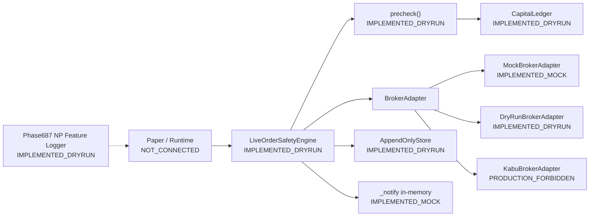
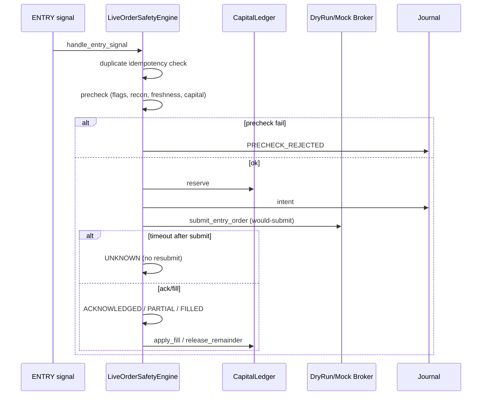
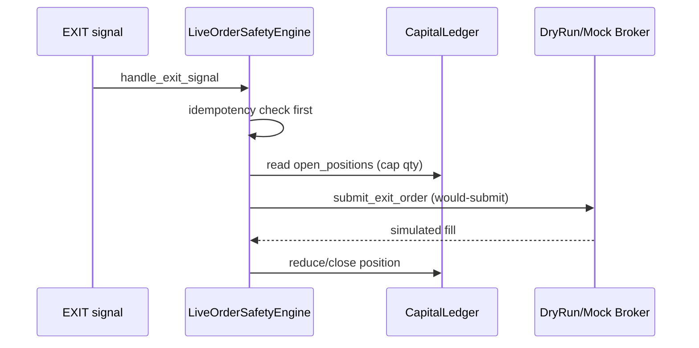
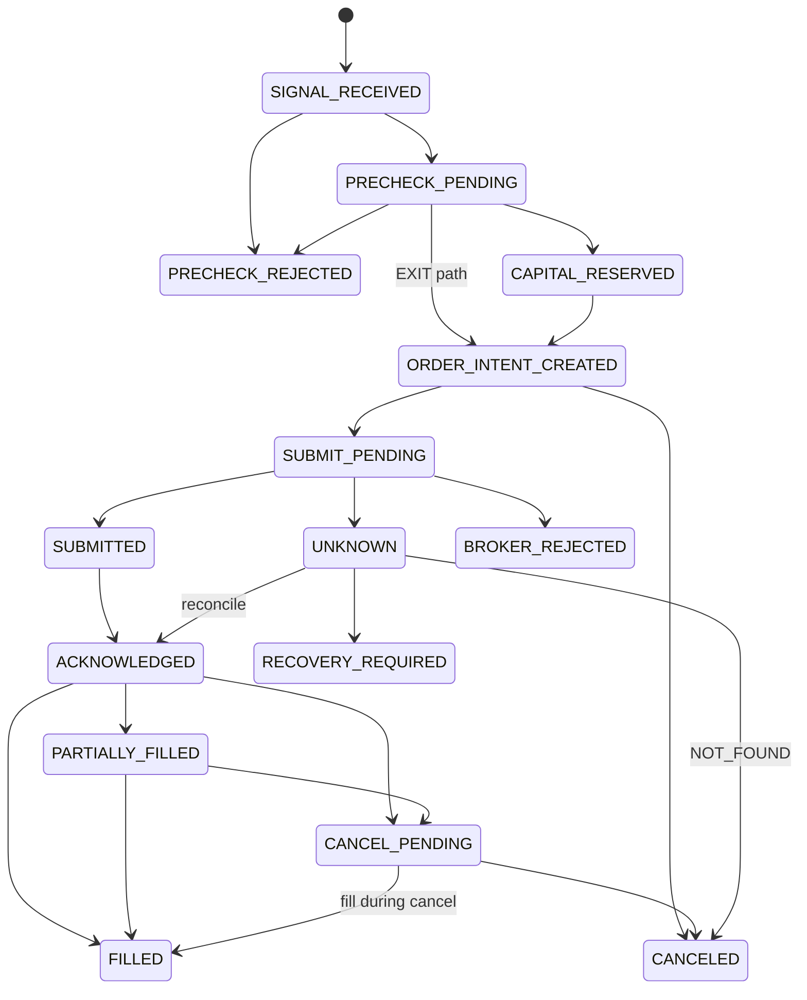
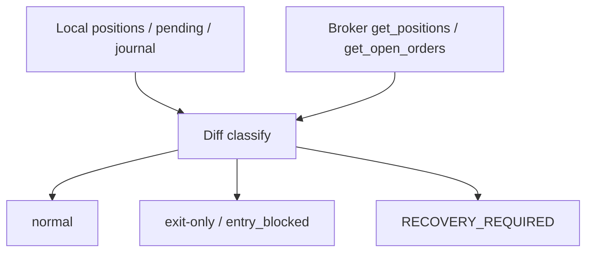
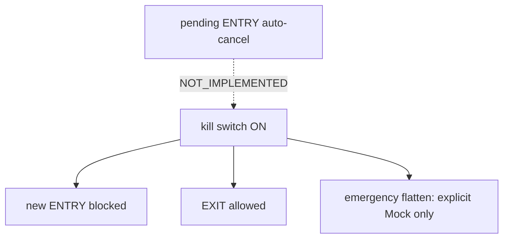

# Live Order System Design

**Document status:** Source of Truth for Phase687W2/W3 live-order safety  
**Code SoT:** `src/small_paper/live_order_safety_sm.py`  
**Machine schema:** `docs/live_trading/schema/live_order_design_schema.json`  
**Last aligned:** Phase687W3

> Status vocabulary: `IMPLEMENTED_MOCK` | `IMPLEMENTED_DRYRUN` | `IMPLEMENTED_READONLY` | `NOT_CONNECTED` | `NOT_IMPLEMENTED` | `PRODUCTION_FORBIDDEN` | `PRODUCTION_REVIEW_REQUIRED`

---

## 1. 目的

将来の実売買に必要な注文・約定・資金・ポジション管理を、`live_trading_enabled=false` / `order_enabled=false` のまま安全に構築する。  
本設計は **Dry-run / Mock 検証基盤** を定義する。実注文送信システム完成を意味しない。

## 2. 対象範囲

| Area | Status |
|------|--------|
| Order lifecycle state machine | IMPLEMENTED_DRYRUN |
| Idempotency keys | IMPLEMENTED_DRYRUN |
| Pre-order safety checks | IMPLEMENTED_DRYRUN |
| Capital reservation (in-memory) | IMPLEMENTED_DRYRUN |
| Mock / Dry-run broker adapters | IMPLEMENTED_MOCK / IMPLEMENTED_DRYRUN |
| Startup reconciliation (local vs mock broker) | IMPLEMENTED_DRYRUN |
| Kill switch (entry block) | IMPLEMENTED_DRYRUN |
| Append-only journals (3 files) | IMPLEMENTED_DRYRUN |
| Journal restore (no resubmit) | IMPLEMENTED_DRYRUN |
| Design consistency checker | IMPLEMENTED_DRYRUN |

## 3. 対象外

| Area | Status |
|------|--------|
| Real Kabu order submit | PRODUCTION_FORBIDDEN |
| Paper Runtime → SafetySM wiring | IMPLEMENTED_DRYRUN (`live_order_runtime_bridge`) |
| Live Discord webhook delivery | NOT_IMPLEMENTED (in-memory mock only) |
| `capital_reservations.jsonl` / `kill_switch_events.jsonl` | IMPLEMENTED_DRYRUN |
| Production order enablement procedure | NOT_AUTHORIZED / NOT_IMPLEMENTED |
| Automatic emergency flatten in production | PRODUCTION_FORBIDDEN |
| ENTRY/EXIT strategy / PBv2 / I/H/C / Phase687 logger changes | Out of scope (must not change) |

## 4. 現在の実装段階

**Current implementation stage: `CAPABILITY_PROVENANCE_FIXED`**

| Layer | Status | Production use |
|-------|--------|----------------|
| ENTRY signal wiring (engine API) | IMPLEMENTED_DRYRUN | Forbidden |
| ENTRY signal wiring (pilot_runner) | IMPLEMENTED_DRYRUN | Forbidden |
| Account read API (Kabu) | IMPLEMENTED_READONLY | Read only (weekend may be unavailable) |
| Kabu order submit | PRODUCTION_FORBIDDEN | Hard fail |
| Emergency flatten | IMPLEMENTED_MOCK | Not connected to production |
| Position sizing policy change | NOT_IMPLEMENTED | Baseline 100株比較ログのみ |
| Forward soak | NOT_STARTED | Separate from implementation READY |

## 5. システム構成

## 6. コンポーネント責務

### 6.1 Paper / Runtime signal source — `NOT_CONNECTED`

| Item | Value |
|------|-------|
| 責務 | Accepted ENTRY/EXIT を SafetySM へ渡す（将来） |
| 入力 | Pilot accept / exit events |
| 出力 | 未接続 |
| 保持状態 | N/A |
| 永続化先 | N/A |
| 失敗時 | N/A |
| 依存 | Phase591 `live_order_dry_run_adapter` は別系統で存在。W2 SafetySM とは未統合 |

### 6.2 LiveOrderSafetyEngine (`LiveOrderSafetySM`) — `IMPLEMENTED_DRYRUN`

| Item | Value |
|------|-------|
| 責務 | 注文状態遷移・precheck・idempotency・kill/recovery gate |
| 入力 | `handle_entry_signal` / `handle_exit_signal`（alias: `receive_*`） |
| 出力 | `SafetyOrder`, Discord mock events, journal rows |
| 保持状態 | `orders`, `by_idempotency`, kill/recovery flags |
| 永続化先 | AppendOnlyStore |
| 失敗時 | reject / UNKNOWN→reconcile / no blind resubmit |
| 依存 | BrokerAdapter, CapitalLedger, AppendOnlyStore |

### 6.3 CapitalLedger (`CapitalReservationManager` + `PositionLedger`) — `IMPLEMENTED_DRYRUN`

| Item | Value |
|------|-------|
| 責務 | 資金・slot・pending・open position の仮予約と解放 |
| 入力 | reserve / apply_fill / release_* |
| 出力 | Reservation, open_positions, pending_by_symbol |
| 保持状態 | in-memory dicts |
| 永続化先 | **NOT_IMPLEMENTED** as dedicated JSONL; reconstructed best-effort via `restore_from_journal` |
| 失敗時 | pre-submit failure で `release_all` |
| 依存 | Engine only |

### 6.4 AppendOnlyStore (`OrderIntentStore` + `OrderStateJournal`) — `IMPLEMENTED_DRYRUN`

| Item | Value |
|------|-------|
| 責務 | append-only audit trail |
| 入力 | intent / state / reconcile rows |
| 出力 | JSONL files |
| 保持状態 | filesystem |
| 永続化先 | `order_intents.jsonl`, `order_state_events.jsonl`, `broker_reconciliation.jsonl` |
| 失敗時 | OSError → ENTRY cancel + capital release（intent path） |
| 依存 | Engine |

### 6.5 BrokerAdapter family

| Adapter | Status | Notes |
|---------|--------|-------|
| BrokerAdapter (interface) | IMPLEMENTED_DRYRUN | Abstract + default `reconcile_order` / `get_recent_executions` |
| MockBrokerAdapter | IMPLEMENTED_MOCK | Fault injection behaviors |
| DryRunBrokerAdapter | IMPLEMENTED_DRYRUN | Adds `would_submit=True` |
| KabuBrokerAdapter | PRODUCTION_FORBIDDEN | submit/cancel/flatten/get_order_status hard-fail; reads skeleton/empty |

### 6.6 Reconciliation — `IMPLEMENTED_DRYRUN`

Methods: `startup_reconciliation`, `reconcile_unknown` (alias `reconcile`).  
Kabu live read reconciliation: `NOT_CONNECTED`.

### 6.7 KillSwitch — `IMPLEMENTED_DRYRUN`

`activate_kill_switch(reason)` → entry block.  
Pending ENTRY auto-cancel on kill: **NOT_IMPLEMENTED** (design requires; code currently blocks new ENTRY only).  
Emergency flatten: Mock only.

### 6.8 DiscordNotifier — `IMPLEMENTED_MOCK`

In-engine `_notify`; failures increment `discord_failures` and do not affect transitions. Real webhook: NOT_IMPLEMENTED.

### 6.9 Phase687 NP Feature Logger — `IMPLEMENTED_DRYRUN`

Separate module `np_pre_entry_feature_logger.py`. Predictor/outcome sidecars. **Must not be modified by order phases.** Not on order submit path.

## 7. ENTRYから約定までの処理

## 8. EXITから決済までの処理

## 9. 状態遷移

States (must match `OrderLifecycleState`):

Illegal examples (audited, rejected): `FILLED → SUBMITTED`, `CANCELED → FILLED` without broker reconcile path.

Full matrix: see `live_order_interface_spec.md` § State transitions and W2 CSV `phase687w2_state_transition_matrix.csv`.

## 10. 資金予約

ENTRY intent 作成時に `CapitalLedger.reserve`。解放: reject / cancel / expire / full fill remainder / reconcile NOT_FOUND。  
Dedicated reservation JSONL: **NOT_IMPLEMENTED**.

## 11. ポジション管理

`CapitalLedger.open_positions` と order `filled_qty` を分離。EXIT qty は保有を超えないよう cap。  
Broker position truth: Mock only; Kabu read: NOT_CONNECTED.

## 12. 冪等性

ENTRY key: `session_id|position_id|symbol|side|intent_sequence`  
EXIT key: `session_id|position_id|symbol|EXIT|exit_reason|intent_sequence`  
Same key → return existing order; no second submit. UNKNOWN → reconcile only.

## 13. 起動時照合

## 14. Kill switch

## 15. 障害復旧

| Case | Action | Status |
|------|--------|--------|
| Timeout after submit | UNKNOWN → reconcile | IMPLEMENTED_DRYRUN |
| Process restart | `restore_from_journal` (no resubmit) | IMPLEMENTED_DRYRUN |
| Broker-only position | entry_blocked + recovery | IMPLEMENTED_DRYRUN |
| Blind resubmit | Forbidden | IMPLEMENTED_DRYRUN |

## 16. ログ・監査

Append-only JSONL (3 files). Illegal transitions written as `ILLEGAL_TRANSITION` events.

## 17. Discord通知

Kinds (in-memory, always labeled DRY-RUN): ORDER INTENT, ORDER PRECHECK BLOCK, ORDER SUBMITTED DRYRUN, ORDER ACK, PARTIAL FILL, FILL, CANCEL, BROKER REJECT, RECONCILIATION ERROR, KILL SWITCH, RECOVERY REQUIRED.

## 18. セキュリティ

- Production submit hard-fail on `KabuBrokerAdapter`
- Config gates reject if live/order enabled or dry_run false
- Secrets not written to journals by design (no token fields in intent rows)

## 19. 本番移行条件

**PRODUCTION ORDER ENABLEMENT: NOT AUTHORIZED / NOT IMPLEMENTED**

Blockers (non-exhaustive):

1. Paper Runtime wiring + shadow soak
2. Kabu read-only reconciliation soak (`IMPLEMENTED_READONLY` not yet)
3. Real Discord notifier
4. Reservation/kill JSONL persistence
5. Pending-ENTRY cancel on kill
6. Explicit human authorization + separate ADR
7. `live_trading_enabled` / `order_enabled` remain false until authorized

## 20. 未解決課題

- Runtime NOT_CONNECTED
- Kill switch does not auto-cancel pending ENTRY
- Capital/kill dedicated journals NOT_IMPLEMENTED
- Kabu read-only API not connected
- Formal error codes exist in `live_order_error_codes.py`; engine still stores legacy short strings as `reject_reason`
- Phase591 adapter and W2 SafetySM dual-stack coexistence

---

## Safety invariants

| ID | Content | Implementation | Tests | Fail-safe |
|----|---------|----------------|-------|-----------|
| INV-001 | Same idempotency key → ≤1 broker submit | `handle_entry_signal` / `handle_exit_signal` | W2 duplicate ENTRY/EXIT; `test_duplicate_entry_no_second_order` | Return existing order |
| INV-002 | `live_trading_enabled=false` → actual broker submit 0 | `precheck`, `actual_broker_submit_count`, Kabu hard-fail | W2 audit; Kabu hard-fail test | Reject / HARD_FAIL |
| INV-003 | `order_enabled=false` → no order endpoint | `precheck` | W2 flags test | Reject `order_enabled` |
| INV-004 | Reconciliation incomplete → no new ENTRY | `startup_reconciliation` sets `entry_blocked` | W2 Scenario D / broker-only fault | PRECHECK reject |
| INV-005 | UNKNOWN → no auto-resubmit | timeout_after path + `reconcile_unknown` | Scenario C | Reconcile only |
| INV-006 | Broker-only position → exit-only | `startup_reconciliation` | Scenario D | `recovery_required` |
| INV-007 | Reservation not leaked after fill/cancel/reject | `release_*` / `apply_fill` | capital reservation test | release_all |
| INV-008 | EXIT qty ≤ holdings | `handle_exit_signal` | EXIT qty capped fault | Cap qty |
| INV-009 | Shadow/Reject/Debug do not create intents | Runtime NOT_CONNECTED; engine only accepts explicit handle_* | Design + W3 doc review | N/A until wired |
| INV-010 | Discord failure isolated | `_notify` try/except | Discord failure fault | `discord_failures++` |
| INV-011 | Predictor ≠ Outcome | Phase687 logger sidecars | Phase687 tests | Separate files |
| INV-012 | Price/board age ≠ pipeline latency | precheck stale_* vs W1 latency semantics | stale price/board faults | Reject stale |
| INV-013 | Same idempotency key + changed payload → no submit | `OrderRequestBuilder` fingerprint mutation | W5 mutation test | `REQUEST_MUTATION_DETECTED` → RECOVERY_REQUIRED |
| INV-014 | Request builder never performs network submit | No HTTP client in builder/parser; Kabu HARD_FAIL | W5 network isolation | submit/cancel count=0 |

---

## Planned implementation (not current)

| Item | Status |
|------|--------|
| Kabu read-only account/positions | IMPLEMENTED_READONLY (when Station/token available) |
| Runtime SafetySM hook | IMPLEMENTED_DRYRUN |
| Production submit path | FORBIDDEN until authorization |
| ExecutionPolicy production selection | NOT_IMPLEMENTED |
| Network submit adapter | PRODUCTION_FORBIDDEN |

## Evidence paths

- `results/reports/phase687w2_live_order_safety/`
- `results/reports/phase687w3_e2e_readonly_reconciliation/`
- `results/reports/phase687w4_runtime_readonly_latency/`
- `results/reports/phase687w4t_kabu_readonly_readiness/`
- `results/reports/phase687w5_kabu_order_contract/`
- `tests/test_phase687w2_live_order_safety.py`
- `tests/test_phase687w3_design_consistency.py`
- `tests/test_phase687w5_kabu_order_contract.py`

## Phase687W4 update

- Runtime wiring: **IMPLEMENTED_DRYRUN** (`live_order_runtime_bridge` + pilot hooks)
- Kabu read API: **IMPLEMENTED_READONLY** (when Station/token available) else explicit unavailable
- Kabu submit: **PRODUCTION_FORBIDDEN**
- Live order: **NOT_IMPLEMENTED**
- Production enablement: **NOT_AUTHORIZED**
- Forward soak: separate from implementation READY

## Phase687W4S Forward Soak

- Verdict (latest): `READONLY_SOAK_NOT_STARTED`
- Sessions collected: `0`
- Readonly success sessions: `0`
- Probe account_status: `OFFLINE`
- Production enablement: NOT_AUTHORIZED / NOT_IMPLEMENTED

## Phase687W4T Token / Read-Only Readiness

- CLI: `python -m small_paper.check_kabu_readonly_readiness`
- Token lifecycle diagnostics with credential masking
- Retry: max 3; AUTH_FAILED no retry; station/timeout limited
- Independent from production submit (HARD_FAIL)
- Station fields: `station_process_detected`, `api_port_reachable`, `token_endpoint_reachable`, `token_acquired`, `readonly_endpoint_reachable`, `operational_api_available`, `process_detection_warning`
- Process-name false alone does **not** classify as `KABU_STATION_NOT_RUNNING` when port/token/readonly succeed

## Phase687W5 Kabu Order Request Contract

- `OrderRequestBuilder`: **IMPLEMENTED_DRYRUN** (`kabu_order_request_builder.py`)
- `OrderResponseParser`: **IMPLEMENTED_MOCK** (`kabu_order_response_parser.py`)
- ExecutionPolicy selection: **NOT_IMPLEMENTED** (schema only; `production_authorized=false`)
- Network submit: **PRODUCTION_FORBIDDEN**
- Real broker ACK: **UNMEASURED**
- Field SoT: official kabusapi → vendor snapshot → `live_order_api_wiring.py`
- Fingerprint + `REQUEST_MUTATION_DETECTED` → RECOVERY_REQUIRED
- Timeout → UNKNOWN; automatic resubmit = 0
- ADR: `docs/live_trading/adr/ADR-687W5-kabu-order-request-contract.md`

## Phase687W5A Official Sendorder Reconciliation

- Vendor snapshot: `docs/live_trading/vendor/kabusapi_sendorder_contract.json`
- ExchangePolicy: SOR / TSE+ / maintenance exception / repay-match; normal NEW Exchange=1 **FORBIDDEN**
- Transaction: MARGIN_NEW_BUY / MARGIN_REPAY_SELL dry-run; CASH_* **NOT_IMPLEMENTED**
- FundType: omit (auto 11) audited or explicit 11
- ClosePositionOrder=0 requires production policy review
- MarginTradeType live account: **NOT_VERIFIED** (until W5B live position observation)
- Checker: `scripts/check_kabu_sendorder_contract_consistency.py`
- ADR: `docs/live_trading/adr/ADR-687W5A-official-sendorder-contract-reconciliation.md`
- Evidence: `results/reports/phase687w5a_official_contract_reconciliation/`

## Phase687W5B Account Capability + Execution Policy Shadow

- Capability profile from read-only wallet/positions; wiring MTT=3 never VERIFIED alone
- Position identity: ExecutionID→HoldID with artifact masking
- Close policy: CLOSE_EXACT_HOLD_ID preferred; no silent Order=0 fallback
- ENTRY Exchange shadow: SOR + TSE+ candidates (no production selection)
- ENTRY/EXIT order-style shadow + compact fill simulation (future path = eval only)
- W4S soak snapshot fields for capability/shadow counts
- Production policy selection: **NOT_IMPLEMENTED** (≥3 W4S sessions required)
- ADR: `docs/live_trading/adr/ADR-687W5B-account-capability-execution-policy-shadow.md`
- Evidence: `results/reports/phase687w5b_account_execution_policy_shadow/`

## Phase687W5B1 Capability Provenance Hardening

- Provenance enum: LIVE_API_* | CONFIG | FIXTURE | SYNTHETIC | UNKNOWN
- `fixture_live_shaped_*` → FIXTURE_ONLY / NOT_VERIFIED (never VERIFIED_FROM_LIVE_*)
- VERIFIED_FROM_LIVE_POSITION requires full live evidence (token, endpoint, timestamp, schema, MTT/Exchange/AccountType)
- Zero live positions → LIVE_API_NO_POSITIONS / MTT NOT_VERIFIED
- Fixture/live mix → CONFLICT; fixture results are not policy evidence
- Soak fields: capability_provenance, fixture_used, margin_trade_type_live_verified, …
- Evidence: `results/reports/phase687w5b1_capability_provenance/` (W5B artifacts not overwritten)

## Phase687W6 Production Enablement Governance Gate

- Machine-readable fail-closed gate for future production enablement
- **PRODUCTION ORDER ENABLEMENT: NOT AUTHORIZED / NOT IMPLEMENTED**
- READY = governance gate complete — not order authorization, write adapter, or enablement
- Blockers: soak (≥3 W4S), provenance, MTT live verify, policy approvals, recon/safety, config SHA, design, operator approval
- Unset / unknown / fixture-only / stale / SHA mismatch / expired approval → BLOCKED
- Boolean defaults are false; never default enabling flags to true
- Approval artifact schema only (`approval_status=NOT_AUTHORIZED`); no valid APPROVED generated
- Canary plan schema only; canary execution forbidden
- CLI: `python -m small_paper.check_production_enablement_readiness` (exit 0 = tech PASS but still NOT_AUTHORIZED)
- Write adapter NOT_IMPLEMENTED; Kabu submit/cancel/flatten HARD_FAIL
- ADR: `docs/live_trading/adr/ADR-687W6-production-enablement-governance.md`
- Evidence: `results/reports/phase687w6_production_enablement_gate/`

## Phase687W7 Operational Recovery and Audit Drill

- Dry-run recovery foundation: session manifest/seal, journal integrity, recovery modes, kill-switch/restart drills, file-failure, disk/clock guards, operator ack schema, audit bundles
- **PRODUCTION ORDER ENABLEMENT: NOT AUTHORIZED / NOT IMPLEMENTED**
- READY = dry-run operational recovery complete — not order authorization or write adapter
- Recovery modes never auto-return to NORMAL without operator acknowledgment
- Journal non-OK → ENTRY blocked; partial tail keeps original + recovery copy
- Disk: warning/critical/hard-stop; cleanup candidates only (no auto-delete of raw PUSH/canonical)
- CLI: `python -m small_paper.check_live_order_recovery_readiness`
- ADR: `docs/live_trading/adr/ADR-687W7-operational-recovery-audit.md`
- Evidence: `results/reports/phase687w7_operational_recovery/`

## Phase687W7A Stateful Journal Recovery + Runtime Session Seal

- Real append-only journals → `restore_from_journal()` rebuilds orders/reservations/positions/kill-switch
- Stop-point matrix A–L with object-level assertions (no hardcoded pass)
- Full session seal required artifacts; missing → INCOMPLETE; post-seal mutation → MANUAL_REVIEW_REQUIRED
- Runtime hooks: real git_commit/config SHA on manifest; finalize + full seal; bridge restore before recon
- W4S soak fields: restart_recovery_test_version, journal_restore_status, session_manifest/seal status, …
- Status: SYNTHETIC_RECOVERY_PROOF_PASS / RUNTIME_INTEGRATION_READY / FORWARD_SESSION_SEAL_PENDING
- **PRODUCTION ORDER ENABLEMENT: NOT AUTHORIZED / NOT IMPLEMENTED**
- ADR: `docs/live_trading/adr/ADR-687W7A-stateful-recovery-session-seal.md`
- Evidence: `results/reports/phase687w7a_stateful_recovery/`

## Phase687W7A1 Recovery Assertion Integrity

- Separated count semantics (aggregate / intent / active reservation / position quantity)
- capital_reserved: intent=0, order_aggregate=1, active_reservation=1
- Kill switch Policy A: HOLD_UNTIL_OPERATOR (active reservation kept)
- pass = assertion_failure_count==0 only; negative oracle must detect FAIL
- W4S: recovery_assertion_* fields required for success
- ADR: `docs/live_trading/adr/ADR-687W7A1-recovery-assertion-integrity.md`
- Evidence: `results/reports/phase687w7a1_recovery_assertion_integrity/`

## Phase687W7A2 W4S Seal Propagation

- session_seal.json is SoT; snapshot copies real seal fields after verify
- Finalize: pre-seal snapshot → manifest → seal → propagate → resave (no post-seal manifest rewrite)
- W4S rejects entry_count=0 / mismatch / unverified / mutated
- ADR: `docs/live_trading/adr/ADR-687W7A2-w4s-seal-propagation.md`
- Evidence: `results/reports/phase687w7a2_w4s_seal_propagation/`

## Phase687W8 One-Command Paper Runner

- Single entry: `cd C:\Users\yhach\Documents\tradebotfile; .\run_paper_trade_checked.bat`
- Prechecks fail-closed; existing `run_paper_trade.bat` called once; post W4S once
- production enablement NOT_AUTHORIZED is informational only
- ADR: `docs/live_trading/adr/ADR-687W8-one-command-paper-runner.md`
- Evidence: `results/reports/phase687w8_paper_trade_checked_runner/`
