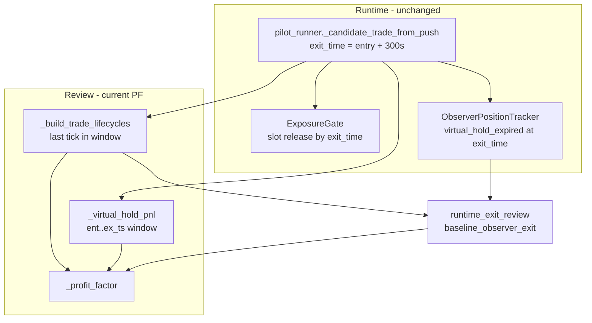
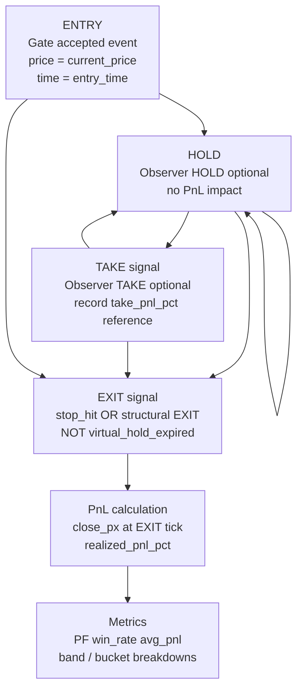
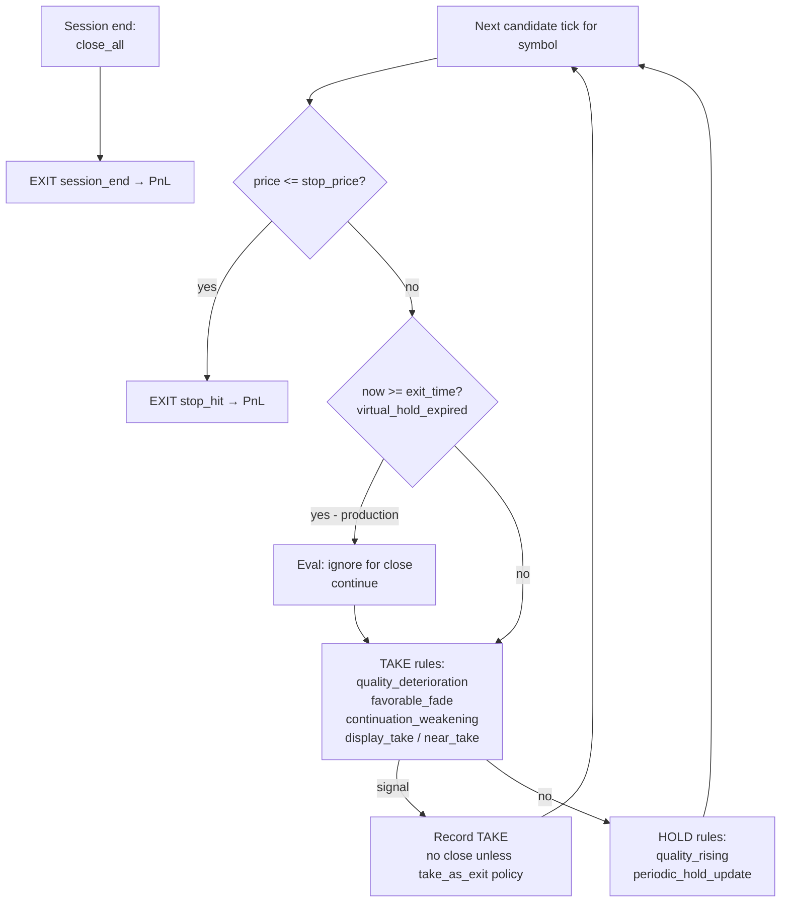

# Phase 57: Realistic Trade Evaluation Path Design

**Status:** Design (Phase 57) — **Phase 58 implemented** (see below)  
**Date:** 2026-05-19  
**Scope:** Small paper pilot (`kabu_native/`) — dry-run / observer-only path  
**Frozen (unchanged by this design):** ENTRY gate, EXIT v13, `min_quality=0.70`, `max_concurrent=3`, `allowed_trading_windows`

---

## 0. Objective

Eliminate **300-second virtual-hold PnL** as the primary performance metric. Evaluate trades only through **structure-based pseudo-trading** that mirrors live operation: gate accept → observer HOLD/TAKE notifications → structural EXIT (price / continuation / quality), without fixed-horizon marks.

**Explicitly out of scope for the new PF path:**

| Category | Examples in codebase |
|----------|----------------------|
| Time-only exit | `virtual_hold_expired`, `live_virtual_hold` |
| Fixed hold caps | `hold_max_180s`, `hold_max_300s`, `hold_max_600s` |
| Fixed horizon marks | `+30/+60/+120/+300s`, `TAKE_HORIZONS_SEC`, `ent_ts + 300` fallback |
| Virtual-hold window PnL | `_virtual_hold_pnl`, `_build_trade_lifecycles` exit at `exit_time` |

---

## 1. Current PF Calculation Paths (300s Usage)

### 1.1 Origin of the 300s window

| File | Function / constant | Role |
|------|---------------------|------|
| `kabu_native/src/small_paper/pilot_runner.py` | `_candidate_trade_from_push` (`virtual_hold_sec=300.0`) | Sets `exit_time = entry + 300s`, `exit_reason=live_virtual_hold` on every candidate/accepted row |
| `kabu_native/src/research/exposure_gate.py` | `ExposureGate.evaluate_entry` / `record_accepted` | Uses `exit_time` to free concurrent slots — **cap simulation**, not structural exit |
| `kabu_native/src/small_paper/observer_position_tracker.py` | `register_entry` → `on_tick` L171–173 | `now >= pos.exit_time` → `virtual_hold_expired` (observer EXIT) |

All review PF paths below ultimately read **`exit_time` from accepted/candidate events** (300s from pilot) or **`ent_ts + 300`** when missing.

---

### 1.2 `_build_trade_lifecycles` (`small_paper_performance_review.py`)

| Step | Function | 300s involvement |
|------|----------|------------------|
| Trade list | `_build_trade_lifecycles` | `ex_ts = parse(exit_time) or ent_ts + 300` |
| Tick window | same | `candidate` ticks filtered `ent_ts <= ts <= ex_ts` |
| Exit price | same | Last tick in window → `exit_px` |
| PnL | same | `(exit_px - entry_px) / entry_px` → `realized_pnl_pct` |
| PF | `_summarize_trades` → `_profit_factor` | PF = sum(wins)/sum(|losses|) on lifecycle PnLs |
| Verdict | `_compute_verdict` | `profit_factor_ge_1_2`, `excessive_virtual_hold` |

**Callers (PF / session verdict):**

| Caller | Entry function | Uses lifecycle PF? |
|--------|----------------|-------------------|
| `run_push_replay_performance_review` | `build_and_write_review` | **Yes** — `accepted_trade_performance.profit_factor` |
| `runtime_weakness_diagnosis.py` | diagnosis builders | **Yes** — `realized_pnl_pct` from lifecycles |
| `runtime_exit_review.py` | `_replay_trade_paths` | **Partial** — sets `path.virtual_hold_pnl_pct` from lifecycle |
| `runtime_phase56_diagnosis.py` | quality band PF | **Yes** — lifecycle PnLs |

**Not PF but 300s-tainted:** `hold_duration_sec = ex_ts - ent_ts` (often ≈300), MFE/MAE inside same window.

---

### 1.3 `_virtual_hold_pnl` (`runtime_pilot_policy_review.py`)

| Step | Function | 300s involvement |
|------|----------|------------------|
| Window | `_virtual_hold_pnl` | `ex_ts = parse(exit_time) or ent_ts + 300` |
| Ticks | same | `price_index[sym]` filtered `ent_ts <= ts <= ex_ts` |
| PnL | same | Last price in window |
| PF | `_simulate_policy` → metrics | Each accepted row gets `realized_pnl_pct = _virtual_hold_pnl(...)` |
| Verdict | `_evaluate_policy_matrix` | `profit_factor_below_1_2` on simulated PF |

**Callers:**

| Caller | Script |
|--------|--------|
| `runtime_pilot_policy_review.run_*` | `kabu_native/scripts/review_runtime_pilot_policy.py` |
| `exposure_cap_whatif_review.py` | imports `_virtual_hold_pnl` — `kabu_native/scripts/review_exposure_cap_whatif.py` |

**Also 300s:** `would_be_pnl_pct` for `max_concurrent` rejects uses same function.

---

### 1.4 `runtime_exit_review.py`

| Output / metric | Function | 300s / time-only |
|-----------------|----------|------------------|
| `virtual_hold_pnl_pct` | `_replay_trade_paths` + `_build_trade_lifecycles` | **Yes** — lifecycle |
| `take_path_review.csv` horizons | `_enrich_take_rows` → `_max_upside_horizons` | **Yes** — +30/60/120/300s after TAKE |
| `hold_path_review.csv` | `_hold_rows` | `exit_pnl_pct = virtual_hold_pnl_pct`; `long_hold` if `>= LONG_HOLD_SEC (300)` |
| `exit_path_review.csv` | `_exit_rows` | Fallback to `virtual_hold_pnl_pct`; counts `virtual_hold` reasons |
| What-if PF grid | `_whatif_grid` → `_simulate_exit_policy` | Tick loop capped at `ex_ts` (300s); policies include `hold_max_*`; baseline falls back to VH PnL |
| Recommendation | `_recommend_runtime_fix` | Uses horizon extended rate + VH rate |

**Script:** `kabu_native/scripts/review_runtime_exit.py`  
**Cross-ref PF:** `session_observed_pf` pulled from `small_paper_performance_review.json` (lifecycle PF).

---

### 1.5 `small_paper_performance_review` (performance_review)

| Component | Function | 300s? |
|-----------|----------|-------|
| Primary PF | `_build_trade_lifecycles` + `_summarize_trades` | **Yes** |
| Quality bands PF | `_band_summary` | **Yes** (same trades) |
| Session bucket PF | `_bucket_summary` | **Yes** |
| Observer replay | `_replay_observer_judgments` | Observer still closes on `virtual_hold_expired` during replay; TAKE follow-up uses **all post-take ticks** (not fixed horizon) but verdict uses `EXCESSIVE_HOLD_SEC=600` |
| Gate / cap | `_analyze_exposure` | No PnL — reject counts only |

**Scripts:** `review_small_paper_push_replay.py`, live session post-run via `build_and_write_review`.

---

### 1.6 `exposure_cap_whatif_review` (exposure_cap_review)

| Component | Function | 300s? |
|-----------|----------|-------|
| Per-cap PF | `_simulate_cap_scenario` | **Yes** — `_virtual_hold_pnl` per accept |
| Blocked HQ PnL | `would_be_pnl_pct` | **Yes** |
| Session comparison | imports performance review PF | **Yes** — nested lifecycle PF |
| Verdict | `_cap_whatif_verdict` | `profit_factor_below_1_2`, cap ranking by PF |

**Script:** `kabu_native/scripts/review_exposure_cap_whatif.py`

---

### 1.7 PF dependency graph (as-is)



**Summary:** Today, **every official session PF ≥ 1.2 check** flows through either `_build_trade_lifecycles` or `_virtual_hold_pnl`. Observer replay records structural events, but **baseline exit PnL still mixes `virtual_hold_expired` and lifecycle fallback**.

---

## 2. Structure-Only Evaluation Path (Design)

### 2.1 Principles

1. **ENTRY** — Use existing gate outcome only (`accepted` events). Entry price = `current_price` at accept. No change to gate logic.
2. **HOLD** — Observer notifications (`continuation_quality_rising`, `periodic_hold_update`). **Do not** close positions or compute PnL on HOLD.
3. **TAKE** — Observer signal only in live; for evaluation, record **reference PnL at TAKE tick** (`take_pnl_pct`) for diagnostics. Default **primary** close is not TAKE unless an explicit sub-policy is selected (see §2.4).
4. **EXIT (PnL-close)** — Only allowed close reasons (see §2.2). **`virtual_hold_expired` excluded** from PF numerator/denominator construction.
5. **Tick universe** — From `entry_time` through **session end** (last candidate/accepted timestamp for the session), **not** `accepted.exit_time`.
6. **Cap simulation** — May continue using 300s `exit_time` for `ExposureGate` slot accounting; label metrics **`concurrency_sim_pnl`** vs **`structural_pnl`** when both are reported.

### 2.2 Allowed structural signals (mapping)

| User term | Runtime observer (`_take_reason` / EXIT) | Use in PnL-close |
|-----------|------------------------------------------|------------------|
| `stop_hit` | EXIT `exit_reason=stop_hit` | **Primary close** — price at tick |
| `quality deterioration` | TAKE `quality_deterioration` | Close via tick rule or first structural EXIT (not VH) |
| `momentum deterioration` | TAKE `continuation_weakening` | Same |
| `favorable fade` | TAKE `favorable_fade` | Same |
| `continuation collapse` | EXIT `exit_kind=continuation_breakdown` only when **not** `virtual_hold_expired` | Allow `session_end` / future structural breakdown rules |
| `observer TAKE` | `OBSERVER_TAKE` event | Reference + optional `take_as_exit` sub-policy |
| `observer EXIT` | `OBSERVER_EXIT` with allowed `exit_reason` | **Primary close** at `unrealized_pnl_pct` / tick price |

**Excluded from PnL-close:** `virtual_hold_expired`, `live_virtual_hold`, `hold_max_*`, horizon columns, `periodic_hold_update` (HOLD only).

**Session boundary:** `session_end` / `push_replay_review_end` / `runtime_review_end` — closes remaining open positions at last tick price. This is a **calendar/session** boundary, not a per-trade fixed 300s horizon.

### 2.3 Proposed evaluator (new module — design name only)

**Module (future):** `kabu_native/src/research/realistic_trade_evaluation.py`  
**Entry (future):** `kabu_native/scripts/review_realistic_trade_evaluation.py`

**Core types (design):**

```text
StructuralTradeRecord
  symbol, entry_time, entry_price
  close_time, close_price, close_reason  # from allowed set
  realized_pnl_pct
  take_events[]   # optional diagnostics
  hold_count
  mfe_pct, mae_pct  # over full session tick path, not 300s window
```

**Core functions (design):**

| Function | Responsibility |
|----------|----------------|
| `build_session_tick_index(events)` | Per-symbol `(ts, price, quality components)` from `candidate` rows |
| `replay_structural_lifecycle(events, pilot_config, policy)` | Observer replay with VH **ignored for close**; tick walk for stop/decay rules |
| `structural_close_pnl(entry_px, close_px)` | Single trade PnL % |
| `summarize_structural_trades(trades)` | PF, win rate, avg hold (wall-clock to close, not capped at 300) |
| `compare_to_legacy_vh(trades, events)` | Side-by-side `structural_pf` vs `virtual_hold_pf` for migration |

### 2.4 Evaluation policies (structure-only family)

| Policy ID | Close rule | PF eligible? | Notes |
|-----------|------------|--------------|-------|
| **`structural_observer_v1`** (recommended primary) | First `OBSERVER_EXIT` with `exit_reason in {stop_hit, session_end}`; **skip** `virtual_hold_expired`; if replay would VH-close, continue ticks until stop or session end | **Yes** | Closest to live observer without changing tracker code in Phase 57 |
| **`structural_stop_only_v1`** | `stop_hit` only; else session_end mark | **Yes** | Conservative; ignores quality/momentum |
| **`structural_decay_exit_v1`** | Tick sim: `quality_decay_exit` OR `momentum_fade_exit` OR `stop_hit` OR `session_end`; **no** `ex_ts` cap | **Yes** | Aligns with `_simulate_exit_policy` minus `hold_max_*` and VH |
| **`structural_trailing_v1`** | Adds `trailing_giveback_exit` on tick path | **Yes** | Optional; still structural |
| **`take_reference_v1`** | Records TAKE PnL; **does not** close | **No** (diagnostic) | Replaces horizon “extended after take” with path-based peak-after-take if needed |
| **`take_as_exit_v1`** | Close at first TAKE tick price | **Yes** (sub-policy) | User-allowed; treat as “observer says cover” hypothetical |
| ~~`baseline_observer_exit`~~ | Current Phase 54 baseline | **No** (legacy) | Includes VH |
| ~~`virtual_hold_lifecycle`~~ | `_build_trade_lifecycles` | **No** (legacy) | 300s window |

**Default recommendation:** Report **`structural_observer_v1`** as the sole gate for Phase 57+ go/no-go; keep legacy VH PF in an appendix table during transition.

### 2.5 Observer replay fork (design detail)

Current: `ObserverPositionTracker.on_tick` checks `now >= pos.exit_time` first → `virtual_hold_expired`.

**Evaluation fork (conceptual — two equivalent options):**

- **Option A (filter):** Run existing tracker; on `OBSERVER_EXIT`, if `exit_reason == virtual_hold_expired`, **do not** close the eval position; continue tick replay until `stop_hit` or `session_end`.
- **Option B (config fork):** Eval-only `exit_time = session_end_datetime` on register; production tracker unchanged.

Option A preserves production code paths in replay; Option B is simpler but diverges from live observer event stream. **Recommend Option A** for review fidelity.

**HOLD / TAKE:** Emit and log as today; only **EXIT** events with allowed reasons finalize `StructuralTradeRecord`.

### 2.6 PnL calculation (structure-only)

```text
entry_px  = accepted.current_price
close_px  = candidate.current_price at close_event_ts
          (or stop_price when stop_hit triggers intrabar on tick)
pnl_pct   = round((close_px - entry_px) / entry_px * 100, 4)

PF        = sum(pnl_pct where pnl_pct > 0) / abs(sum(pnl_pct where pnl_pct < 0))
```

**MFE/MAE:** Max/min unrealized over **all session ticks** from entry to structural close (not 300s).

**Partial fills / overlap:** Same symbol re-accepted before prior structural close → flag `overlap_replaced` (existing Phase 54 note); exclude or split per design choice in implementation phase.

---

## 3. Evaluation Flow (Structure-Only)

### 3.1 End-to-end flow



### 3.2 Per-tick decision order (eval replay)

Matches live observer priority, with VH branch **disabled for eval close**:



### 3.3 Data inputs / outputs (design)

| Input | Source |
|-------|--------|
| Events | `small_paper_events.jsonl` or `.csv` |
| Config | `small_paper_pilot.yaml` → `observer_tracker_config_from_pilot` |
| Poll clock | `poll_interval_sec` from session summary (replay only) |

| Output (proposed) | Content |
|-------------------|---------|
| `realistic_trade_evaluation.json` | `structural_pf`, policy id, trade count, close_reason distribution |
| `structural_trades_review.csv` | Per-trade structural close |
| `legacy_vs_structural_pf.csv` | Migration comparison |

---

## 4. Impact Analysis

### 4.1 Metrics expected to shift

| Metric | Current driver | After structural path |
|--------|----------------|---------------------|
| Session PF | ~300s last-tick mark | Longer holds possible; more `stop_hit` / `session_end`; **VH-heavy sessions drop artificial closes** |
| `avg_hold_duration_sec` | Often ≈300 | Wall-clock to true structural close |
| `live_virtual_hold_rate_pct` | High in Phase 54 live | Should → **0%** in structural PF (VH only in legacy column) |
| TAKE “extended after 300s” | Phase 54/56 horizons | Replace with **path peak after TAKE** (no fixed seconds) |
| Cap what-if ranking | VH PnL per cap | Re-run with `structural_pnl`; cap **accept count** unchanged |

### 4.2 What stays unchanged (by constraint)

- `pilot_runner._candidate_trade_from_push` / `virtual_hold_sec` (runtime cap bookkeeping)
- `ExposureGate` thresholds and `allowed_trading_windows`
- Discord observer messages (still show VH EXIT in live — evaluation filter is review-only)
- EXIT v13 production logic (not in small paper path)

### 4.3 Review script disposition (design)

| Script / module | Current PF | Phase 58+ intent |
|-----------------|------------|------------------|
| `review_small_paper_push_replay` / `performance_review` | lifecycle VH | Add `structural_trade_performance`; demote VH to `legacy_virtual_hold_performance` |
| `review_runtime_pilot_policy` | `_virtual_hold_pnl` | Policy matrix on structural replay or dual-report |
| `review_exposure_cap_whatif` | VH | Cap counts unchanged; PF columns from structural evaluator |
| `review_runtime_exit` | VH + horizons + hold_max | TAKE/HOLD diagnostics only; PF from `structural_*` policies |
| `review_phase56_diagnosis` | lifecycle band PF + horizons | Bands on structural PnL; drop `max_upside_*s` columns |
| `review_runtime_weakness` | lifecycle | Switch trade source to structural records |

### 4.4 Go / no-go criteria (proposed)

Replace single check:

- ~~`accepted_trade_performance.profit_factor >= 1.2` (VH)~~

With:

- **`structural_trade_performance.profit_factor >= 1.2`** under `structural_observer_v1`
- **`virtual_hold_expired_close_rate == 0%`** in structural trade set
- Optional: `structural_pf / legacy_vh_pf` reported for drift monitoring (no threshold in Phase 57)

---

## 5. Reference: Live session anchor

**Example session:** `kabu_native/results/small_paper/20260519/live_full_session_081047/`  
Phase 54 reported high `virtual_hold` exit rate and `baseline_observer_exit` PF ~1.22 — largely VH-driven. Structural re-evaluation on this session is the recommended first validation once implementation is approved (out of scope for Phase 57).

---

## 6. Phase 57 deliverables checklist

| # | Deliverable | Status |
|---|-------------|--------|
| 1 | Inventory current PF paths + 300s touchpoints | **Done** (§1) |
| 2 | Structure-only evaluation path design | **Done** (§2) |
| 3 | ENTRY → HOLD → TAKE → EXIT → PnL flow | **Done** (§3) |
| 4 | Impact analysis | **Done** (§4) |
| 5 | Code changes | **Not in scope** |

---

## Phase 58 — Implementation (structural_observer_v1)

| Item | Path |
|------|------|
| Review module | `kabu_native/src/research/structural_observer_review.py` |
| CLI | `kabu_native/scripts/review_structural_observer.py` |

**Eval fork:** `register_entry` uses `exit_time = session_end` (eval trade copy only) so `virtual_hold_expired` does not fire; any VH event is logged as `virtual_hold_expired_ignored` and does not close official trades.

**Official PF:** `structural_pf` from `structural_observer_v1` closes only on `stop_hit`, `session_end`, or `overlap_replaced_review`.

**Legacy reference:** `legacy_virtual_hold_pf` (and `legacy_*` prefix) from `_build_trade_lifecycles` — not used for `official_verdict`.

```bash
python kabu_native/scripts/review_structural_observer.py \
  --session-dir kabu_native/results/small_paper/YYYYMMDD/live_full_session_HHMMSS \
  --config kabu_native/configs/small_paper_pilot_q070_cap3.yaml
```

Outputs in session dir: `structural_observer_review.json`, `structural_trades.csv`, `structural_events.csv`, `structural_exit_reasons.csv`.

---

## Phase 60 — combined_structural_exit_v1 official review

CLI `--structural-exit-policy combined_structural_exit_v1` runs `replay_combined_structural_exit_v1` as the official PF path.

Shared rules: `kabu_native/src/research/structural_exit_policies.py`.

Also emits `structural_policy_comparison.csv` and `structural_exit_policy_summary.csv`.

---

## Phase 61 — Live observer notification (combined_structural_exit_v1)

| Item | Path / behavior |
|------|-----------------|
| Tracker | `small_paper/observer_position_tracker.py` uses `structural_exit_policies` when `structural_exit_policy=combined_structural_exit_v1` |
| Config | `configs/small_paper_pilot_q070_cap3.yaml` → `structural_exit_policy` |
| Discord | `notify_exit` only if `is_structural_exit`; tag `[STRUCTURAL EXIT]` |
| VH | Counted as `virtual_hold_expired_ignored_count`; no Discord EXIT |
| Readiness | `check_live_observer_readiness.py` → `phase60_combined_structural_pass` |

**Not in scope:** real orders, pilot ENTRY/gate changes, EXIT v13 production module.

---

## Phase 67 — Quality recalibration trial (MFE-linked favorable)

Diagnosis Phases 62–66 showed `favorable_continuation=1.0` on micro-ticks inflated quality while price MFE stayed tiny. Phase66 push-replay with gate+cap favored:

`favorable_recalc = min(1.0, rolling_mfe_pct / 0.003)` + `use_market_time_window: true` on `LiveFeatureBridge`.

| Item | Path |
|------|------|
| Trial config | `configs/small_paper_pilot_q070_cap3_mfe_fav.yaml` |
| Baseline trial (unchanged) | `configs/small_paper_pilot_q070_cap3.yaml` |
| Bridge | `small_paper/live_feature_bridge.py` (`favorable_mode`, `use_market_time_window`) |
| Safety | `check_mfe_favorable_trial_config` in `small_paper/safety.py` |

ENTRY/EXIT v13/cap/windows thresholds are unchanged; only trial quality feature generation differs.

---

## Phase 59 — Structural Exit Design Review

| Item | Path |
|------|------|
| Module | `kabu_native/src/research/structural_exit_design_review.py` |
| CLI | `kabu_native/scripts/review_structural_exit_design.py` |

Loss decomposition, overlap what-if, structure-only EXIT candidate matrix (no VH / horizon / `hold_max_*`).

---

## Appendix A — Function index (300s-related)

| File | Functions |
|------|-----------|
| `pilot_runner.py` | `_candidate_trade_from_push` |
| `small_paper_performance_review.py` | `_build_trade_lifecycles`, `_summarize_trades`, `run_push_replay_performance_review`, `_replay_observer_judgments` |
| `runtime_pilot_policy_review.py` | `_virtual_hold_pnl`, `_simulate_policy` |
| `exposure_cap_whatif_review.py` | `_simulate_cap_scenario` |
| `runtime_exit_review.py` | `_replay_trade_paths`, `_max_upside_horizons`, `_enrich_take_rows`, `_hold_rows`, `_exit_rows`, `_simulate_exit_policy`, `_whatif_grid` |
| `runtime_phase56_diagnosis.py` | horizon / band PF helpers |
| `observer_position_tracker.py` | `register_entry`, `on_tick` (`virtual_hold_expired`) |

## Appendix B — Allowed vs forbidden (quick reference)

| Allowed in structural PF | Forbidden in structural PF |
|--------------------------|----------------------------|
| `stop_hit` | `virtual_hold_expired` |
| `quality_deterioration` (via decay exit or EXIT) | `live_virtual_hold` |
| `continuation_weakening` | `hold_max_*` |
| `favorable_fade` | `max_upside_30s` … `300s` |
| `observer TAKE` (reference / optional exit policy) | `_virtual_hold_pnl` window |
| `session_end` | Fixed `ent+300` tick window |
